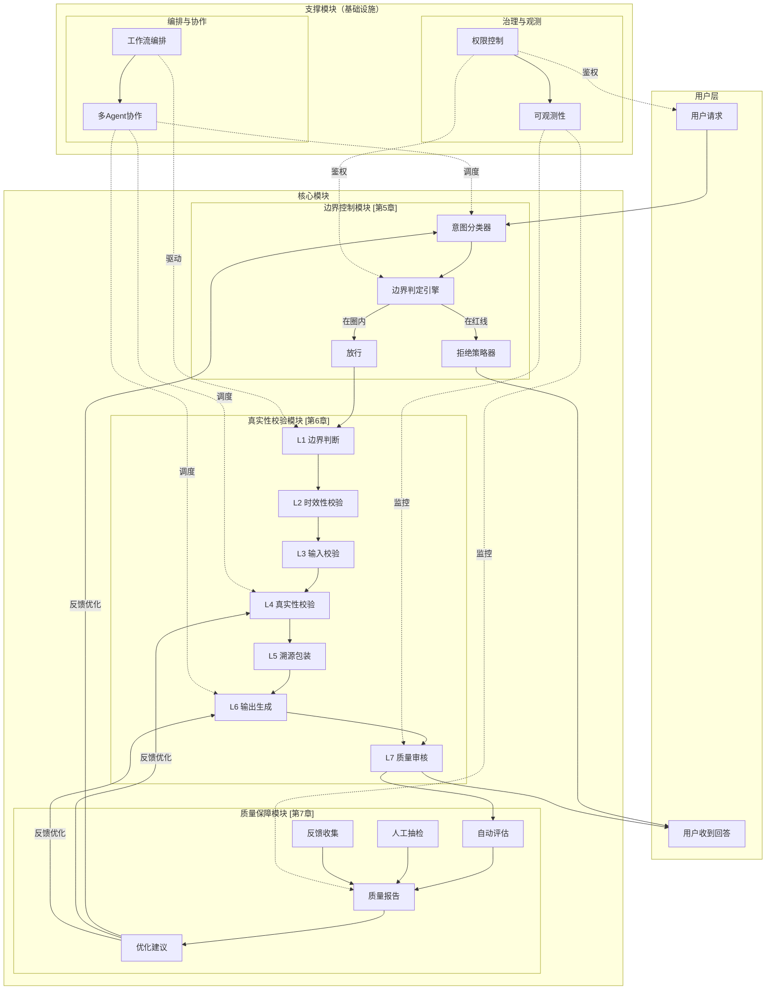
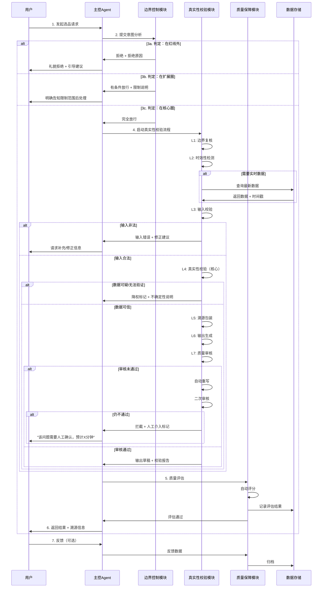

## 0. 产品核心目标

### 0.1 核心定位

> **使命**：为跨境电商卖家提供**可信赖的AI选品决策助手**——在明确的能力边界内，基于真实数据给出高质量选品建议，不编造、不越界、不误导。

本Agent不是"全能顾问"，而是**专精于选品决策链**的专业助手。它清晰知道自己能回答什么、不能回答什么；知道什么信息有把握、什么信息需要坦诚告知不确定性；始终以用户商业利益为核心，拒绝任何可能造成伤害的"善意谎言"。

---

### 0.2 产品目标

本产品的设计、开发、运营围绕以下三大核心目标展开，所有功能优先级排序、技术方案选型、质量保障机制均以此为准绳：

| 目标 | 核心诉求 | 一句话定义 |
|------|----------|-----------|
| **目标 1：问题边界控制** | 有边界的Agent才是可靠的Agent | 只回答选品相关问题，Agent有能力且有权限拒绝回答无关问题 |
| **目标 2：信息真实性保障** | 真实性是选品决策的生命线 | 禁止一切自行编造、臆想、未经考证的信息；能力不足时直接向用户坦诚反馈"我不知道" |
| **目标 3：输出质量达标** | 高质量输出是产品价值的核心载体 | 综合输出质量达到 **90%** 以上，让卖家敢于信赖、愿意采纳 |

这三条目标构成一个**递进关系**：
- **边界控制**是基础——先确保问题在能力范围内，再谈回答质量；
- **真实性保障**是底线——即使回答对了问题，如果数据是编造的，价值为负；
- **质量达标**是追求——在真实、可控的前提下，持续优化回答的准确性、完整性和可用性。

---

### 0.3 指导原则：Harness Engineering 方法论

本产品采用 **Harness Engineering（驾驭工程 / 编排工程）** 方法论进行设计与实现。其核心理念是：用工程化手段让 AI 成为可靠的系统组件，而非不可控的黑箱。

Harness Engineering 的七大维度在本方案中的具体落地：

| 维度 | 本方案具体实现 |
|------|----------------|
| **问题边界控制** | 核心圈 + 扩展圈 + 红线三级边界模型，配合三级防御体系 |
| **安全护栏 (Guardrails)** | **七层防护**（L1 边界判断 → L2 时效性校验 → L3 输入校验 → L4 真实性校验 → L5 溯源包装 → L6 输出生成 → L7 质量审核） |
| **工作流编排** | 状态机驱动，支持串行 / 并行 / 条件分支 / 循环 |
| **多Agent协作** | 主控 Agent 统一调度，支持并行优化，Context Store 共享状态 |
| **权限控制** | 角色分级（Admin / Analyst / Viewer），Tool Gate 边界控制 |
| **可观测性** | 全链路日志、分层监控告警、审计追溯 |
| **评估体系** | 以 90% 质量目标为导向的完整质量管理体系 + 人工抽检机制 |

> **关键原则**：边界宁紧勿松，误判宁拒勿错；接受 Agent "不知道"，绝不容忍 "编造"。

---

### 0.4 成功标准

产品的成功不是"功能上线"，而是**持续创造用户价值**。我们从以下三个层面衡量产品成功：

#### 第一层：质量指标达成

| 指标类别 | 具体指标 | 目标值 | 说明 |
|---------|---------|--------|------|
| **准确性** | 数据准确率 | ≥ 85% | AI输出的事实数据与权威源一致的比例 |
| **准确性** | 选品采纳率 | ≥ 50% | 卖家看了推荐后实际采纳上架的比例 |
| **可靠性** | 真实性合规率 | 100% | 符合"禁止幻觉"规范的比例，红线指标 |
| **可靠性** | 问题边界准确率 | ≥ 95% | 正确识别并处理/拒绝无关问题的比例 |
| **完整性** | 信息覆盖度 | ≥ 90% | 用户问题各维度都被回答的比例 |
| **用户体验** | 响应满意度 | ≥ 4.0 / 5 | 用户对回答质量的满意度评分 |

#### 第二层：阶段里程碑达成

| 阶段 | 时间 | 里程碑 | 质量目标 |
|------|------|--------|---------|
| **MVP** | Week 1-4 | Demo 可用（非生产级） | 核心链路跑通，Guardrails 初版落地，100% 人工抽检 |
| **V1.0** | Week 5-12 | 生产级上线 | 50% 综合质量目标，A/B 测试框架就绪 |
| **V1.5** | Week 13-24 | 规模化运营 | 75%-85% 综合质量目标，模型微调 + 反馈闭环 |
| **V2.0** | Week 25-36 | 质量达标 | **90%** 综合质量目标，智能化运维 |

#### 第三层：用户价值验证

| 验证方式 | 标准 |
|---------|------|
| **选品采纳 → 上架 → 盈利** | 采纳商品在 3 个月内达到预期利润率的比例 ≥ 35% |
| **用户留存** | 周活跃率 ≥ 60%，月活跃率 ≥ 40% |
| **口碑传播** | NPS（净推荐值）≥ 30 |

> **成功公式**：可信赖的边界 + 真实的数据 + 高质量的建议 = 卖家敢于决策、愿意付费、持续使用。

---

---

## 1. Harness Engineering 核心理念（本方案核心主线）

> **本章定位**：深入阐述 Harness Engineering 方法论的理论基础与核心框架，建立全团队统一的技术语言与认知基线。第0章的"指导原则"是本方法的概览，本章则是完整展开。

---

### 1.1 为什么需要 Harness Engineering

#### 1.1.1 AI Agent 的"不可预测性"本质

大语言模型（LLM）的底层机制决定了 AI Agent 天然具有不可预测性：

| 传统软件 vs LLM | 传统软件 | LLM-based Agent |
|----------------|---------|-----------------|
| **确定性** | 相同输入 → 相同输出 | 相同输入 → 可能不同输出（温度、上下文影响） |
| **可测试性** | 单元测试覆盖所有分支 | 输出空间近乎无限，无法穷举测试 |
| **故障模式** | 明确（崩溃、报错、超时） | 隐蔽（幻觉、偏见、越界、格式错乱） |
| **调试手段** | 断点、日志、复现 | 难以复现，"黑箱"推理 |
| **责任边界** | 清晰的输入-处理-输出 | 模糊，Agent 可能"自作主张" |

**对选品场景的特殊挑战**：
- 一个错误的销量数据 → 卖家批量采购 → 库存积压 → 资金链断裂
- 一个编造的合规信息 → 商品被海关扣留 → 罚款 + 信誉损失
- 一次越界的"投资建议" → 卖家亏损 → 法律风险 + 品牌崩塌

> **核心认知**：AI Agent 的"聪明"是其价值，也是其风险来源。Harness Engineering 不是抑制智能，而是让智能**可控、可预期、可追责**。

#### 1.1.2 传统软件工程方法为何失效

传统软件质量保障手段在面对 LLM 时存在结构性缺陷：

**1. 测试方法失效**
- 单元测试：无法覆盖 LLM 的无限输出空间
- 集成测试：Agent 的行为依赖外部工具返回，不可复现
- 回归测试：模型版本迭代后，之前通过的用例可能突然失败

**2. 监控方法不足**
- 传统监控关注"系统是否活着"（CPU、内存、QPS）
- AI 系统需要监控"输出是否正确"——这是语义层面的，非指标层面的
- 错误输出可能看起来"完全正常"（一个自信满满的幻觉回答）

**3. 安全模型不匹配**
- 传统安全：防止注入、XSS、越权访问
- AI 安全：防止"语义层面的伤害"——编造、误导、偏见、越界建议

#### 1.1.3 Harness = 给 AI 套上"缰绳"

"Harness"原意为"马具、缰绳"——不是用来阻止马奔跑，而是让马**在骑手期望的方向上**奔跑。

```
传统视角：AI Agent = 自动驾驶汽车（设定目的地，信任它自己开）
Harness 视角：AI Agent = 赛马（给它赛道和规则，让它在规则内冲刺）
```

Harness Engineering 的核心假设：
1. **不追求 100% 准确**——LLM 的统计本质决定了这一点不可能
2. **追求 100% 可控**——在确定的边界内，行为是可预期的
3. **接受"拒绝"作为成功**——Agent 说"我不知道"比胡说八道更有价值
4. **多层防御 > 单层完美**——任何单点都有可能失效，纵深防御是正道

---

### 1.2 Harness Engineering 核心概念

Harness Engineering 是一个系统化的方法论，包含七大维度，形成从"输入约束"到"输出评估"的完整闭环：

```
┌─────────────────────────────────────────────────────────────┐
│                    Harness Engineering                       │
│                                                              │
│   ┌──────────┐    ┌──────────┐    ┌──────────┐            │
│   │ 维度1    │───→│ 维度2    │───→│ 维度3    │            │
│   │ 问题边界 │    │ 安全护栏 │    │ 工作流   │            │
│   │ 控制     │    │ Guardrails│   │ 编排     │            │
│   └──────────┘    └──────────┘    └──────────┘            │
│         │               │               │                  │
│         ↓               ↓               ↓                  │
│   ┌──────────┐    ┌──────────┐    ┌──────────┐            │
│   │ 维度4    │    │ 维度5    │    │ 维度6    │            │
│   │ 多Agent  │    │ 权限控制 │    │ 可观测性 │            │
│   │ 协作     │    │          │    │          │            │
│   └──────────┘    └──────────┘    └──────────┘            │
│         │               │               │                  │
│         ↓               ↓               ↓                  │
│              ┌──────────┐                                   │
│              │ 维度7    │                                   │
│              │ 评估体系 │                                   │
│              │ (闭环)   │                                   │
│              └──────────┘                                   │
│                    │                                         │
│                    └────────────────→ 反馈优化              │
└─────────────────────────────────────────────────────────────┘
```

#### 维度 1：问题边界控制（Scope Control）

**定义**：明确 Agent 能回答什么、不能回答什么，并确保超出范围的问题被正确识别和拒绝。

**为什么是第一维度**：
- 边界是所有后续质量保障的前提
- 在错误的问题上给出正确的答案是灾难（答非所问却看起来很专业）
- 用户测试发现：Agent 在边界外的表现是信任崩塌的主要来源

**三级边界模型**：

| 层级 | 名称 | 范围 | 策略 |
|------|------|------|------|
| **核心圈** | Core Zone | 选品决策链全流程 | 全力保障，重点投入 |
| **扩展圈** | Extension Zone | 与选品强相关的周边（市场趋势、平台政策） | 有条件支持，明确限制 |
| **红线** | Red Line | 投资建议、法律意见、个人隐私等 | 严格拒绝，明确告知 |

**关键原则**：**边界宁紧勿松，误判宁拒勿错**。宁可拒绝一个本该回答的问题（用户可以追问），也不回答一个不该回答的问题（可能造成损害）。

#### 维度 2：安全护栏（Guardrails）

**定义**：在 Agent 处理流程的每一个关键节点设置校验机制，防止有害、错误、不当的输出流出系统。

**七层防护体系**（本方案核心落地）：

```
用户输入
   ↓
┌─────────────────────────────────────┐
│ L1: 边界判断                          │ ← 是否在核心圈/扩展圈？
│   ↓ 拒绝 → "这个问题超出了我的范围"   │
├─────────────────────────────────────┤
│ L2: 时效性校验                        │ ← 问题是否涉及需要实时数据？
│   ↓ 需要 → 触发实时数据查询           │
├─────────────────────────────────────┤
│ L3: 输入校验                          │ ← 输入是否完整、合法、无注入？
├─────────────────────────────────────┤
│ L4: 真实性校验                        │ ← 核心！信息是否来自可信源？
│   ↓ 可疑 → 降权/标记/拒绝           │
├─────────────────────────────────────┤
│ L5: 溯源包装                          │ ← 数据来源是否可追溯？
├─────────────────────────────────────┤
│ L6: 输出生成                          │ ← LLM 生成最终回答
├─────────────────────────────────────┤
│ L7: 质量审核                          │ ← 输出是否符合格式/安全/质量标准？
│   ↓ 失败 → 拦截/重写/人工介入        │
└─────────────────────────────────────┘
   ↓
用户收到回答
```

**每层护栏的哲学**：
- 不是"过滤"，而是"验证"
- 不是"阻止"，而是"保护"
- 每层都独立运作，多层形成纵深防御

#### 维度 3：工作流编排（Workflow Orchestration）

**定义**：将复杂的选品任务拆解为可编排、可监控、可回滚的原子步骤，由状态机驱动执行。

**为什么需要编排**：
- 选品不是"一问一答"，而是多步骤决策链（需求分析 → 市场扫描 → 竞品分析 → 风险评估 → 决策建议）
- LLM 单轮对话能力有限，需要分而治之
- 每个步骤可以独立优化、独立测试、独立监控

**编排模式支持**：

| 模式 | 说明 | 选品场景示例 |
|------|------|-------------|
| **串行** | 步骤依次执行 | 先分析市场容量，再分析竞争度，最后出建议 |
| **并行** | 多个步骤同时执行 | 同时查询销量、价格、评价三个维度 |
| **条件分支** | 根据中间结果走不同路径 | 高风险商品触发额外合规检查分支 |
| **循环** | 重复执行直到满足条件 | 多轮搜索直到找到足够数据支撑 |

**状态机设计原则**：
- 每个状态有明确的进入条件、处理逻辑、退出条件
- 状态转换全部可观测、可审计
- 支持人工介入和状态回滚

#### 维度 4：多 Agent 协作（Multi-Agent Collaboration）

**定义**：将复杂任务分配给多个专业化 Agent，通过主控 Agent 统一调度，实现"分而治之"。

**协作模式**：

```
┌─────────────────────────────────────┐
│           主控 Agent                  │
│      （Orchestrator / 调度器）        │
│  - 任务分解与分配                     │
│  - 状态管理与同步                     │
│  - 冲突解决与合并                     │
│  - 结果聚合与输出                     │
└─────────────────────────────────────┘
         │              │              │
    ┌────┘         ┌────┘         ┌────┘
    ↓              ↓              ↓
┌────────┐   ┌────────┐   ┌────────┐
│ 市场   │   │ 竞品   │   │ 合规   │
│ 分析   │   │ 分析   │   │ 检查   │
│ Agent  │   │ Agent  │   │ Agent  │
└────────┘   └────────┘   └────────┘
    │              │              │
    └──────────────┴──────────────┘
                   ↓
          ┌─────────────┐
          │ Context Store│
          │  (共享状态)  │
          └─────────────┘
```

**Context Store 设计**：
- 所有 Agent 共享统一的状态存储
- 支持读写隔离（防止 Agent 互相覆盖）
- 支持版本控制（可回溯到任意步骤的状态）

#### 维度 5：权限控制（Access Control）

**定义**：明确谁可以做什么、看到什么、修改什么，防止越权操作和数据泄露。

**角色分级**：

| 角色 | 权限 | 典型用户 |
|------|------|---------|
| **Admin** | 系统配置、权限管理、全量数据 | 技术负责人、安全管理员 |
| **Analyst** | 发起选品任务、查看结果、提交反馈 | 选品专员、运营人员 |
| **Viewer** | 查看已生成报告、历史记录 | 管理层、协作同事 |

**Tool Gate 机制**：
- 每个 Tool（工具）有独立的权限开关
- Agent 调用 Tool 前需校验权限
- 敏感操作（如修改生产数据）需二次确认

#### 维度 6：可观测性（Observability）

**定义**：对 Agent 的全链路行为进行记录、监控和分析，确保"可审计、可诊断、可优化"。

**三层观测体系**：

| 层级 | 观测对象 | 手段 | 用途 |
|------|---------|------|------|
| **L1: 系统层** | QPS、延迟、错误率、资源使用 | Metrics + Dashboard | 保障服务可用性 |
| **L2: 业务层** | 任务成功率、步骤耗时、工具调用 | 结构化日志 + 追踪 | 优化业务流程 |
| **L3: 语义层** | 输出质量、幻觉检测、用户满意度 | 评估模型 + 抽检 | 保障输出质量 |

**审计追溯要求**：
- 每次用户交互完整记录（脱敏后）
- 每个决策步骤可追溯（为什么调用这个工具、为什么返回这个结果）
- 支持"时光机"——重放任意历史会话

#### 维度 7：评估体系（Evaluation Framework）

**定义**：建立系统化的质量评估机制，让"好"与"不好"可量化、可比较、可改进。

**评估闭环**：

```
定义指标 → 收集数据 → 自动评估 → 人工抽检 → 分析根因 → 优化改进 → 验证效果
   ↑                                                              │
   └──────────────────────────────────────────────────────────────┘
```

**本方案评估体系**（详见第 X 章）：
- **自动评估**：准确性、完整性、相关性、安全性（用规则和模型自动打分）
- **人工抽检**：A/B 测试、盲评、专家评审
- **用户反馈**：满意度评分、采纳率、纠错反馈
- **业务验证**：上架成功率、盈利率、留存率

**关键原则**：
- 评估不是"事后检查"，而是"设计时就考虑"
- 评估指标决定优化方向——指标选错，优化白费
- 人工评估是"黄金标准"，自动评估追求与人工评估的高一致性

---

### 1.3 本方案与 Harness Engineering 的对应关系

下表将本产品的三大核心目标映射到 Harness Engineering 的七大维度，明确每项目标的理论支撑和落地手段：

| 产品目标 | Harness 维度 | 核心机制 | 落地章节 |
|---------|-------------|---------|---------|
| **目标 1：问题边界控制** | 维度 1：问题边界控制 | 三级边界模型 + 三级防御体系 | **第 5 章** |
| **目标 2：信息真实性保障** | 维度 2：安全护栏（Guardrails） | **七层防护体系**（L1→L7） | **第 6 章** |
| **目标 3：输出质量达标** | 维度 7：评估体系 | 90% 质量目标 + 自动评估 + 人工抽检 | **第 7 章** |

**支撑维度**（为三大目标提供基础设施）：

| Harness 维度 | 支撑目标 | 作用说明 |
|-------------|---------|---------|
| 维度 3：工作流编排 | 全部 | 将选品任务拆解为可控步骤，每个步骤可独立保障质量 |
| 维度 4：多 Agent 协作 | 全部 | 专业化分工，让"擅长做某事"的 Agent 做它擅长的事 |
| 维度 5：权限控制 | 目标 1、2 | 防止越权访问导致的数据泄露和误操作 |
| 维度 6：可观测性 | 全部 | 没有观测就没有优化，所有改进基于数据 |

**Harness Engineering 在本方案中的角色**：

```
┌──────────────────────────────────────────────────────────┐
│              本方案：跨境电商选品 AI Agent                  │
│                                                          │
│   ┌─────────────────────────────────────────────────┐   │
│   │         Harness Engineering（方法论层）           │   │
│   │  不是某个功能，而是贯穿全方案的设计哲学            │   │
│   │                                                  │   │
│   │  ┌─────────┐  ┌─────────┐  ┌─────────┐         │   │
│   │  │ 边界控制 │  │ 安全护栏 │  │ 评估体系 │ ← 三大 │   │
│   │  │ (目标1)  │  │ (目标2)  │  │ (目标3)  │   支柱  │   │
│   │  └────┬────┘  └────┬────┘  └────┬────┘         │   │
│   │       └─────────────┴─────────────┘              │   │
│   │                   ↓                              │   │
│   │         ┌─────────────────┐                     │   │
│   │         │ 编排 / 协作 /    │ ← 支撑体系         │   │
│   │         │ 权限 / 观测      │                     │   │
│   │         └─────────────────┘                     │   │
│   └─────────────────────────────────────────────────┘   │
│                           ↓                              │
│   ┌─────────────────────────────────────────────────┐   │
│   │         技术实现层（具体功能 / 代码 / 配置）       │   │
│   │         状态机、Guardrails、评估模型、监控...     │   │
│   └─────────────────────────────────────────────────┘   │
│                           ↓                              │
│   ┌─────────────────────────────────────────────────┐   │
│   │         用户价值层（卖家获得的可信赖选品建议）      │   │
│   └─────────────────────────────────────────────────┘   │
└──────────────────────────────────────────────────────────┘
```

> **一句话总结**：Harness Engineering 是"道"——指导我们如何设计一个可信赖的 AI Agent；本方案是"术"——在选品场景下对 Harness Engineering 的具体实现。道术合一，方能打造真正有价值的 AI 产品。

---

---

## 2. 业务背景

### 2.1 跨境电商选品痛点

选品是跨境电商的**生死线**——选对一款产品可能带来数倍回报，选错一款产品则可能导致库存积压、资金链断裂。当前跨境卖家在选品环节面临三大核心痛点：

#### 信息不对称

卖家与目标市场之间存在天然的信息壁垒：
- **需求侧盲区**：难以精准感知海外消费者的真实需求变化，依赖二手报告或主观判断
- **供给侧盲区**：供应商质量参差不齐，真实产能、交期、品控水平难以验证
- **竞争侧盲区**：竞品销量、定价策略、广告投放等核心数据获取困难，多数依赖估算工具
- **政策侧盲区**：平台规则、关税政策、合规要求频繁变化，信息获取滞后

#### 决策成本高

一次完整的选品决策需要投入大量时间和人力：
- **数据采集**：人工遍历多个平台、工具、报告，汇总整理耗时数天至数周
- **多维度权衡**：需同时考虑市场容量、竞争强度、利润空间、供应链稳定性、合规风险等数十个变量
- **动态跟踪**：市场环境瞬息万变，一次分析的结果可能在两周后失效，需要持续监控
- **团队沟通**：选品涉及运营、采购、物流、财务等多部门，信息同步成本高

#### 试错代价大

选品失误的直接和间接成本极高：
- **资金占用**：首批备货、头程物流、平台押金等前期投入动辄数万元至数十万元
- **库存风险**：滞销商品面临仓储费、降价清仓、甚至销毁的多重损失
- **机会成本**：错误的选品方向挤占了本可投入优质品类的资源和时间
- **信誉损失**：质量问题或合规问题可能导致店铺评分下降、账号受限

> **一个真实场景**：某卖家基于"感觉"选中一款"看起来不错"的家居用品，投入15万元备货，上架后发现竞品已占据类目头部、广告竞价高达$5/点击，最终3个月仅售出30%，清仓后净亏损8万元——这样的故事在跨境电商圈每天都在发生。

---

### 2.2 为什么需要 AI Agent

面对上述痛点，传统的人工选品方式已触及效率天花板，AI Agent 的引入不是"锦上添花"，而是**必然选择**：

#### 人工选品效率低

| 对比维度 | 人工选品 | AI Agent |
|---------|---------|----------|
| **数据覆盖** | 同时关注10-20个SKU已属极限 | 可并行监控数千个SKU的全维度数据 |
| **分析速度** | 单份竞品分析报告需2-4小时 | 秒级生成多维度分析报告 |
| **响应时效** | 工作日8小时，节假日延迟 | **7×24小时**实时响应 |
| **经验依赖** | 高度依赖个人经验，人员流动风险大 | 知识沉淀在系统，可复用、可迭代 |
| **一致性** | 不同人员判断标准差异大 | 统一评估框架，输出标准可控 |

#### 数据处理能力有限

人工处理数据存在天然瓶颈：
- **量级瓶颈**：一个中等类目的商品列表可能包含10万+SKU，人工筛选不现实
- **维度瓶颈**：同时权衡价格、销量、评价、利润率、物流成本、季节性等10+维度超出人类工作记忆容量
- **关联瓶颈**：发现"A品类降价→B品类需求上升"这类跨品类关联需要大量数据交叉分析
- **时效瓶颈**：人工无法做到对竞品价格、库存、评价变化的分钟级监控

#### 24/7 服务需求

跨境电商的全球化属性决定了其"永不眠"的特性：
- **时区差异**：目标市场（欧美、东南亚）与卖家所在地存在6-12小时时差，关键决策时刻往往不在工作时段
- **事件驱动**：平台大促、竞品突然降价、爆款出现等关键事件需要即时响应
- **决策周期压缩**：热销窗口期可能只有几天，拖延意味着错失机会

> **核心洞察**：卖家需要的不是一个"更快的选品工具"，而是一个**可信赖的选品决策伙伴**——能理解业务目标、能处理海量数据、能7×24小时待命、能在不确定时坦诚告知"我不知道"。这正是本方案设计 AI Agent 的出发点。

---

### 2.3 本方案解决的业务问题

本方案聚焦跨境电商选品决策链的四个核心场景，为卖家创造可量化的业务价值：

#### 核心场景

| 场景 | 解决的问题 | 本方案能力 |
|------|-----------|-----------|
| **市场分析** | 不知道什么品类有机会、市场容量多大 | 多源数据聚合分析，输出市场容量、趋势、季节性判断 |
| **竞品监控** | 不知道竞品在做什么、如何差异化 | 实时竞品跟踪，输出竞品画像、差异化机会点 |
| **利润测算** | 算不清真实利润，被隐性成本吞噬 | 全成本建模（采购+物流+平台费+汇率+退换货），输出精确利润预测 |
| **选品推荐** | 面对海量商品不知从何下手 | 基于多维度评分模型，输出排序推荐+风险提示 |

#### 用户价值

| 价值维度 | 具体收益 |
|---------|---------|
| **提高效率** | 选品分析周期从数天缩短至数分钟；同时监控SKU数量提升100倍+ |
| **降低风险** | 通过真实性校验和溯源机制，减少因数据错误导致的决策失误；通过合规审查降低违规风险 |
| **辅助决策** | 提供结构化、可追溯、可验证的决策依据，让卖家"知其然更知其所以然" |

> **价值主张**：本 Agent 不替卖家做决策，而是让卖家**在更充分、更真实、更及时的信息基础上做出更好的决策**。

---

---

## 3. 用户画像与分层策略

### 3.1 用户类型深度画像

基于跨境电商卖家的经营规模、组织形态和选品成熟度，我们将目标用户划分为三类。这种划分不是简单的"大中小"，而是**选品能力成熟度**的阶梯式分布。

#### 3.1.1 小型卖家（月销 < 10万RMB）

**典型画像**
- **规模**：个人创业者或小团队（1-3人），兼职或全职
- **平台**：以亚马逊、Temu、SHEIN、TikTok Shop 等单一平台为主
- **资金**：备货资金有限，单次选品投入通常在1-5万元
- **经验**：0-2年跨境经验，对目标市场了解有限

**核心特征**
| 维度 | 表现 |
|------|------|
| **技术接受度** | 中等，习惯使用简单工具（如Excel、基础选品插件） |
| **数据敏感度** | 低，更依赖"直觉"和"跟风" |
| **决策链条** | 极短，通常1人决策，无需多方协调 |
| **风险承受力** | 低，一次选品失误可能影响资金链 |
| **时间投入** | 有限，选品只是众多工作中的一项 |

**典型场景**
> 小王在亚马逊上开了第一家店，月销3万RMB。他每天花2小时浏览竞品、看BSR榜单、在卖家群里问"这个品能不能做"。他最大的恐惧是：投入5万元备货，结果卖不动。他需要有人告诉他"这个品，可以做"或者"这个品，千万别碰"。

**对AI Agent的期望**
- **简单直接**：输入一个品类或一个竞品，得到"做不做"的建议
- **低认知负荷**：不需要理解复杂的数据指标，只需要结论和风险提示
- **低成本**：免费或低价试用，按效果付费
- **学习辅助**：在推荐的同时教他"为什么这么推荐"

#### 3.1.2 中型卖家（月销 10-100万RMB）

**典型画像**
- **规模**：专业团队（3-10人），有明确的岗位分工
- **平台**：多平台布局或单一平台深耕，店铺数量2-5个
- **资金**：备货资金相对充裕，单次选品投入5-20万元
- **经验**：2-5年跨境经验，有成功选品案例，也有失败教训

**核心特征**
| 维度 | 表现 |
|------|------|
| **技术接受度** | 高，使用过多种选品工具（Helium10、JS、卖家精灵等） |
| **数据敏感度** | 中高，会看数据报表，但需要时间整合多源数据 |
| **决策链条** | 中等，通常需要运营负责人或老板确认 |
| **风险承受力** | 中等，能承受可控范围内的试错成本 |
| **时间投入** | 专业投入，选品是核心工作之一 |

**典型场景**
> 李总的团队有5人，月销50万RMB，在亚马逊上有3个店铺。他们已经有一套选品SOP：先用工具筛选市场容量，再分析竞品，最后开会讨论。但这个过程需要3-5天，且不同人分析同一组数据可能得出不同结论。他们需要Agent帮他们**更快、更一致、更全面**地完成分析。

**对AI Agent的期望**
- **效率提升**：将3天的分析压缩到30分钟
- **多维视角**：同时提供市场、竞品、利润、合规等多个维度的分析
- **可调整**：允许他们根据自己的经验调整权重和假设
- **可追溯**：每个结论都有数据来源，方便他们验证和汇报

#### 3.1.3 大型卖家（月销 > 100万RMB）

**典型画像**
- **规模**：公司化运营（10人以上），有专门的选品部门
- **平台**：全平台布局，店铺数量10+，SKU数量100+
- **资金**：备货资金充足，关注资金周转效率
- **经验**：5年以上跨境经验，有成熟的供应链和运营体系

**核心特征**
| 维度 | 表现 |
|------|------|
| **技术接受度** | 很高，有自己的数据团队或技术合作伙伴 |
| **数据敏感度** | 很高，要求数据实时、准确、可对接 |
| **决策链条** | 长，涉及选品、运营、采购、财务多部门 |
| **风险承受力** | 高（绝对值），但对系统性风险极度敏感 |
| **时间投入** | 系统化投入，关注选品流程的ROI |

**典型场景**
> 张总的公司有30人，月销300万RMB，SKU超过200个。他们已经有了自研的选品系统，但维护成本高、迭代慢。他们希望将AI能力**嵌入现有流程**，而不是替换整个系统。他们需要API对接ERP、需要多团队协作、需要私有化部署保障数据安全。

**对AI Agent的期望**
- **系统集成**：通过API接入现有ERP/BI系统
- **自动化**：批量分析、自动监控、异常告警
- **团队协作**：支持多人同时操作、权限管理、审批流程
- **定制化**：支持自定义数据源、自定义评分模型、自定义输出格式

---

### 3.2 用户分层服务策略

基于上述用户画像，我们设计差异化的服务策略。核心原则：**不是功能删减，而是认知负荷的分层**——同一产品通过"工作区"概念区分"快速模式/专业模式/企业模式"。

| 维度 | 小型卖家 | 中型卖家 | 大型卖家 |
|------|---------|---------|---------|
| **月销区间** | < 10万RMB | 10-100万RMB | > 100万RMB |
| **核心痛点** | 不知道卖什么，怕选错 | 分析效率低，决策不一致 | 规模化选品的系统化瓶颈 |
| **Agent策略** | **"傻瓜式推荐"** | **"分析式辅助"** | **"系统级集成"** |
| **交互模式** | 对话式问答，一步出结果 | 多步骤向导，可调整参数 | API + 管理后台 |
| **数据深度** | 核心指标（销量、利润、风险） | 全维度数据 + 自定义权重 | 自定义数据源 + 内部数据融合 |
| **输出形式** | 简洁结论 + 风险提示 | 结构化报告 + 数据看板 | 可导出的API数据 + 集成告警 |
| **定价策略** | 免费试用 + 低价订阅（<99元/月） | 效果付费（199-999元/月） | 企业定制（按量/按功能） |
| **服务支持** | 社区 + 文档 | 在线客服 + 培训 | 专属客户经理 + 技术支持 |

#### 3.2.1 功能差异化矩阵

| 功能模块 | 小型卖家 | 中型卖家 | 大型卖家 |
|---------|---------|---------|---------|
| **市场分析** | 预设品类分析 | 自定义品类 + 多维度筛选 | 批量品类 + API对接 |
| **竞品分析** | 单个竞品快速分析 | 多竞品对比分析 | 竞品库自动监控 |
| **利润测算** | 简化模型（3-5个参数） | 完整模型（10+参数，可调） | 自定义成本模型 |
| **推荐引擎** | Top5直接推荐 | 评分排序 + 可调整权重 | 自定义算法 + A/B测试 |
| **数据导出** | 不支持 | PDF/Excel报告 | API实时推送 |
| **团队协作** | 不支持 | 基础（分享链接） | 完整（权限、审批、审计） |
| **私有化部署** | 不支持 | 不支持 | 支持 |

---

### 3.3 用户旅程地图

理解用户在选品过程中的真实旅程，是设计Agent交互流程的基础。

#### 3.3.1 小型卖家选品旅程

```
触发阶段 → 探索阶段 → 决策阶段 → 执行阶段 → 复盘阶段
```

| 阶段 | 用户行为 | 核心痛点 | Agent介入点 |
|------|---------|---------|------------|
| **触发** | 听说某个品类"很火" / 看到竞品卖得好 | 信息来源不可靠 | 提供市场热度验证 |
| **探索** | 在平台搜索、看榜单、问同行 | 缺乏系统分析能力 | 一键生成品类分析报告 |
| **决策** | 凭感觉判断"能不能做" | 决策依据不足 | 给出明确建议 + 风险提示 |
| **执行** | 找供应商、下单备货 | 脱离Agent范围 | 提供供应商评估框架 |
| **复盘** | 看销售数据，总结成败 | 缺乏归因分析 | 未来版本：销售复盘建议 |

#### 3.3.2 中型卖家选品旅程

| 阶段 | 用户行为 | 核心痛点 | Agent介入点 |
|------|---------|---------|------------|
| **触发** | 季度选品会 / 数据团队发现机会 | 机会筛选效率低 | 批量初筛 + 优先级排序 |
| **探索** | 多工具交叉验证、团队讨论 | 数据分散、结论不一致 | 统一数据视图 + 标准化分析 |
| **决策** | 写分析报告、开会决策 | 报告撰写耗时、说服力不足 | 自动生成报告 + 数据溯源 |
| **执行** | 分派任务给采购和运营 | 信息传递失真 | 报告分享 + 协作空间 |
| **复盘** | 对比预测vs实际销售 | 预测准确性难以评估 | 预测准确率追踪 |

#### 3.3.3 大型卖家选品旅程

| 阶段 | 用户行为 | 核心痛点 | Agent介入点 |
|------|---------|---------|------------|
| **触发** | 系统自动告警 / 战略会议 | 告警噪音多、真正机会难识别 | 智能告警 + 置信度评分 |
| **探索** | 数据团队跑数、分析师出报告 | 分析周期长、人力成本高 | 自动化分析流水线 |
| **决策** | 多部门会签、高层审批 | 决策流程长、信息同步难 | 集成审批流、实时数据同步 |
| **执行** | ERP自动下单、供应链联动 | 系统集成复杂 | API对接、 webhook推送 |
| **复盘** | 季度ROI复盘、流程优化 | 数据孤岛、归因困难 | 全链路数据打通 |

---

### 3.4 MVP阶段用户优先级策略

在产品早期，资源有限，必须明确**先服务谁、后服务谁、暂不服务谁**。

#### 3.4.1 优先级排序

| 优先级 | 用户类型 | 理由 |
|--------|---------|------|
| **P0 - 首发** | 中型卖家 | 付费意愿强 + 需求明确 + 决策快 + 有成功案例可传播 |
| **P1 - 跟进** | 小型卖家 | 用户基数大 + 获客成本低 + 口碑传播效应强 |
| **P2 - 拓展** | 大型卖家 | 客单价高 + 长期价值大 + 需要产品成熟后再切入 |

#### 3.4.2 为什么优先服务中型卖家？

**"夹心层"战略**：中型卖家处于"有痛点、有预算、有决策权"的黄金交叉点：

1. **痛点足够痛**：人工选品效率瓶颈真实存在，且已尝试过工具但未满足
2. **付费意愿明确**：已有为选品工具付费的习惯（Helium10、卖家精灵等），对"按效果付费"接受度高
3. **决策周期短**：通常1-2人即可决策试用，无需复杂的采购流程
4. **成功案例可复制**：中型卖家的成功故事对小型卖家有示范效应，对大型卖家有说服力
5. **反馈质量高**：具备一定的数据素养，能提供有价值的反馈，帮助产品迭代

#### 3.4.3 各阶段用户拓展路线图

| 阶段 | 时间 | 目标用户 | 策略 |
|------|------|---------|------|
| **MVP** | Week 1-4 | 中型卖家（种子用户5-10家） | 定向邀请，深度共创，打磨核心功能 |
| **V1.0** | Week 5-12 | 中型卖家（100家）+ 小型卖家（试水） | 中型为主，小型免费试用积累口碑 |
| **V1.5** | Week 13-24 | 全层级覆盖 | 小型免费增值，中型付费，大型试点 |
| **V2.0** | Week 25-36 | 全层级规模化 | 推出企业版，服务大型卖家 |

#### 3.4.4 暂不服务大型卖家的原因（MVP阶段）

| 限制因素 | 说明 |
|---------|------|
| **技术成熟度** | 大型卖家要求API稳定、数据安全、私有化部署，MVP阶段难以满足 |
| **销售周期** | 企业级销售周期通常3-6个月，不适合快速迭代验证 |
| **资源投入** | 企业级服务需要专属客户成功团队，早期资源不足 |
| **产品口碑** | 大型卖家对品牌声誉敏感，产品不成熟时引入可能适得其反 |

> **策略总结**：先拿下"最易获得、最能反馈、最有传播力"的中型卖家，建立产品口碑和收入基础，再向两端扩展。这是经典的"海滩head市场"策略在AI Agent产品中的应用。

---

### 3.5 场景拆解与优先级

> **本章定位**：承接第3章的用户画像与分层策略，向下衔接第4章的整体产品规划。本章将抽象的用户需求转化为具体的选品场景，明确各场景的输入输出、优先级排序，以及与技术模块的映射关系，为后续技术架构设计和开发排期提供产品层面的清晰蓝图。

#### 3.5.1 核心选品场景拆解

基于第2章定义的业务问题和第3章的用户旅程分析，我们将选品决策链拆解为四个核心场景。每个场景对应选品流程中的一个关键决策节点，独立闭环且相互关联。

##### 场景一：市场分析

**场景定义**：评估目标品类的市场容量、增长趋势、竞争格局和季节性特征，回答"这个品类有没有机会、机会有多大"。

| 维度 | 说明 |
|------|------|
| **核心问题** | 这个品类的市场容量多大？增长趋势如何？竞争是否激烈？有没有季节性风险？ |
| **典型用户** | 中型卖家（探索新品类）、小型卖家（验证"听说很火"的品类） |
| **用户输入** | 品类名称 / 关键词 / 目标平台 / 目标市场（国家或站点） |
| **Agent输入** | 平台公开数据（BSR榜单、搜索量趋势）、第三方数据（Google Trends、行业报告）、历史分析数据 |
| **Agent输出** | ① 市场容量评估（月销售额估算、卖家数量）；② 增长趋势判断（上升/平稳/下降）；③ 竞争强度分析（头部集中度、新卖家进入难度）；④ 季节性风险提示；⑤ 综合机会评分（1-10分） |
| **质量关键** | 数据来源可追溯、容量估算有方法论说明、趋势判断标注置信度 |
| **Harness维度** | 维度1（边界控制：明确只分析可获取公开数据的品类）、维度2（L4真实性校验：数据来源必须可信）、维度7（评估：容量估算准确率） |

##### 场景二：竞品监控

**场景定义**：追踪指定竞品或竞品群体的动态变化，发现差异化机会和潜在威胁，回答"竞品在做什么、我该怎么差异化"。

| 维度 | 说明 |
|------|------|
| **核心问题** | 这个竞品的销量、价格、评价变化趋势如何？它的优势和弱点是什么？我有没有差异化空间？ |
| **典型用户** | 中型卖家（已进入品类，持续优化）、大型卖家（系统性竞品跟踪） |
| **用户输入** | 竞品ASIN / 店铺链接 / 品类关键词（用于自动发现竞品） |
| **Agent输入** | 竞品详情页数据（价格、标题、图片、卖点）、评价数据（评分分布、高频关键词）、销量估算数据、广告投放迹象 |
| **Agent输出** | ① 竞品画像（价格带、卖点、目标人群）；② 评价情感分析（好评点 / 差评点 / 未满足需求）；③ 价格/销量变化趋势；④ 差异化机会点（竞品弱点 + 用户需求缺口）；⑤ 威胁等级评估 |
| **质量关键** | 销量估算方法论透明、评价分析有据可查、差异化建议具体可执行 |
| **Harness维度** | 维度1（边界控制：不泄露竞品隐私数据，只分析公开可见信息）、维度2（L4真实性校验：评价数据必须来自真实用户）、维度3（工作流：支持单竞品深度分析 vs 多竞品批量监控两种模式） |

##### 场景三：利润测算

**场景定义**：基于完整的成本模型计算真实利润，识别隐性成本陷阱，回答"卖这个品能不能赚钱、能赚多少"。

| 维度 | 说明 |
|------|------|
| **核心问题** | 这个品的真实净利润率是多少？回本周期多久？有哪些隐性成本需要注意？ |
| **典型用户** | 全层级（小型卖家尤其需要，因为一次算错可能致命） |
| **用户输入** | 采购成本 / 售价 / 物流方式 / 目标平台 / 目标市场 / 预期退换货率（可选填，Agent提供默认值） |
| **Agent输入** | 平台费率表（佣金、FBA费用、广告费基准）、物流费率数据、汇率数据、行业平均退换货率 |
| **Agent输出** | ① 完整成本拆解（采购 + 头程 + 尾程 + 平台费 + 广告费 + 税费 + 退换货损耗）；② 净利润率 & 单件利润；③ 盈亏平衡销量；④ 敏感因素分析（价格降10% / 广告费升20% 对利润的影响）；⑤ 风险提示（高退换货品类的特别标注） |
| **质量关键** | 计算公式透明可验证、费率数据标注时效性和来源、敏感分析覆盖关键变量 |
| **Harness维度** | 维度1（边界控制：明确声明"测算基于当前数据，实际结果受市场波动影响"）、维度2（L2时效性校验：汇率/费率数据必须标注有效期）、维度7（评估：测算结果与实际利润的偏差率） |

##### 场景四：选品推荐

**场景定义**：基于多维度评分模型，从海量商品中筛选并排序高潜力选品，回答"我应该优先看哪些品"。

| 维度 | 说明 |
|------|------|
| **核心问题** | 在我的预算/品类偏好/风险承受范围内，哪些品最值得优先考虑？ |
| **典型用户** | 小型卖家（不知道卖什么）、中型卖家（季度选品会批量筛选） |
| **用户输入** | 预算范围 / 偏好品类（可选） / 风险承受等级 / 筛选条件（如"利润率>30%"） |
| **Agent输入** | 聚合前三场景的数据（市场容量 + 竞品强度 + 利润测算结果），结合用户历史偏好 |
| **Agent输出** | ① Top N 选品推荐列表（含评分和排序依据）；② 每个推荐品的"机会-风险"简报；③ 推荐理由（为什么推荐这个品：市场增长？竞品弱？利润高？）；④ 下一步行动建议（先做市场分析确认？直接测算利润？） |
| **质量关键** | 推荐理由可解释（不是黑盒）、排序逻辑透明、明确标注"推荐 ≠ 保证盈利" |
| **Harness维度** | 维度1（边界控制：推荐是"辅助决策"而非"投资建议"）、维度2（L7质量审核：推荐列表必须经过幻觉检测和逻辑一致性校验）、维度7（评估：推荐采纳率和上架后的实际盈利率） |

##### 四场景关系图

```
┌─────────────────────────────────────────────────────────────┐
│                      选品决策链                              │
│                                                              │
│   ┌──────────────┐    ┌──────────────┐                     │
│   │  市场分析     │    │  竞品监控     │                     │
│   │  "有机会吗？" │    │  "竞争大吗？" │                     │
│   └──────┬───────┘    └──────┬───────┘                     │
│          │                   │                              │
│          └─────────┬─────────┘                              │
│                    ↓                                        │
│            ┌──────────────┐                                │
│            │  利润测算     │                                │
│            │  "赚钱吗？"   │                                │
│            └──────┬───────┘                                │
│                   │                                         │
│                   ↓                                         │
│            ┌──────────────┐                                │
│            │  选品推荐     │                                │
│            │  "优先做哪个？"│                                │
│            └──────────────┘                                │
│                                                              │
│   【依赖关系】推荐依赖前三场景的数据聚合                       │
│   【独立闭环】每个场景可单独调用，也可串联执行                  │
└─────────────────────────────────────────────────────────────┘
```

#### 3.5.2 场景优先级矩阵

四个核心场景不可能同时做到完美，必须依据**用户价值、技术依赖、实现复杂度**三个维度确定开发优先级。

##### 优先级排序逻辑

| 排序维度 | 权重 | 考量因素 |
|---------|------|---------|
| **用户价值** | 40% | 该场景解决的用户痛点有多痛？不用这个场景用户是否还能完成选品？ |
| **技术依赖** | 30% | 该场景是否依赖其他场景的数据？是否有外部数据源可用？ |
| **实现复杂度** | 30% | 数据获取难度、模型推理复杂度、Guardrails实现难度 |

##### 场景优先级总表

| 优先级 | 场景 | MVP | V1.0 | V1.5 | V2.0 | 核心理由 |
|--------|------|-----|------|------|------|---------|
| **P0** | 市场分析 | ✅ 基础版 | ✅ 增强版 | ✅ 全量版 | ✅ 智能版 | 选品起点，无市场分析则无后续一切；数据相对易获取 |
| **P0** | 利润测算 | ✅ 简化版 | ✅ 完整版 | ✅ 敏感分析 | ✅ 动态预测 | 利润是卖家最终关心的数字；计算逻辑确定，LLM幻觉风险低 |
| **P1** | 竞品监控 | ❌ | ✅ 单竞品版 | ✅ 批量监控 | ✅ 自动告警 | 依赖市场分析先建立品类认知；数据获取成本较高 |
| **P2** | 选品推荐 | ❌ | ⚠️ 初版（规则排序） | ✅ 评分模型版 | ✅ 个性化推荐 | 依赖前三场景数据聚合；MVP阶段人工推荐比AI推荐更可控 |

> **符号说明**：✅ = 重点投入；⚠️ = 有限支持 / 实验性；❌ = 暂不支持

##### 各阶段场景展开详述

**MVP 阶段（Week 1-4）：双柱落地**

| 场景 | MVP范围 |  deliberately不做 |
|------|---------|------------------|
| 市场分析 | 单品类分析、3个核心平台（亚马逊/Temu/TikTok Shop）、5个核心市场（美/英/德/日/东南亚）、容量估算采用简化模型 | 多品类对比、季节性预测、历史趋势回溯 |
| 利润测算 | 核心成本项（采购+头程+FBA+佣金）、静态测算、单场景计算 | 动态成本模拟（汇率波动、广告费变化）、批量测算、API对接 |

**MVP阶段不做竞品监控和选品推荐的原因**：
1. 竞品监控需要稳定的竞品数据抓取管道，4周内难以建设可靠的数据源
2. 选品推荐是"聚合智能"，在底层数据管道未验证前做推荐，容易产生"垃圾进垃圾出"的幻觉问题
3. MVP的核心目标是验证"Agent能否给出可信的市场分析和利润测算"，而非"Agent能否替用户完成全部选品"

**V1.0 阶段（Week 5-12）：补齐竞品，初探推荐**

| 场景 | V1.0范围 |
|------|---------|
| 市场分析 | 增加品类对比分析、Google Trends集成、季节性标注 |
| 利润测算 | 增加敏感因素分析、支持多平台费率、批量SKU测算 |
| 竞品监控 | 上线单竞品深度分析（ASIN输入 → 完整竞品画像）、评价情感分析 |
| 选品推荐 | 实验性上线：基于规则排序的Top10推荐（非AI生成，降低幻觉风险） |

**V1.5 阶段（Week 13-24）：智能推荐，规模化**

| 场景 | V1.5范围 |
|------|---------|
| 市场分析 | 批量品类扫描、自动机会发现、市场变化告警 |
| 利润测算 | 动态成本预测（基于历史汇率/费率趋势）、ROI模拟 |
| 竞品监控 | 批量竞品库监控、价格异动告警、新竞品进入检测 |
| 选品推荐 | 正式版上线：多维度评分模型 + AI生成推荐理由、支持用户自定义权重 |

**V2.0 阶段（Week 25-36）：质量达标，企业级**

| 场景 | V2.0范围 |
|------|---------|
| 市场分析 | 智能品类发现（"根据我的优势供应链，推荐适合我的品类"） |
| 利润测算 | 与ERP数据打通的实时利润追踪、全链路成本归因 |
| 竞品监控 | 竞品策略变化自动归因（"竞品降价可能是因为库存积压"） |
| 选品推荐 | 个性化推荐引擎（基于用户历史采纳数据持续优化）、A/B测试框架 |

##### 优先级决策的风险说明

| 风险点 | 缓解措施 |
|--------|---------|
| MVP不做竞品监控，中型卖家可能觉得"不够用" | MVP种子用户定向选择"已有明确品类方向"的卖家，他们的核心痛点是验证市场机会而非发现竞品 |
| MVP不做选品推荐，小型卖家可能觉得"没惊喜" | 通过市场分析中的"机会评分"和利润测算中的"盈亏平衡点"提供类似"做不做"的决策建议，替代完整推荐 |
| V1.0推荐用规则排序而非AI，可能被质疑"不够智能" | 明确标注"规则推荐，理由透明"，反而建立信任；AI推荐在V1.5数据管道成熟后再引入 |

#### 3.5.3 场景→模块映射

将四个场景映射到后续技术章节（第4-6章），明确各场景依赖哪些技术模块，为开发排期提供产品-技术对齐基础。

##### 映射总表

| 场景 | 第4章 产品架构 | 第5章 边界控制 | 第6章 安全护栏 | 第7章 评估体系 |
|------|---------------|---------------|---------------|---------------|
| **市场分析** | 市场数据采集模块、容量估算引擎、趋势分析引擎 | 品类边界判定（是否属于可分析范围）、平台边界（支持/不支持的平台明确拒绝） | L2时效性校验（数据时效标注）、L4真实性校验（容量估算方法论透明）、L5溯源包装 | 容量估算准确率、趋势判断准确率、数据覆盖率 |
| **竞品监控** | 竞品数据抓取模块、评价分析引擎、价格追踪引擎 | 隐私边界（不分析非公开数据）、请求频率边界（防止过度抓取触发平台风控） | L1边界判断（竞品ASIN合法性校验）、L4真实性校验（评价数据去重/反作弊）、L6输出生成（竞品画像结构化输出） | 竞品画像完整性、评价分析准确率、价格追踪及时性 |
| **利润测算** | 成本模型引擎、费率数据库、汇率服务 | 输入参数边界（拒绝不合理参数如负成本）、平台边界（不支持的平台明确拒绝） | L2时效性校验（费率/汇率数据有效期标注）、L3输入校验（参数合法性检查）、L7质量审核（公式计算结果二次验证） | 测算偏差率（预测利润 vs 实际利润）、公式覆盖率、敏感分析完整性 |
| **选品推荐** | 推荐排序引擎、评分模型、用户偏好学习模块 | 推荐范围边界（只推荐Agent有能力分析的品类）、免责声明边界（明确标注"非投资建议"） | L4真实性校验（推荐理由必须有数据支撑）、L6输出生成（推荐列表结构化输出）、L7质量审核（幻觉检测 + 逻辑一致性检查） | 推荐采纳率、上架盈利率、用户满意度、推荐理由可解释性评分 |

##### 各场景的技术模块依赖关系

```
┌─────────────────────────────────────────────────────────────────┐
│                        场景依赖关系图                             │
│                                                                  │
│   ┌─────────────┐    ┌─────────────┐                           │
│   │  市场分析    │    │  竞品监控    │                           │
│   │  [场景1]     │    │  [场景2]     │                           │
│   │             │    │             │                           │
│   │ 依赖模块：   │    │ 依赖模块：   │                           │
│   │ • 市场数据   │    │ • 竞品抓取   │                           │
│   │ • 容量估算   │    │ • 评价分析   │                           │
│   │ • 趋势分析   │    │ • 价格追踪   │                           │
│   └──────┬──────┘    └──────┬──────┘                           │
│          │                   │                                  │
│          └─────────┬─────────┘                                  │
│                    ↓                                             │
│            ┌─────────────┐                                      │
│            │  利润测算    │                                      │
│            │  [场景3]     │                                      │
│            │             │                                      │
│            │ 依赖模块：   │                                      │
│            │ • 成本模型   │ ← 依赖市场分析的品类定义              │
│            │ • 费率数据   │ ← 依赖竞品监控的价格基准              │
│            │ • 汇率服务   │                                      │
│            └──────┬──────┘                                      │
│                   │                                              │
│                   ↓                                              │
│            ┌─────────────┐                                      │
│            │  选品推荐    │                                      │
│            │  [场景4]     │                                      │
│            │             │                                      │
│            │ 依赖模块：   │                                      │
│            │ • 评分模型   │ ← 依赖前三场景的全部输出              │
│            │ • 排序引擎   │                                      │
│            │ • 偏好学习   │                                      │
│            └─────────────┘                                      │
│                                                                  │
│   【底层支撑】第5章边界控制 + 第6章Guardrails（全场景通用）        │
│   【上层评估】第7章评估体系（全场景质量监控）                      │
└─────────────────────────────────────────────────────────────────┘
```

##### 关键设计决策

| 决策 | 说明 | 影响 |
|------|------|------|
| **市场分析与竞品监控数据独立** | 两场景的数据管道独立建设，不共用抓取服务 | 降低耦合度，单个场景数据故障不影响其他场景；但增加基础设施成本 |
| **利润测算作为"计算密集型"场景** | 利润测算以规则计算为主，LLM仅用于解释和格式化输出 | 显著降低幻觉风险，计算结果100%可复现；但需要维护准确的费率数据库 |
| **选品推荐不直接调用外部数据** | 推荐引擎只消费前三场景已加工的数据，不直接查询外部API | 保证推荐质量受控（数据经过Guardrails过滤），但增加数据管道延迟 |
| **全场景统一边界判定层** | 第5章的边界控制模块作为所有场景的入口检查 | 一致的拒绝策略和用户体验，但需要处理不同场景的边界差异 |

---

---

## 4. 整体产品规划

> **本章定位**："总分总"结构中的第一个"总"，展示系统全貌，让读者快速了解产品由哪些模块组成、如何协作，为后续第5-7章的展开建立全局视角。

---

### 4.1 系统模块总览

#### 核心模块（实现三大目标）

本产品由**三大核心模块**组成，形成"准入 → 处理 → 评估"的完整闭环，共同支撑"可信赖的AI选品决策助手"使命：

| 模块 | 核心职责 | 落地章节 |
|------|----------|----------|
| **边界控制模块** | 判断用户问题是否在Agent能力范围内，对越界问题坚决拒绝 | 第5章 |
| **真实性校验模块** | 通过七层防护体系确保所有数据真实、可追溯、可验证 | 第6章 |
| **质量保障模块** | 对输出进行多维度质量评估，建立持续优化闭环 | 第7章 |

#### 支撑模块（基础设施）

除三大核心模块外，系统还依赖以下**四大支撑模块**提供基础设施能力，确保核心模块在工程层面可落地、可运维、可扩展：

| 模块 | 职责 | 对应Harness维度 |
|------|------|----------------|
| **工作流编排** | 状态机驱动任务步骤拆分，支持串行/并行/条件分支/循环 | 维度3 |
| **多Agent协作** | 主控Agent调度专业Agent，Context Store共享状态 | 维度4 |
| **权限控制** | 角色分级（Admin/Analyst/Viewer）+ Tool Gate边界控制 | 维度5 |
| **可观测性** | 分层监控（系统/业务/语义）+ 全链路日志审计 | 维度6 |

> **支撑模块与核心模块的关系**：支撑模块不直接面向用户输出价值，而是为核心模块提供"运行环境"。没有工作流编排，Guardrails的七层校验无法按序执行；没有多Agent协作，复杂选品任务无法拆解到专业化Agent；没有权限控制，边界控制无法落实到具体用户；没有可观测性，质量保障无法闭环优化。

#### 4.1.1 边界控制模块（Scope Control）

**定位**：系统的"守门员"，所有用户请求的第一道关卡。

**核心职责**：
- **意图识别**：理解用户问题的真实意图，判断其所属领域
- **边界判定**：对照"核心圈/扩展圈/红线"三级边界模型进行分级判定
- **策略执行**：对核心圈内问题放行；对扩展圈问题附加条件后放行；对红线问题礼貌拒绝
- **拒绝话术生成**：生成统一、友好、有建设性的拒绝回复，避免伤害用户体验

**子模块分解**：

| 子模块 | 功能 | 关键输出 |
|--------|------|----------|
| 意图分类器 | 将用户输入分类到预定义意图类别 | 意图标签 + 置信度 |
| 边界判定引擎 | 基于规则+模型进行边界判定 | 判定结果（核心圈/扩展圈/红线） |
| 拒绝策略器 | 生成针对不同场景的拒绝话术 | 结构化拒绝回复 |
| 边界配置中心 | 维护边界规则，支持动态调整 | 规则版本 + 变更日志 |

#### 4.1.2 真实性校验模块（Truth Verification）

**定位**：系统的"安检仪"，确保流经系统的每一条数据都经过真实性验证。

**核心职责**：
- **L1 边界判断**：复用边界控制模块结果，防止漏网之鱼
- **L2 时效性校验**：识别问题是否依赖实时数据，触发数据刷新
- **L3 输入校验**：验证用户输入的合法性、完整性、安全性
- **L4 真实性校验**：核心环节——验证信息来源可信度、交叉验证数据一致性
- **L5 溯源包装**：为每条数据附加来源标签，确保"每条数据都有娘家"
- **L6 输出生成**：在约束条件下调用LLM生成回答
- **L7 质量审核**：对生成结果进行最终安全检查

**子模块分解**：

| 子模块 | 功能 | 关键输出 |
|--------|------|----------|
| 时效性检测器 | 判断问题对数据时效的敏感度 | 时效等级（实时/近期/历史） |
| 输入验证器 | 校验参数范围、格式、注入风险 | 验证报告（通过/警告/拒绝） |
| 真实性引擎 | 多源交叉验证、可信度评分 | 验证结果 + 可信度标签 |
| 溯源包装器 | 为数据附加来源URL、抓取时间、置信度 | 结构化溯源信息 |
| 输出生成器 | 在Guardrails约束下调用LLM | 初版回答草稿 |
| 安全审核器 | 幻觉检测、事实核查、合规检查 | 审核报告（通过/拦截/重写） |

#### 4.1.3 质量保障模块（Quality Assurance）

**定位**：系统的"质检部"，建立"度量 → 评估 → 优化"的持续改进飞轮。

**核心职责**：
- **自动评估**：基于规则引擎和评估模型对输出进行自动打分
- **人工抽检**：建立A/B测试、盲评、专家评审机制
- **用户反馈收集**：追踪采纳率、满意度、纠错反馈
- **质量报告生成**：周期性输出质量报告，驱动产品优化
- **反馈闭环**：将评估结果回流到模型和规则中，实现持续优化

**子模块分解**：

| 子模块 | 功能 | 关键输出 |
|--------|------|----------|
| 自动评估引擎 | 对输出进行准确性、完整性、相关性打分 | 评估分数 + 维度拆解 |
| 人工抽检平台 | 支持A/B测试、盲评、专家评审 | 人工评分 + 评审意见 |
| 反馈收集器 | 收集用户满意度、采纳率、纠错 | 反馈数据集 |
| 质量报告生成器 | 周期性汇总质量数据 | 质量报告（周/月/季度） |
| 优化建议器 | 基于质量数据生成优化建议 | 优化任务清单 |

#### 4.1.4 模块关系图

七大模块形成"核心流水线 + 支撑底座"的完整架构，数据和控制流清晰分离：



**模块间数据流说明**：

| 数据流 | 方向 | 内容 | 触发条件 |
|--------|------|------|----------|
| 用户请求 | 用户 → 边界控制 | 原始问题文本 | 每次交互 |
| 边界判定结果 | 边界控制 → 真实性校验 | 放行/拒绝 + 边界标签 | 判定完成后 |
| 校验后数据 | 真实性校验 → 质量保障 | 输出草稿 + 校验日志 | 回答生成后 |
| 质量评估结果 | 质量保障 → 系统 | 评分 + 优化建议 | 每次交互后 |
| 优化反馈 | 质量保障 → 边界控制/真实性校验 | 规则更新 + 模型调优参数 | 周期性批量 |

---

### 4.2 整体流程图

用户发起选品请求到收到结果的完整流程，包含正常路径和异常处理路径：



**流程关键节点说明**：

| 步骤 | 节点 | 说明 | 异常处理 |
|------|------|------|----------|
| 1 | 请求接收 | 用户通过对话界面/API发起请求 | 限流、鉴权失败时直接返回错误 |
| 2-3 | 边界判定 | 必须在100ms内完成判定 | 判定超时默认拒绝，记录异常 |
| 4 | 真实性校验 | L1-L7逐层执行，每层可独立失败 | 任一层失败进入对应降级路径 |
| 5 | 质量评估 | 对最终输出进行多维度评分 | 评分过低触发重写或人工介入 |
| 6 | 结果返回 | 附带数据来源和置信度说明 | 网络超时进入异步通知流程 |
| 7 | 反馈收集 | 用户满意度评分和纠错 | 非阻塞，后台异步处理 |

**异常分支处理矩阵**：

| 异常场景 | 处理方式 | 用户体验 |
|----------|----------|----------|
| 边界判定为红线 | 礼貌拒绝 + 引导至合适资源 | "这个问题超出了我的服务范围，建议您咨询..." |
| 输入参数非法 | 指出具体问题 + 给出正确示例 | "您的采购成本似乎填写有误，请确认是否为正数" |
| 数据时效性不足 | 明确标注数据时间 + 建议核实 | "该数据截至2024年3月，建议确认最新费率" |
| 真实性校验存疑 | 降权显示 + 标注不确定性 | "该数据可信度为中等，建议交叉验证" |
| 质量审核不通过 | 自动重写 → 二次审核 → 人工介入 | "正在为您优化回答，请稍候..." |
| 系统超时 | 异步处理 + 结果推送 | "分析需要更多时间，结果将在5分钟内发送至..." |

---

### 4.3 核心场景案例

以下三个场景分别覆盖小型、中型、大型三类典型用户，展示产品在实际业务中的完整使用流程。

---

#### 场景1：新手卖家快速选品——"这个品我能做吗？"

> **人物**：小王，27岁，亚马逊新手卖家，兼职做跨境电商，月销3万RMB，手头有5万元可用于备货。
>
> **情境**：周五晚上10点，小王在TikTok上看到一款"便携式榨汁杯"在欧美很火，心动不已。他打开微信，向选品Agent发出询问。

**对话实录**：

> **小王**："我在TikTok上看到便携式榨汁杯很火，想在亚马逊美国站卖，你觉得能做吗？"
>
> **Agent**：[边界控制] → 判定为"核心圈-市场分析+利润测算"，放行。
>
> **Agent**：[L2时效性校验] → 该品类数据需要近期数据，触发实时查询...
>
> **Agent**：[L4真实性校验] → 从Keepa、Jungle Scout、亚马逊BSR获取数据，交叉验证...
>
> **Agent**："根据我的分析，**便携式榨汁杯在亚马逊美国站目前处于红海状态**，以下是详细评估：
>
> **📊 市场容量**
> - 月销量估算：约12万件（数据来源：Jungle Scout，2024年5月）
> - 头部卖家集中度：CR5 = 68%，市场被少数大品牌垄断
> - 新品进入难度：⭐⭐⭐⭐☆（较高）
>
> **💰 利润测算（基于您的5万预算）**
> - 采购成本：$4.5/件（1688批发价）
> - 售价区间：$19.99-$35.99
> - FBA费用：$5.2/件
> - 平台佣金：15%
> - **净利润率：约18%-35%**
> - 盈亏平衡销量：约800件/月
>
> **⚠️ 风险提示**
> 1. **合规风险**：该产品需FDA食品接触材料认证，部分卖家因认证不全被下架
> 2. **专利风险**：BlendJet持有相关外观专利，存在侵权风险
> 3. **季节性**：夏季销量高，冬季下滑明显
>
> **💡 我的建议**
> 以您目前的预算和经验，**不建议直接进入该品类**。但如果您的供应链能解决认证问题，且能找到差异化卖点（如更大容量、更长续航），可以考虑小批量试销。
>
> 您希望我帮您寻找**竞争更温和的细分品类**吗？"

**场景价值**：小王原本可能盲目投入5万元，现在不仅得到了"不建议"的明确结论，还了解了具体的风险点和利润结构。更重要的是，Agent提供了替代方案——这建立了信任，为后续付费转化埋下伏笔。

**技术亮点**：
- 边界控制准确识别"选品咨询"意图
- 真实性校验交叉验证多平台数据
- 利润测算自动匹配用户预算等级
- 输出包含具体数字+来源+置信度

---

#### 场景2：中型卖家竞品监控——"竞品最近有什么动作？"

> **人物**：李总，35岁，中型亚马逊卖家，主营家居用品，月销50万RMB，团队5人。
>
> **情境**：周一上午9点，李总发现店铺流量下降15%，怀疑是竞品在做促销活动。他打开Agent管理后台，发起竞品监控请求。

**操作流程**：

> **李总**：（在Agent后台输入）"监控以下3个ASIN近7天的价格、评价和排名变化：B08XXXXXX1、B08XXXXXX2、B08XXXXXX3"
>
> **Agent**：[边界控制] → 判定为"核心圈-竞品监控"，放行。
>
> **Agent**：[L1-L3校验] → ASIN格式合法，请求频率合规
>
> **Agent**：[L4真实性校验] → 抓取Keepa历史数据、亚马逊实时数据，与内部数据库交叉比对...
>
> **Agent**：（3分钟后生成结构化报告）

**竞品监控报告摘要**：

| 竞品 | 7天前价格 | 当前价格 | 价格变化 | 评价新增 | BSR变化 | 关键动作 |
|------|----------|----------|----------|----------|---------|----------|
| ASIN-1 | $32.99 | $24.99 | ⬇️ -24% | +127条 | 1,200→850 | 开启7天秒杀 |
| ASIN-2 | $29.99 | $29.99 | ➡️ 持平 | +43条 | 2,100→2,300 | 无明显促销 |
| ASIN-3 | $35.99 | $31.99 | ⬇️ -11% | +89条 | 800→720 | 降价+广告加码 |

**Agent分析结论**：

> "**流量下降原因已定位**：
>
> 1. **ASIN-1（您的直接竞品）本周开启7天秒杀，降价24%**，这是您流量下降的主要原因。该竞品评价新增127条，推测在配合站外引流。
>
> 2. **ASIN-3同步降价11%并加大广告投放**，形成价格挤压效应。
>
> **差异化机会**：
> - ASIN-1的差评集中在'电池续航不足'（23%提及），您的产品若续航更长可突出此卖点
> - ASIN-3缺少'多色可选'，如果您有配色优势可强化视觉差异化
>
> **建议应对策略**：
> - 短期：评估是否有空间跟进促销（需保证利润率≥20%）
> - 中期：在Listing中强化'续航+配色'差异化卖点
> - 长期：考虑开发升级版，解决竞品差评痛点
>
> ⚠️ **数据来源**：Keepa（历史价格）、亚马逊前台（实时价格/BSR），数据采集时间：2024-05-20 09:15 CST"

**场景价值**：李总从"流量下降了为什么"到"具体谁在做什么、我该怎么应对"，整个过程不到5分钟。传统方式下，他的运营专员需要手动查3个竞品、整理Excel、开会讨论，至少需要半天时间。

**技术亮点**：
- 多源数据实时聚合（Keepa + 亚马逊 + 内部数据）
- 自动归因分析（价格变化→流量影响链）
- 差评情感分析提取差异化机会
- 输出结构化报告，可直接用于团队同步

---

#### 场景3：大型卖家利润测算与风险评估——"这个品上了能赚钱吗？"

> **人物**：张总，42岁，大型跨境电商企业CEO，多平台运营（亚马逊+Temu+TikTok Shop），月销300万RMB，SKU 200+，有专门的数据团队。
>
> **情境**：周三下午2点，张总的采购经理找到一款"智能宠物喂食器"，供应商报价$28/件。张总需要在15分钟内决定：是否下单首批500件？

**操作流程**：

> **张总**：（通过企业API发起请求）
> ```json
> {
>   "product": "智能宠物喂食器",
>   "platform": ["amazon_us", "temu_us"],
>   "cost_price": 28,
>   "suggested_retail": 79.99,
>   "shipping_mode": "sea",
>   "order_qty": 500,
>   "target_margin": 0.30
> }
> ```
>
> **Agent**：[边界控制] → 判定为"核心圈-利润测算"，放行。同时触发企业级权限校验（确认张总有权发起该类请求）。
>
> **Agent**：[L2时效性校验] → 汇率、费率数据需要最新值，触发实时更新...
>
> **Agent**：[L4真实性校验] → 调取内部ERP历史数据 + 外部市场数据，验证供应商报价合理性...
>
> **Agent**：（2分钟后返回详细测算报告）

**利润测算报告**：

**📋 基础假设**
- 产品：智能宠物喂食器
- 采购成本：$28.00/件
- 建议售价：$79.99
- 头程物流：海运，$3.2/件（时效25天）
- 目标利润率：30%

**💰 亚马逊美国站利润测算**

| 成本项 | 金额 | 说明 |
|--------|------|------|
| 采购成本 | $28.00 | 供应商报价 |
| 头程运费 | $3.20 | 海运，25天 |
| FBA费用 | $8.64 | 标准尺寸，1.2磅 |
| 平台佣金 | $12.00 | 15%（宠物用品类目） |
| 广告费（预估） | $8.00 | 按售价10%估算 |
| 退换货损耗 | $2.40 | 按3%退换率 |
| **单件总成本** | **$62.24** | |
| **单件净利润** | **$17.75** | |
| **净利润率** | **22.2%** | ⚠️ **低于目标30%** |

**📊 盈亏分析**
- 盈亏平衡销量：142件/月
- 500件库存周转周期：约3.5个月
- 总投入：$15,620（货款+头程）
- **风险提示：净利润率22.2%低于您设定的30%目标，但仍有盈利空间**

**🔍 敏感因素分析**

| 变量变化 | 净利润率影响 | 风险评估 |
|----------|-------------|----------|
| 售价降10%（$71.99） | 降至13.5% | 🔴 高风险 |
| 广告费升至15% | 降至17.8% | 🟡 中风险 |
| 海运改空运（+$4.5） | 降至16.4% | 🟡 中风险 |
| 退换货率升至8% | 降至19.8% | 🟡 中风险 |
| 汇率波动±5% | ±1.2% | 🟢 低风险 |

**💡 Agent建议**

> "张总，基于当前数据：
>
> 1. **该产品在亚马逊美国站可盈利，但利润率22.2%未达您设定的30%目标**。
>
> 2. **关键瓶颈**：平台佣金（15%）和FBA费用（$8.64）占比较高，这是品类特性决定的。
>
> 3. **优化建议**：
>    - 与供应商谈判：若采购价降至$25，利润率可提升至26.5%
>    - 考虑Temu渠道：Temu佣金更低（5%），但售价需降至$59.99，利润率约24%
>    - 提升客单价：开发'喂食器+饮水机'组合装，摊薄单位物流成本
>
> 4. **合规提醒**：智能宠物喂食器在美需FCC认证，请确认供应商是否提供。
>
> ⚠️ **数据声明**：费率数据截至2024-05-20，实际利润受市场波动影响。建议下单前与财务确认最新汇率。
>
> 📎 **数据来源**：内部ERP（历史成本）、亚马逊卖家中心（费率）、Freightos（物流费率）、XE（汇率）"

**场景价值**：张总在15分钟内获得了完整的利润测算、风险评估和优化建议。传统方式下，这需要数据团队拉数据、财务做测算、采购谈价格，至少2-3天。更重要的是，Agent主动指出了"未达目标利润率"和"FCC认证"两个关键风险点——这正是 Harness Engineering 中"质量审核"和"边界控制"的价值体现。

**技术亮点**：
- API级集成，无缝嵌入企业现有工作流
- 敏感因素分析覆盖5个关键变量
- 主动提供优化路径（谈判降价、多平台对比、组合策略）
- 合规风险前置提醒（FCC认证）
- 数据全溯源，满足企业审计要求

---

**三个场景对比总结**：

| 维度 | 场景1：新手卖家 | 场景2：中型卖家 | 场景3：大型卖家 |
|------|----------------|----------------|----------------|
| **核心诉求** | "能不能做？" | "竞品在做什么？" | "能赚多少？风险多大？" |
| **交互方式** | 对话式，自然语言 | 后台输入，结构化报告 | API调用，JSON输入输出 |
| **输出深度** | 结论+风险+建议 | 数据矩阵+归因分析 | 完整财务模型+敏感分析 |
| **决策时效** | 即时（5分钟内） | 即时（5分钟内） | 即时（5分钟内） |
| **关键价值** | 避免盲目投入 | 快速响应竞品变化 | 量化支撑大额采购决策 |
| **Harness体现** | 边界控制防越界 | 多源数据交叉验证 | 全链路溯源满足审计 |

---

---

## 5. 边界控制模块设计

> **本章定位**：承接第4章"整体产品规划"中对边界控制模块的定义...（此处需要补充完整）

### 5.1 总体设计

#### 5.1.1 业务背景

边界控制是 Harness Engineering 七大维度中的**第一维度**，也是本产品的**三大核心目标之首**。其存在的根本原因在于：AI Agent 的能力天然具有开放性，而商业决策场景对"可控性"有刚性要求。

##### 为什么边界控制是"第一关卡"

在选品场景中，一个越界的回答可能造成的损害远超"答不上来"：

| 越界类型 | 具体表现 | 潜在后果 |
|---------|---------|---------|
| **领域越界** | 用户询问"这支股票能不能买"，Agent给出买入建议 | 构成投资建议，触及金融监管红线 |
| **能力越界** | 用户询问"明年美国大选对电商的影响"，Agent编造分析 | 用户基于虚假信息调整战略，造成损失 |
| **时效越界** | 用户询问"今天亚马逊美国站的爆款是什么"，Agent使用3个月前的数据回答 | 用户跟进过时趋势，错失窗口期 |
| **合规越界** | 用户询问"如何规避关税"，Agent提供灰色方案 | 法律风险、平台封号、品牌声誉受损 |
| **隐私越界** | 用户询问"某竞品的供应商是谁"，Agent泄露商业机密 | 隐私侵权、商业纠纷 |

> **核心认知**：Agent 说"我不知道"是可控的失败；Agent 说"我认为..."（在不该回答的问题上）是不可控的风险。

##### 边界控制的三层价值

```
┌─────────────────────────────────────────────────────────────┐
│                    边界控制的三层价值                         │
│                                                              │
│   ┌─────────────────────────────────────────────────────┐   │
│   │ 第一层：安全防护                                      │   │
│   │ 防止Agent在能力范围外输出有害、误导、越界的内容      │   │
│   │ → 底线价值：不出事                                    │   │
│   └─────────────────────────────────────────────────────┘   │
│                          ↓                                   │
│   ┌─────────────────────────────────────────────────────┐   │
│   │ 第二层：信任建立                                      │   │
│   │ 让用户知道Agent"知道自己的能力边界"，建立可靠感      │   │
│   │ → 核心价值：可信赖                                    │   │
│   └─────────────────────────────────────────────────────┘   │
│                          ↓                                   │
│   ┌─────────────────────────────────────────────────────┐   │
│   │ 第三层：资源聚焦                                      │   │
│   │ 将计算资源、数据资源、模型能力聚焦在核心场景          │   │
│   │ → 效率价值：做精不做杂                                │   │
│   └─────────────────────────────────────────────────────┘   │
└─────────────────────────────────────────────────────────────┘
```

#### 5.1.2 需求设计

##### 功能需求

| 需求编号 | 需求名称 | 需求描述 | 优先级 |
|---------|---------|---------|--------|
| BC-001 | 意图识别 | 识别用户输入的真实意图，分类到预定义意图体系 | P0 |
| BC-002 | 边界判定 | 基于三级边界模型（核心圈/扩展圈/红线）判定问题归属 | P0 |
| BC-003 | 动态放行 | 对核心圈问题完全放行，对扩展圈问题附加条件后放行 | P0 |
| BC-004 | 拒绝策略 | 对红线问题生成统一、友好、有建设性的拒绝回复 | P0 |
| BC-005 | 输入源管理 | 管理Agent可接入的数据源类型、范围和权限 | P1 |
| BC-006 | 场景边界定义 | 为每个选品子场景定义明确的输入边界、处理边界和输出边界 | P1 |
| BC-007 | 风险分级 | 对不同边界越界行为进行风险分级，触发不同处理策略 | P1 |
| BC-008 | 边界配置中心 | 支持边界规则的动态配置、版本管理和灰度发布 | P2 |
| BC-009 | 边界审计日志 | 记录所有边界判定行为和结果，支持追溯分析 | P2 |
| BC-010 | 误判反馈闭环 | 收集用户对边界判定的反馈，持续优化判定准确率 | P2 |

##### 非功能需求

| 需求编号 | 需求名称 | 目标值 | 说明 |
|---------|---------|--------|------|
| BC-NFR-001 | 判定延迟 | ≤ 100ms | 边界判定必须在100ms内完成，不影响用户体验 |
| BC-NFR-002 | 判定准确率 | ≥ 95% | 正确识别问题归属的比例 |
| BC-NFR-003 | 可用性 | ≥ 99.9% | 边界控制模块自身的服务可用性 |
| BC-NFR-004 | 规则热更新 | ≤ 5s | 边界规则变更后5秒内生效，无需重启服务 |
| BC-NFR-005 | 可扩展性 | 支持100+意图类别 | 支持未来新增业务场景的边界定义 |

#### 5.1.4 边界情况

##### 边界模糊地带处理

| 模糊场景 | 判定策略 | 处理方式 |
|---------|---------|---------|
| **用户问"这个品能不能做"** | 属于核心圈（选品决策），但若用户实际想问"这个股票能不能买" | 先按核心圈处理，在利润测算中如发现属于金融产品，触发二次判定 |
| **用户问"明年什么品类会火"** | 介于市场趋势（扩展圈）和选品推荐（核心圈）之间 | 按扩展圈处理，附加"预测不确定性"免责声明，提供历史趋势而非未来预测 |
| **用户问"怎么避开关税"** | 表面是合规咨询，实则可能寻求灰色方案 | 仅提供公开透明的合规路径，拒绝任何规避建议 |
| **用户连续追问逐渐越界** | 对话上下文中的渐进越界 | 每轮对话独立判定，累计3次红线意图触发对话冷却机制 |

##### 误判处理策略

| 误判类型 | 识别方式 | 补救措施 |
|---------|---------|---------|
| **误拒**（该答的没答） | 用户反馈"为什么不回答我"、重复提问 | 提供"申诉"通道，将误判样本加入训练集 |
| **误放**（不该答的答了） | 人工抽检发现、用户投诉 | 立即回滚相关回答，更新规则拦截类似问题 |
| **置信度不足** | 模型输出置信度 < 0.7 | 不直接拒绝也不直接放行，而是请求用户澄清："您是想了解...还是...？" |

---

### 5.2 输入源管理

#### 5.2.1 业务背景

Agent的输出质量上限取决于输入数据的质量。如果输入源本身不可靠、不及时、不合法，即使后续处理流程再完善，也无法产出可信的结果。输入源管理的核心目标是：**确保Agent只消费可信、可控、合法的数据**。

##### 输入源的三类风险

| 风险类型 | 具体表现 | 后果 |
|---------|---------|------|
| **数据源不可信** | 使用未经验证的第三方数据、爬取非授权数据 | 数据错误导致选品决策失误 |
| **数据时效过期** | 使用3个月前的市场数据回答当前问题 | 用户基于过时信息决策，错失机会或承担风险 |
| **数据采集越界** | 过度抓取竞品数据触发平台风控、侵犯隐私 | 账号受限、法律纠纷 |

#### 5.2.2 需求设计

##### 数据源分级管理体系

| 数据层级 | 名称 | 说明 | 管理策略 |
|---------|------|------|---------|
| **Tier 1** | 核心数据源 | 官方API、授权数据服务、内部ERP | 全量接入，优先使用 |
| **Tier 2** | 扩展数据源 | 公开可获取的第三方数据（BSR、评价等） | 有条件接入，标注来源和限制 |
| **Tier 3** | 参考数据源 | 行业报告、新闻、社交媒体趋势 | 仅作辅助参考，不单独作为决策依据 |
| **Prohibited** | 禁止数据源 | 非授权私有数据、爬虫违规获取的数据、个人隐私数据 | 严格禁止，触发即告警 |

##### 输入源管理功能需求

| 需求编号 | 需求名称 | 需求描述 | 优先级 |
|---------|---------|---------|--------|
| ISM-001 | 数据源注册 | 所有数据源必须注册到系统中，未注册的数据源禁止接入 | P0 |
| ISM-002 | 数据源认证 | 每个数据源需通过可信度认证（Tier分级） | P0 |
| ISM-003 | 时效性标注 | 所有数据必须标注采集时间和有效期 | P0 |
| ISM-004 | 采集频率控制 | 根据数据源特性和平台规则控制采集频率 | P1 |
| ISM-005 | 数据质量监控 | 监控数据源的可用性、准确率、延迟 | P1 |
| ISM-006 | 数据源熔断 | 数据源异常时自动熔断，切换备用源 | P2 |
| ISM-007 | 数据溯源追踪 | 每条数据记录其来源、采集时间、处理链路 | P2 |

#### 5.2.4 边界情况

##### 数据源异常处理

| 异常场景 | 检测方式 | 处理策略 |
|---------|---------|---------|
| **数据源API故障** | HTTP错误码、超时 | 熔断该源，切换备用源，3次失败后降级到Tier 2/3 |
| **数据格式变更** | Schema校验失败 | 暂停该源数据消费，告警运维，人工确认后恢复 |
| **数据质量骤降** | 准确率监控告警 | 自动降权，标注数据可信度下降，触发人工核查 |
| **采集频率超限** | 限流触发 | 自动降速，队列缓冲，超限请求进入低优先级队列 |

##### 数据缺失处理

| 场景 | 处理策略 |
|------|---------|
| **单字段缺失** | 标注"数据缺失"，不填充假设值 |
| **整条记录缺失** | 从备用源补充，若无备用源则标注"该维度数据暂不可用" |
| **全量数据缺失** | 拒绝回答该维度，建议用户"该数据暂时无法获取，建议参考..." |

---

### 5.3 场景边界定义

#### 5.3.1 业务背景

选品不是单一任务，而是由多个子场景组成的决策链。每个子场景有其特定的输入边界、处理边界和输出边界。明确各场景的边界，是防止"能力溢出"和"责任不清"的关键。

#### 5.3.2 需求设计

##### 四场景边界矩阵

基于第3章定义的四核心场景（市场分析、竞品监控、利润测算、选品推荐），为每个场景定义完整的边界：

| 场景 | 输入边界 | 处理边界 | 输出边界 | 明确不做的 |
|------|---------|---------|---------|-----------|
| **市场分析** | 品类名称/关键词、目标平台（亚马逊/Temu等）、目标市场（国家/站点） | 基于公开数据估算市场容量、分析竞争格局、判断趋势方向 | 结构化分析报告，含数据来源和置信度 | 不做非公开渠道数据；不做绝对精准的销量承诺；不做"保证成功"的承诺 |
| **竞品监控** | 竞品ASIN/店铺链接、监控维度（价格/评价/排名）、时间范围 | 抓取公开可见的竞品信息、分析评价情感、追踪价格变化 | 竞品画像报告，标注数据抓取时间 | 不抓取非公开数据；不做竞品内部运营策略的推测；不泄露竞品隐私 |
| **利润测算** | 采购成本、售价、物流方式、平台、目标市场、预期销量 | 基于已知费率模型计算成本结构、盈亏平衡点、敏感因素 | 完整成本拆解表，标注费率有效期 | 不做未来汇率预测；不做"保证利润"的承诺；不替代财务专业判断 |
| **选品推荐** | 预算范围、品类偏好、风险承受等级、筛选条件 | 聚合前三场景数据，基于评分模型排序，生成推荐理由 | Top N推荐列表，含评分依据和风险提示 | 不推荐Agent无能力分析的品类；不做"必赚"承诺；不替用户做最终决策 |

##### 跨场景边界规则

| 规则编号 | 规则描述 | 触发条件 |
|---------|---------|---------|
| CB-001 | 市场分析 → 竞品监控的衔接边界 | 市场分析发现"竞争度高"时，才触发竞品监控建议 |
| CB-002 | 竞品监控 → 利润测算的衔接边界 | 竞品监控发现"价格稳定、有差异化空间"时，才触发利润测算 |
| CB-003 | 利润测算 → 选品推荐的衔接边界 | 利润测算利润率 > 15% 且风险可控时，才进入推荐列表 |
| CB-004 | 场景降级规则 | 当某场景数据不足时，降级到更轻量的分析模式，而非编造数据 |
| CB-005 | 场景拒绝规则 | 当用户要求跳过前置场景直接获得推荐时，明确告知"推荐需要基于分析，无法直接生成" |

#### 5.3.4 边界情况

##### 场景越界处理

| 越界行为 | 示例 | 处理方式 |
|---------|------|---------|
| **跳过前置场景** | 用户直接要求"给我推荐10个产品"，但没有任何输入 | 引导用户补充信息："为了给您准确的推荐，请告诉我您的预算范围和感兴趣的品类" |
| **要求超范围输出** | 用户要求"保证这10个产品都能赚钱" | 明确拒绝："我无法保证任何产品的盈利，只能基于数据分析提供参考建议" |
| **场景串接异常** | 市场分析显示"品类不存在"，用户仍要求利润测算 | 阻断后续场景："该品类在目标平台暂无足够数据，无法进行利润测算" |

---

### 5.4 风险分级机制

#### 5.4.1 业务背景

并非所有边界越界行为的严重程度相同。将越界风险进行分级，可以实现**差异化处理**——对高风险越界严格拦截，对低风险越界灵活处理，在保证安全的同时优化用户体验。

#### 5.4.2 需求设计

##### 风险分级模型

| 风险等级 | 名称 | 定义 | 示例 | 处理策略 |
|---------|------|------|------|---------|
| **L1 - 严重** | Critical | 可能导致法律风险、用户重大财产损失、品牌声誉严重受损 | 提供投资建议、泄露隐私、教唆违规操作 | **强制拦截**，记录审计日志，必要时告警运营团队 |
| **L2 - 高** | High | 可能导致用户决策失误、数据可信度受损 | 使用过期数据未标注、输出无来源的估算数据 | **拦截或降权**，要求二次确认，标注不确定性 |
| **L3 - 中** | Medium | 可能影响用户体验、降低信任度 | 回答超出核心能力范围但无害的问题、输出格式不规范 | **警告提示**，附加免责声明，允许通过但记录 |
| **L4 - 低** | Low | 轻微偏差，影响有限 | 回答过于冗长、包含少量无关信息 | **提示优化**，不阻断，纳入质量评估 |
| **L5 - 信息** | Info | 不构成风险，仅作记录 | 边界判定置信度较低、使用了降级策略 | **日志记录**，用于后续模型优化 |

##### 风险分级判定矩阵

| 判定维度 | L1 Critical | L2 High | L3 Medium | L4 Low |
|---------|-------------|---------|-----------|--------|
| **法律合规** | 违反法律法规 | 触碰监管灰色地带 | 未明确标注限制 | 格式性合规提示缺失 |
| **财务影响** | 可能导致用户直接经济损失 | 可能导致用户决策偏差 | 信息不完整影响判断 | 表达不精确 |
| **数据真实性** | 主动编造数据 | 使用未经验证数据 | 数据来源未标注 | 数据呈现方式不优 |
| **隐私安全** | 泄露个人/商业隐私 | 过度收集用户信息 | 未明确告知数据用途 | 隐私政策链接不明显 |
| **平台合规** | 违反平台服务条款 | 可能触发平台风控 | 未遵守平台最佳实践 | 平台标识不规范 |

#### 5.4.4 边界情况

##### 风险分级误判处理

| 场景 | 处理方式 |
|------|---------|
| **正常问题被判定为L2+** | 用户可提交"误判申诉"，人工复核后调整规则 |
| **高风险问题漏过判定** | 依赖第6章Guardrails的L7质量审核作为兜底 |
| **风险分累积过高导致正常用户被限制** | 提供"风险分解除"申请，说明后人工审核 |

**本章小结**

边界控制模块是跨境电商选品AI Agent的"守门员"，其设计遵循 Harness Engineering "边界宁紧勿松，误判宁拒勿错"的核心原则。通过三级边界模型（核心圈/扩展圈/红线）、双轨判定架构（规则引擎+模型判定）、数据源分级管理、场景边界定义和风险分级机制，确保Agent始终在可控范围内提供服务，为用户建立"可信赖"的第一印象。

边界控制不是限制Agent的能力，而是**让Agent清楚自己的能力边界**——知道什么能说、什么不能说、什么不确定——这比"什么都能说"更接近真正的智能。

---

---

## 6. 真实性校验模块设计

> **本章定位**：承接第5章"边界控制模块"，向下衔接第7章"质量保障模块"。边界控制解决"能不能答"的问题（L1），真实性校验解决"答得真不真"的问题（L2-L7）。本章是七层防护体系的核心落地章节，直接支撑产品三大核心目标之——**信息真实性保障**。

### 6.1 总体设计

#### 6.1.1 业务背景

**信息真实性是选品决策的生命线。** 在跨境电商选品场景中，一条虚假信息的破坏力远超"没有信息"——没有信息时卖家会选择谨慎观望，而虚假信息会让卖家做出错误的资源配置决策，进而产生真实的资金损失。

##### 为什么真实性校验是"不可妥协的底线"

在Harness Engineering七层防护体系中，L4真实性校验处于核心位置。但它并非孤立存在，而是与L2时效性校验、L5溯源包装、L7质量审核形成**真实性保障闭环**：

```
┌─────────────────────────────────────────────────────────────┐
│                    真实性保障闭环                             │
│                                                              │
│   ┌──────────┐    ┌──────────┐    ┌──────────┐            │
│   │ L2 时效性 │───→│ L4 真实性 │───→│ L5 溯源  │            │
│   │  校验     │    │  校验     │    │  包装    │            │
│   └──────────┘    └────┬─────┘    └──────────┘            │
│                        │                                    │
│                        ↓                                    │
│                 ┌──────────┐                               │
│                 │ L7 质量  │                               │
│                 │  审核    │ ← 最终兜底                     │
│                 └──────────┘                               │
│                                                              │
│   【闭环逻辑】                                               │
│   • 时效性校验确保"数据是新的"                              │
│   • 真实性校验确保"数据是真的"                              │
│   • 溯源包装确保"数据有出处"                                │
│   • 质量审核确保"输出是稳的"                                │
└─────────────────────────────────────────────────────────────┘
```

##### 选品场景中的真实性风险矩阵

| 风险类别 | 具体表现 | 典型后果 | 发生频率 |
|---------|---------|---------|---------|
| **数据幻觉** | Agent"编造"销量数据、市场份额 | 卖家高估市场容量，过量备货 | 高 |
| **来源混淆** | 将第三方估算数据当作官方数据呈现 | 卖家误判数据可信度，决策基准错误 | 高 |
| **时效错位** | 使用6个月前的数据回答当前问题 | 卖家跟进已消失的趋势，错失真实机会 | 中 |
| **交叉验证缺失** | 单一数据源异常未被识别 | 基于错误数据链产生级联误判 | 中 |
| **推理过度** | 从有限数据"推导"出未经证实的结论 | 卖家基于"Agent的推测"而非"事实"决策 | 高 |
| **数值捏造** | 利润测算中自行填补缺失参数 | 卖家发现实际利润与测算严重偏离 | 中 |

> **关键认知**：LLM的"创造性"在营销文案生成中是优势，在选品数据分析中是致命缺陷。真实性校验不是"优化项"，而是**产品存在的先决条件**——没有真实性保障的选品Agent，其价值为负。

##### 与边界控制模块的衔接关系

第5章边界控制模块（L1）与第6章真实性校验模块（L2-L7）形成**递进防御**关系：

| 层级 | 模块 | 核心问题 | 失败后果 |
|------|------|---------|---------|
| **L1** | 边界控制 | "这个问题我该不该回答？" | 在不该回答的问题上浪费资源或造成越界风险 |
| **L2-L7** | 真实性校验 | "这个回答里的信息是不是真的？" | 在正确的方向上给出错误的数据，导致用户决策失误 |

**衔接设计原则**：
- L1判定"放行"后，L2-L7立即接管，不因"问题合法"而放松对"内容真实"的要求
- L1的"扩展圈"判定结果（有条件放行）需传递给L2，触发额外的真实性校验强度（如：扩展圈问题要求双源交叉验证，核心圈问题允许单源验证）
- L1拒绝的问题不进入L2-L7，节省计算资源；L2-L7发现的真实性异常反向反馈给L1，用于优化边界规则

#### 6.1.2 需求设计

##### 总体功能需求

真实性校验模块覆盖七层防护体系中的L2至L7，每个层级有明确的功能定义和输出标准：

| 层级 | 需求编号 | 需求名称 | 需求描述 | 优先级 |
|------|---------|---------|---------|--------|
| **L2** | TV-L2-001 | 时效性检测 | 识别问题对数据时效的敏感度，判定数据是否需要刷新 | P0 |
| **L2** | TV-L2-002 | 时效性标注 | 所有输出数据必须标注采集时间和有效期 | P0 |
| **L3** | TV-L3-001 | 输入完整性校验 | 检查用户输入是否满足当前场景的最小数据要求 | P0 |
| **L3** | TV-L3-002 | 输入合法性校验 | 检查参数是否在合理范围内（如成本>0、利润率<100%） | P0 |
| **L4** | TV-L4-001 | 数据源可信度评估 | 对每条数据评估其来源的可信度等级 | P0 |
| **L4** | TV-L4-002 | 多源交叉验证 | 对关键数据点进行至少两个独立来源的交叉比对 | P0 |
| **L4** | TV-L4-003 | 异常值检测 | 识别与历史基准或同类数据显著偏离的异常值 | P1 |
| **L5** | TV-L5-001 | 数据来源标注 | 每条核心数据必须附带数据来源信息 | P0 |
| **L5** | TV-L5-002 | 数据链路追溯 | 记录数据从采集到呈现的全链路处理记录 | P1 |
| **L6** | TV-L6-001 | 约束条件生成 | 基于L2-L5的校验结果，生成LLM输出的约束条件 | P0 |
| **L6** | TV-L6-002 | 幻觉预防指令 | 向LLM注入"禁止编造"的强约束指令 | P0 |
| **L7** | TV-L7-001 | 输出事实核查 | 对LLM生成内容进行事实一致性校验 | P0 |
| **L7** | TV-L7-002 | 数值准确性校验 | 对输出中的数值进行计算复核 | P0 |
| **L7** | TV-L7-003 | 逻辑一致性校验 | 检查输出内容的内在逻辑是否自洽 | P1 |

##### 非功能需求

| 需求编号 | 需求名称 | 目标值 | 说明 |
|---------|---------|--------|------|
| TV-NFR-001 | 校验延迟 | ≤ 2s（L2-L5）≤ 3s（L6-L7） | 真实性校验总耗时需控制在用户可接受范围内 |
| TV-NFR-002 | 真实性合规率 | 100% | 所有面向用户的数据输出必须经过L4校验，红线指标 |
| TV-NFR-003 | 溯源覆盖率 | ≥ 95% | 输出中核心数据点附带来源标注的比例 |
| TV-NFR-004 | 误判容忍 | 误拒率 ≤ 5% | 将真实数据误判为不可信的比例需控制在低水平 |
| TV-NFR-005 | 降级可用性 | 核心功能可用 | 当校验服务异常时，系统应降级到"保守模式"（减少输出范围、提高不确定性标注），而非完全不可用 |

##### 七层校验流程设计

```
用户请求（已通过L1边界判定）
    ↓
┌─────────────────────────────────────────────┐
│ L2: 时效性校验                                │
│ • 判定问题对数据时效的敏感度                   │
│ • 标记需要实时数据的字段                       │
│ • 触发数据刷新或标注数据时间                   │
└─────────────────────────────────────────────┘
    ↓ 数据过期 → 触发刷新 / 标注"数据截至X月"
┌─────────────────────────────────────────────┐
│ L3: 输入校验                                  │
│ • 检查参数完整性（必填项是否齐全）             │
│ • 检查参数合法性（数值范围、格式）             │
│ • 检查输入一致性（参数间逻辑冲突）             │
└─────────────────────────────────────────────┘
    ↓ 校验失败 → 返回修正提示
┌─────────────────────────────────────────────┐
│ L4: 真实性校验（核心）                         │
│ • 数据源可信度评估（Tier分级匹配）             │
│ • 多源交叉验证（关键数据双源比对）             │
│ • 异常值检测（偏离基准的数据标记）             │
│ • 输出：每条数据的可信度标签                   │
└─────────────────────────────────────────────┘
    ↓ 数据可疑 → 降权/标注/拒绝
┌─────────────────────────────────────────────┐
│ L5: 溯源包装                                  │
│ • 为每条数据附加来源信息                       │
│ • 生成结构化溯源卡片                           │
│ • 输出：数据 + 来源 + 时间 + 置信度            │
└─────────────────────────────────────────────┘
    ↓
┌─────────────────────────────────────────────┐
│ L6: 输出生成                                  │
│ • 将L2-L5的校验结果转化为LLM约束条件          │
│ • 注入"禁止编造"强指令                         │
│ • 在约束条件下调用LLM生成回答                  │
└─────────────────────────────────────────────┘
    ↓
┌─────────────────────────────────────────────┐
│ L7: 质量审核                                  │
│ • 事实核查：输出中的事实声明与源数据一致性     │
│ • 数值核查：计算结果与公式复算一致性           │
│ • 逻辑核查：推理链条的合理性                   │
│ • 输出：审核通过 / 重写 / 拦截                 │
└─────────────────────────────────────────────┘
    ↓
用户收到回答（附溯源信息）
```

#### 6.1.3 边界情况

##### 校验链中断处理

| 中断点 | 场景 | 处理策略 | 用户体验 |
|--------|------|---------|---------|
| **L2中断** | 时效性服务故障，无法判定数据新鲜度 | 保守策略：所有数据标注"时效性未验证"，建议用户核实最新数据 | "以下数据的基础费率截至2024年X月，建议下单前确认是否有调整" |
| **L3中断** | 输入校验规则引擎异常 | 放行到L4，但附加"输入未完整校验"标记，降低输出置信度 | 正常输出，但置信度标签降一级 |
| **L4中断** | 真实性校验服务不可用 | **阻断流程**，进入降级模式：只输出经过L2-L3的原始数据，不生成分析结论 | "当前无法进行深度数据验证，以下是原始数据供您参考..." |
| **L5中断** | 溯源包装服务故障 | 输出数据，但标注"来源信息暂不可用" | 正常输出，溯源卡片显示"来源追溯中" |
| **L6中断** | LLM服务不可用 | 返回结构化数据+模板化说明，不生成自然语言分析 | 表格/列表形式呈现数据，无分析性文字 |
| **L7中断** | 质量审核服务异常 | 输出标记为"未经最终审核"，降低置信度 | 正常输出，但附加"该回答未经完整质量校验"提示 |

##### 可信度分级与输出策略

| 可信度等级 | 定义 | 输出策略 |
|-----------|------|---------|
| **A - 已验证** | 多源交叉验证一致，数据正常 | 正常呈现，标注来源 |
| **B - 可信** | 单源但来源可信（Tier 1），无异常 | 正常呈现，标注来源，建议"可参考" |
| **C - 存疑** | 单源且来源为Tier 2/3，或数据存在轻微异常 | 降权呈现（如降低排名、弱化颜色），明确标注"该数据可信度有限，建议交叉验证" |
| **D - 未验证** | 无法获取有效数据源，或校验服务中断 | 不呈现该数据，或呈现时标注"数据暂不可用" |
| **E - 冲突** | 多源交叉验证不一致 | 呈现所有来源数据，标注"不同来源数据存在差异"，不给出倾向性结论 |

##### 用户质疑真实性时的处理

| 用户行为 | 系统响应 |
|---------|---------|
| 用户指出"这个数据不对" | 记录质疑内容，触发该数据点的重新校验，24小时内反馈核查结果 |
| 用户要求"告诉我这个数据从哪里来的" | 展示完整溯源链路（数据源→采集时间→处理步骤→呈现方式） |
| 用户提供 contradicting 数据 | 标记为"用户提供替代数据"，并存入反馈库用于模型优化 |

---

### 6.2 信息源分级校验

#### 6.2.1 业务背景

数据不是平等的。在跨境电商选品场景中，"亚马逊官方API返回的销量数据"与"某第三方工具估算的销量数据"具有完全不同的可信度。信息源分级校验的核心目标是：**让Agent和用户都清楚"这条数据有多可靠"**。

##### 信息源分级的业务必要性

| 场景 | 无分级的问题 | 有分级的价值 |
|------|-----------|-----------|
| 市场容量估算 | Agent混合使用官方数据和估算数据，用户无法判断容量数字的可靠程度 | 官方数据标"已验证"，估算数据标"参考值"，用户自行判断权重 |
| 竞品销量分析 | 不同工具对同一ASIN的销量估算可能相差3-5倍 | 呈现多源数据并标注各来源的估算方法论差异 |
| 费率数据引用 | 平台费率调整后，Agent可能引用旧费率 | Tier 1数据源实时同步，过期数据自动降级 |
| 行业趋势判断 | 将社交媒体"热度"等同于"市场需求" | 社交媒体数据仅作Tier 3参考，不单独支撑决策 |

##### 与第5章数据源管理的衔接

第5章"输入源管理"从**系统接入**角度定义了数据源分级（Tier 1/2/3/Prohibited），本章从**校验使用**角度进一步细化：

- 第5章回答"什么数据能进系统"
- 第6章回答"进来的数据怎么用、怎么呈现"

衔接原则：第5章的Tier分级是第6章可信度评估的输入条件之一，但不是唯一条件。同一条Tier 1数据，如果时效过期或与其他源冲突，其可信度仍可能降级。

#### 6.2.2 需求设计

##### 信息源可信度矩阵

| 可信度等级 | 数据源特征 | 交叉验证要求 | 呈现方式 |
|-----------|-----------|-------------|---------|
| **★★★★★ 官方认证** | 平台官方API、卖家后台数据、政府公开数据 | 无需交叉验证（自身即权威） | 正常呈现，标注"官方数据" |
| **★★★★☆ 一级验证** | Tier 1数据源（授权数据服务、内部ERP），且多源一致 | 双源确认即可 | 正常呈现，标注"已验证" |
| **★★★☆☆ 二级参考** | Tier 2数据源（公开第三方数据），单源或轻度交叉 | 建议双源但未强制 | 正常呈现，标注"参考数据" |
| **★★☆☆☆ 三级提示** | Tier 3数据源（行业报告、媒体、社交媒体），或Tier 2但存在异常 | 不单独作为决策依据 | 弱化呈现，标注"辅助参考" |
| **★☆☆☆☆ 未验证** | 无法溯源、校验服务中断、或来源为Prohibited | 禁止使用 | 不呈现或标注"数据暂不可用" |

##### 信息源校验功能需求

| 需求编号 | 需求名称 | 需求描述 | 优先级 |
|---------|---------|---------|--------|
| ISV-001 | 源-级映射 | 每条数据必须关联其来源和对应可信度等级 | P0 |
| ISV-002 | 动态降级 | 当数据源被标记为"异常"或"过期"时，自动降级其所有数据的可信度 | P0 |
| ISV-003 | 交叉验证触发 | 对"关键数据点"（如市场容量、利润率、合规状态）强制触发双源验证 | P0 |
| ISV-004 | 方法论透明 | 对估算类数据，必须呈现其估算方法论（如"Jungle Scout基于BSR排名估算"） | P1 |
| ISV-005 | 源间差异呈现 | 当多源数据不一致时，呈现各来源的数值及差异范围 | P1 |
| ISV-006 | 源质量监控 | 持续监控各数据源的准确率、可用性、延迟，触发自动降级 | P2 |

**关键数据点定义**（必须触发交叉验证）：

| 场景 | 关键数据点 | 校验强度 |
|------|-----------|---------|
| 市场分析 | 市场容量估算、品类存在性、平台政策状态 | 必须双源验证 |
| 竞品监控 | 竞品价格、BSR排名、评价数量 | 建议双源，至少单源Tier 1 |
| 利润测算 | 平台佣金率、FBA费用、汇率 | 必须Tier 1或官方数据 |
| 选品推荐 | 推荐排序依据、评分计算结果 | 必须可溯源至底层数据 |

##### 估算类数据的特殊处理

选品场景中大量数据本质上是"估算"而非"事实"（如市场容量、竞品销量）。对此类产品设计的特殊要求：

| 数据类型 | 处理策略 | 呈现规范 |
|---------|---------|---------|
| **市场容量估算** | 使用多种估算模型（如BSR反推、关键词搜索量×转化率、头部卖家销量加总），呈现区间而非单点 | "月销量估算：8万-15万件（多模型综合，置信度中等）" |
| **竞品销量估算** | 明确标注"估算"性质，呈现估算方法论 | "月销量估算：约2,300件（基于Keepa BSR趋势估算，非官方数据）" |
| **利润测算结果** | 标注所有假设条件，呈现敏感区间 | "净利润率：18%-32%（基于当前费率，实际受广告费、退换率影响）" |
| **趋势预测** | 明确区分"历史趋势"和"未来预测"，后者标注预测性质 | "过去12个月趋势：上升 │ 未来趋势：预测性质，存在不确定性" |

#### 6.2.3 边界情况

##### 数据源冲突处理

| 冲突场景 | 处理策略 | 示例 |
|---------|---------|------|
| **双源一致** | 正常呈现，标注双源确认 | Jungle Scout和Helium 10对同一ASIN销量估算接近 |
| **双源轻度差异（<20%）** | 呈现平均值，标注差异范围 | "月销量：约5,000件（两源估算：4,800 vs 5,500）" |
| **双源显著差异（20%-50%）** | 呈现区间，标注可信度降级 | "月销量估算区间：4,000-7,000件（来源间差异较大，建议参考趋势方向而非具体数值）" |
| **双源严重冲突（>50%）** | 不呈现具体数值，仅标注"数据存在争议" | "该ASIN销量数据在不同来源间差异显著，暂无法给出可靠估算" |
| **官方数据与估算数据冲突** | 以官方数据为准，标注估算差异 | "官方类目报告：月销10万件 │ 第三方估算：8万件（官方数据优先）" |

##### 数据源失效降级

| 失效场景 | 检测方式 | 自动响应 |
|---------|---------|---------|
| **官方API限流** | HTTP 429/503 | 切换至Tier 2缓存数据，标注"官方数据暂时不可用，以下为最近一次同步数据" |
| **第三方服务下线** | 连接超时/404 | 该源所有数据降级为"未验证"，触发备用源接入 |
| **数据格式变更** | Schema校验失败 | 暂停消费该源，告警运维，历史数据标注"格式待确认" |
| **季节性数据断层** | 特定品类在特定时段无交易 | 标注"该品类当前处于淡季，历史数据仅供参考" |

---

### 6.3 事实性核查机制

#### 6.3.1 业务背景

事实性核查是真实性校验的**核心战场**。它的目标是：确保Agent输出中的每一个事实声明（"市场容量X万""佣金率Y%""竞品月销量Z件"）都有可靠的数据支撑，而非LLM的"合理推测"或"编造"。

##### LLM幻觉在选品场景中的特殊危害

通用对话场景中，LLM的"幻觉"可能表现为"爱因斯坦去过月球"——明显荒谬，用户容易识别。但在选品场景中，幻觉可能表现为"该品类月销12万件"——**听起来合理，无法凭直觉判断真假**，用户极可能直接采信。

| 幻觉类型 | 示例 | 危害 |
|---------|------|------|
| **数值捏造** | "亚马逊美国站宠物用品类目月销约450万件"（实际无此数据） | 用户据此判断市场容量，决定备货量 |
| **来源虚构** | "根据Jungle Scout 2024年报告..."（实际未引用该报告） | 用户信任度被人为抬高 |
| **关系臆造** | "由于TikTok热度上升，亚马逊该类目销量预计增长30%"（无因果关系数据） | 用户基于虚假因果链调整策略 |
| **政策误传** | "亚马逊将于下月调整该类目佣金至12%"（实际无此政策） | 用户调整定价策略，实际政策未变 |

> **产品设计原则**：在事实性核查模块中，**"宁可少说不说，不可说错"**。Agent被允许回答"该数据我暂时无法确认"，但绝不允许给出一个"看起来合理但无法验证"的数字。

##### 事实性核查的三层防线

```
┌─────────────────────────────────────────────────────────────┐
│                    事实性核查三层防线                         │
│                                                              │
│   第一层：事前预防（Prevention）                              │
│   • 约束LLM只能使用经L4校验的数据                             │
│   • 结构化输出模板，减少自由发挥空间                          │
│   • 注入"禁止编造"强指令                                     │
│                                                              │
│   第二层：事中拦截（Interception）                            │
│   • L7质量审核中的事实核查                                    │
│   • 数值计算复核（独立计算引擎）                              │
│   • 关键词黑名单（"据估计""可能"等模糊词触发审核）            │
│                                                              │
│   第三层：事后追溯（Traceability）                            │
│   • 全链路溯源，每条数据可查来源                              │
│   • 用户反馈闭环，质疑即触发重查                              │
│   • 周期性人工抽检，发现系统盲区                              │
└─────────────────────────────────────────────────────────────┘
```

#### 6.3.2 需求设计

##### 事实声明识别与校验

**事实声明定义**：输出中可被验证真伪的具体陈述，包括数值声明、状态声明、关系声明三类。

| 声明类型 | 示例 | 校验方式 |
|---------|------|---------|
| **数值声明** | "月销12万件""佣金率15%""净利润$5.2" | 与源数据比对 / 独立计算引擎复算 |
| **状态声明** | "该类目处于增长期""平台政策已调整" | 与源数据趋势比对 / 时效性校验 |
| **关系声明** | "竞品降价导致销量上升""TikTok热度带动亚马逊销量" | 因果关系必须基于数据支撑，禁止纯推理 |

##### 功能需求

| 需求编号 | 需求名称 | 需求描述 | 优先级 |
|---------|---------|---------|--------|
| FC-001 | 事实声明提取 | 从LLM输出中提取所有事实声明，建立校验清单 | P0 |
| FC-002 | 数值一致性校验 | 将输出中的数值与源数据库进行比对，标记偏差 | P0 |
| FC-003 | 计算结果复核 | 对利润测算等计算类输出，使用独立引擎复算 | P0 |
| FC-004 | 来源匹配校验 | 验证输出中引用的来源是否真实存在于源数据库 | P0 |
| FC-005 | 时态一致性校验 | 验证输出中的时效声明与数据实际采集时间一致 | P1 |
| FC-006 | 因果推断审查 | 识别输出中的因果关系声明，校验是否有数据支撑 | P1 |
| FC-007 | 极端值审查 | 识别输出中与历史基准显著偏离的数值，触发复核 | P1 |
| FC-008 | 事实声明覆盖率 | 统计输出中"有校验支撑"vs"无校验支撑"的声明比例 | P2 |

##### 利润测算的特殊核查规则

利润测算是选品场景中**数值精确性要求最高**的场景，设计独立的核查规则：

| 核查项 | 核查规则 | 失败处理 |
|--------|---------|---------|
| **公式完整性** | 必须包含：采购成本+头程+尾程+平台费+广告费+税费+退换货损耗 | 缺失项标注"未计入"，不隐式假设为0 |
| **费率时效性** | 平台佣金、FBA费用必须标注有效期 | 过期费率触发"费率可能已更新"提示 |
| **汇率标注** | 所有货币转换必须标注使用的汇率及时间 | 未标注汇率的输出被拦截重写 |
| **计算复算** | 独立计算引擎对最终净利润进行复算，与LLM输出比对 | 偏差>5%触发重写 |
| **敏感分析完整性** | 必须覆盖：价格变动±10%、广告费变动±20%、汇率变动±5% | 缺失项标注"未做该维度敏感分析" |

#### 6.3.3 边界情况

##### LLM输出与源数据冲突的处理

| 冲突场景 | 判定策略 | 系统行为 |
|---------|---------|---------|
| **LLM输出数值 = 源数据** | 校验通过 | 正常呈现 |
| **LLM输出数值在源数据误差范围内（<5%）** | 校验通过（视为四舍五入差异） | 正常呈现，以源数据为准统一数值 |
| **LLM输出数值与源数据偏差5%-20%** | 校验警告 | 拦截重写，使用源数据数值 |
| **LLM输出数值与源数据偏差>20%** | 校验失败 | 拦截，触发"疑似幻觉"告警，人工复核 |
| **LLM引用了不存在的来源** | 校验失败 | 拦截重写，删除虚假来源引用 |
| **LLM做出了源数据中不存在的推断** | 视推断性质判定 | 纯数据推断→降权标注；无依据推断→拦截 |

##### 数据不完整场景的事实声明策略

| 数据完整度 | 策略 | 输出示例 |
|-----------|------|---------|
| **完整**（所有关键字段有数据） | 正常输出，全量校验 | 标准分析报告 |
| **部分缺失**（部分字段无数据） | 输出可用部分，缺失字段标注"数据暂不可用" | "市场容量：约10万件 │ 季节性数据：暂不可用" |
| **严重缺失**（关键字段缺失>50%） | 降级为"信息不足，无法给出可靠分析" | "当前数据不足以支撑完整分析，建议补充以下信息..." |
| **全部缺失** | 拒绝回答，提供替代建议 | "该品类在目标平台暂无足够公开数据，建议考虑..." |

---

### 6.4 不确定性表达

#### 6.4.1 业务背景

**"不知道"是一种能力，而非缺陷。** 在选品场景中，Agent的诚实表达不确定性与提供准确信息同等重要。不确定性表达的设计目标是：当数据不足、来源存疑、或问题本身超出可验证范围时，Agent能够**清晰、坦诚、有帮助地**告知用户"我不确定"，而不是用模糊语言包装猜测。

##### 为什么不确定性表达是产品设计的必要组成

| 用户心理 | 不良设计的表现 | 良好设计的表现 |
|---------|--------------|--------------|
| 信任建立 | Agent对所有问题给出自信满满的回答，从不犹豫 | Agent在不确定时明确说"这部分我不确定"，用户反而更信任其他部分 |
| 风险认知 | Agent给出单一数字（"月销量5,000件"），用户误以为是事实 | Agent给出区间和置信度（"月销量估算：3,000-7,000件，置信度中等"），用户理解这是估算 |
| 决策辅助 | Agent替用户做"做/不做"决策 | Agent提供信息+分析，明确标注不确定性，让用户自主决策 |

##### 不确定性表达与Harness Engineering的关系

不确定性表达不是"失败时的托词"，而是**主动的产品设计选择**：

- **L2时效性校验**：数据过期时，不隐瞒，明确标注"数据截至X月"
- **L4真实性校验**：来源存疑时，不伪装，明确标注"该数据可信度有限"
- **L7质量审核**：无法通过事实核查时，不放行，明确告知"该结论无法验证"

> **核心原则**：Agent输出的价值不仅来自"它知道什么"，更来自"它清楚自己不知道什么"。一个能准确表达不确定性的Agent，比一个假装全知全能的Agent更值得信赖。

#### 6.4.2 需求设计

##### 不确定性分级表达体系

| 不确定性等级 | 定义 | 表达模板 | 视觉呈现 |
|-------------|------|---------|---------|
| **L0 - 已确认** | 多源验证一致，数据新鲜 | 直接陈述，无需特殊标注 | 正常文本 |
| **L1 - 高可信** | 单源但权威，或轻微估算 | "根据[来源]，..." | 正常文本 + 来源标注 |
| **L2 - 中等不确定** | 估算数据、单源非权威、或数据间轻度差异 | "估算显示..." / "数据参考范围：X-Y" | 弱化色（如灰色）+ 区间表达 |
| **L3 - 高度不确定** | 多源冲突、数据陈旧、或关键假设依赖 | "该数据存在不确定性，不同来源差异较大" | 显著标注（如⚠️图标）+ 明确提示 |
| **L4 - 未知** | 无数据、无法验证、或超出当前能力 | "该信息我暂时无法确认" | 不呈现该维度，或明确标注"未知" |

##### 不确定性表达功能需求

| 需求编号 | 需求名称 | 需求描述 | 优先级 |
|---------|---------|---------|--------|
| UE-001 | 置信度标签 | 每条核心数据必须附带可信度标签（L0-L4） | P0 |
| UE-002 | 区间表达 | 估算类数据必须使用区间或范围表达，禁止单点精确值 | P0 |
| UE-003 | 来源透明 | 不确定性标注必须伴随来源说明（"为什么不确定"） | P0 |
| UE-004 | 影响说明 | 对高度不确定的数据，必须说明其对决策的影响 | P1 |
| UE-005 | 行动建议 | 对不确定信息，提供用户可采取的验证行动 | P1 |
| UE-006 | 避免模糊词 | 输出审查中识别并替换模糊词汇（"可能""大概""据说"→明确的不确定性标注） | P1 |
| UE-007 | 一致性校验 | 同一回答中不确定性表达风格一致，不混用多种表述 | P2 |

**禁止使用的模糊表达与替代方案**：

| 禁止表达 | 问题 | 替代方案 |
|---------|------|---------|
| "市场大概X万" | "大概"模糊了估算性质 | "市场估算：X-Y万（基于Z方法，置信度中等）" |
| "佣金可能是15%" | "可能"未说明不确定性来源 | "平台佣金：15%（截至2024年5月费率表，建议下单前确认是否有调整）" |
| "据说竞品在降价" | "据说"来源不明 | "价格监测显示：竞品近7天价格下降10%（数据来源：Keepa）" |
| "这个品应该能赚钱" | "应该"是无依据的推断 | "基于当前数据，净利润率约20%，但受广告费和汇率影响较大" |
| "预计增长30%" | "预计"未区分预测依据 | "过去6个月趋势：增长20% │ 未来预测：存在不确定性，历史趋势不代表未来表现" |

##### 场景化的不确定性表达规范

| 场景 | 不确定性来源 | 标准表达 |
|------|-----------|---------|
| **市场容量** | 估算模型差异、数据采样偏差 | "月销量估算：X-Y万件（多模型综合，实际可能因季节性波动偏离此区间）" |
| **竞品销量** | 第三方工具估算，非官方数据 | "月销量估算：约Z件（基于BSR排名反向估算，非官方数据，仅供参考）" |
| **利润测算** | 费率变动、汇率波动、实际运营差异 | "净利润率：X%-Y%（基于当前费率和假设条件，实际利润可能因市场波动偏离）" |
| **趋势判断** | 历史数据≠未来表现 | "过去12个月：上升趋势 │ 未来判断：基于历史数据的推断，存在不确定性" |
| **合规状态** | 政策可能调整、地区差异 | "当前合规要求：...（政策可能调整，建议上架前咨询专业合规顾问）" |

#### 6.4.3 边界情况

##### 用户追问"你到底确不确定"

| 用户行为 | 系统响应策略 |
|---------|---------|
| 用户对某条数据追问"这是真的吗" | 展示该数据的完整溯源链路（来源→采集时间→校验过程→置信度判定依据） |
| 用户要求"给我一个确定的数字" | 解释为什么无法给出确定数字（估算本质、数据来源限制），提供"最可能区间"+"极端情况" |
| 用户因不确定性过多而失去信心 | 总结"已确认"的信息和"不确定"的信息，强调"已确认"部分的价值 |

##### 不确定性过度表达的风险控制

过度表达不确定性会削弱Agent的实用价值，需平衡坦诚与有用：

| 风险 | 控制策略 |
|------|---------|
| **每条数据都标"不确定"** | 设定"高可信阈值"：Tier 1官方数据、多源一致数据默认标L0/L1，无需过度标注 |
| **分析结论全是"可能"** | 约束：每个分析场景至少有一个"核心结论"可以相对确定地表达，不确定性集中在"辅助判断" |
| **用户感到"问了等于没问"** | 即使信息不确定，也要提供"基于当前最可靠信息的倾向性判断"+"该判断的不确定性说明" |

**本章小结**

真实性校验模块是跨境电商选品AI Agent的"安检仪"，其设计遵循 Harness Engineering "接受Agent'不知道'，绝不容忍'编造'"的核心原则。通过七层防护体系（L2时效性→L3输入校验→L4真实性校验→L5溯源包装→L6输出生成→L7质量审核）、信息源分级校验、事实性核查机制和不确定性表达体系，确保每一条流向用户的数据都经过"时效-真实-溯源-审核"的完整校验链。

真实性校验不是限制Agent的表达自由，而是**让Agent的表达有根基**——每一个数字有来源、每一个结论有依据、每一次不确定有坦诚。在选品决策这个"真金白银"的场景中，这种"有根基的表达"是Agent赢得用户信任的唯一途径。

信息真实性是选品决策的生命线，真实性校验模块就是守护这条生命线的核心防线。


---

---

## 7. 质量保障模块设计

> **本章定位**：承接第6章"真实性校验模块设计"，系统阐述质量保障体系的设计。第6章解决"信息是否真实"的问题，本章解决"输出是否达标"的问题。两者共同支撑"综合输出质量达到90%以上"的核心目标。

### 7.1 总体设计

#### 7.1.1 业务背景

质量保障是 Harness Engineering 方法论中**评估体系维度的核心落地**，也是实现"目标3：输出质量达标"的直接手段。

前两章（边界控制、真实性校验）解决的是"不该答的不要答"、"答的要真实"的问题，而质量保障解决的是"答得好不好的问题"——即使用户的问题在边界内、数据也真实，Agent 给出的回答仍然可能：

| 质量问题的表现 | 具体危害 |
|--------------|----------|
| **信息不完整** | 用户问了5个维度，只回答了3个，决策信息不够 |
| **逻辑不通顺** | 前后矛盾、因果倒置，让用户无所适从 |
| **格式混乱** | 用户要求JSON，给出的是纯文本；要求表格，给出的是段落 |
| **重点不突出** | 用户想知道"能不能做"，Agent用1000字解释"是什么" |

因此，质量保障不是"锦上添花"，而是**产品价值的核心载体**。

#### 7.1.2 需求设计

##### 质量保障体系架构

质量保障模块采用"三层检验 + 反馈闭环"架构：

| 层级 | 名称 | 检验内容 | 介入时机 |
|-----|------|---------|---------|
| L1 | 自动校验 | 格式、长度、必填字段、敏感词 | 输出生成后立即执行 |
| L2 | 质量评估 | 完整性、相关性、一致性、可读性 | 自动校验通过后 |
| L3 | 人工抽检 | 业务逻辑、决策建议质量、实际价值 | 按比例抽检或用户反馈触发 |

##### 质量评估指标体系

| 指标维度 | 具体指标 | 目标值 | 测量方式 |
|---------|---------|--------|---------|
| **准确性** | 事实性错误数量 | ≤ 2处/次输出 | 自动检测 + 人工抽检 |
| **完整性** | 信息覆盖度 | ≥ 90% | 用户问题维度 vs 回答维度 |
| **一致性** | 前后逻辑一致性 | 100% | 一致性检测模型 |
| **格式符合度** | 输出格式正确率 | ≥ 95% | 模板匹配检测 |
| **可读性** | 用户满意度评分 | ≥ 4.0/5 | 用户评分反馈 |

##### 质量保障功能需求

| 需求编号 | 需求名称 | 需求描述 | 优先级 |
|---------|---------|---------|--------|
| QA-001 | 自动格式校验 | 校验输出格式是否符合要求（JSON/表格/纯文本等） | P0 |
| QA-002 | 完整性检测 | 检测用户问题的各维度是否都被回答 | P0 |
| QA-003 | 一致性检测 | 检测回答内部是否存在逻辑矛盾 | P1 |
| QA-004 | 质量评分 | 对输出质量进行0-100分评分，低于阈值触发拦截 | P0 |
| QA-005 | 质量拦截 | 质量评分低于阈值时，拦截输出并触发重写 | P0 |
| QA-006 | 人工抽检 | 按比例抽取输出进行人工评审 | P1 |
| QA-007 | 质量反馈收集 | 收集用户对输出质量的评价和纠错 | P1 |
| QA-008 | 质量趋势分析 | 分析质量指标随时间的变化趋势 | P2 |

#### 7.1.3 边界情况

##### 质量检测失败的处理策略

| 失败类型 | 检测方式 | 处理策略 |
|---------|---------|---------|
| **格式错误** | 模板匹配失败 | 拦截输出，触发格式重写 |
| **完整性不足** | 用户问题维度 - 回答维度 < 阙值 | 补充缺失维度或提示用户"更多问题" |
| **一致性冲突** | 矛盾检测模型识别 | 拦截输出，标记冲突点，要求重新生成 |
| **质量评分过低** | 综合评分 < 70分 | 拦截输出，返回第6章真实性校验环节 |

##### 质量保障 vs 真实性校验的边界

| 场景 | 归属模块 | 判断依据 |
|------|---------|---------|
| "这个数据是编造的" | 真实性校验 | 信息来源问题 |
| "这个回答没有回答我的问题" | 质量保障 | 信息完整性问题 |
| "前后说法自相矛盾" | 质量保障 | 逻辑一致性问题 |
| "这个建议不专业" | 质量保障 | 输出质量水平问题 |

---

### 7.2 输出质量评估

#### 7.2.1 业务背景

自动化质量评估面临的核心挑战是：**LLM输出质量的判断本质上是语义层面的，难以用规则穷举**。

传统软件的质量检测（单元测试、集成测试）在 LLM 场景下存在局限：
- 正确答案不唯一（同一问题可以有多种合理的回答方式）
- "好"与"不好"之间没有清晰的边界
- 业务场景不同，质量标准不同

因此，质量评估需要采用"规则检测 + 模型评估 + 人工反馈"三层互补的机制。

#### 7.2.2 需求设计

##### 质量评估流程

```
LLM输出
   ↓
L1 自动校验（规则） → 不通过 → 拦截/重写
   ↓ 通过
L2 质量评估（模型） → 评分<阈值 → 拦截/重写
   ↓ 通过
L3 人工抽检（如需） → 不通过 → 加入训练集优化
   ↓ 通过
输出给用户
```

##### 自动评估维度

| 评估维度 | 评估方法 | 权重 |
|---------|---------|------|
| **事实准确性** | 与已知数据源比对 | 30% |
| **信息完整性** | 问题维度覆盖度 | 25% |
| **逻辑一致性** | 矛盾检测模型 | 20% |
| **格式规范性** | 模板匹配度 | 15% |
| **语言流畅性** | 语言质量模型 | 10% |

##### 质量评分等级

| 等级 | 分值 | 含义 | 处理策略 |
|-----|------|------|---------|
| A | 90-100 | 优秀 | 直接输出，可作为标杆学习 |
| B | 75-89 | 良好 | 直接输出 |
| C | 60-74 | 合格 | 直接输出，标注可改进点 |
| D | 45-59 | 需改进 | 拦截，触发重写 |
| E | <45 | 不合格 | 拦截，标记问题类型，人工介入 |

#### 7.2.3 边界情况

##### 评估模型误判的处理

| 误判类型 | 具体表现 | 处理策略 |
|---------|---------|---------|
| **误判为低质量** | 优质回答被错误拦截 | 人工复核通道，纠错后加入正样本 |
| **误判为高质量** | 低质量回答被放过 | 人工抽检发现后，标记负样本 |
| **评估超时** | 评估流程超过3秒 | 跳过评估，直接输出（不加质量标签） |

---

### 7.3 质量反馈闭环

#### 7.3.1 业务背景

质量保障不是"一次性检测"，而是**持续优化的闭环系统**。每一次用户反馈、每一次人工抽检、每一次质量问题都是优化模型和规则的机会。

反馈闭环的核心价值：
- 将"人工判断"转化为"机器能力"（通过标注数据训练模型）
- 让质量指标可量化、可追踪、可优化
- 形成"问题发现 → 根因分析 → 优化改进 → 效果验证"的正向循环

#### 7.3.2 需求设计

##### 反馈收集渠道

| 渠道 | 触发方式 | 收集内容 |
|-----|---------|---------|
| **显式评分** | 用户主动打分（1-5星） | 满意度评分 |
| **显式纠错** | 用户点击"指出错误" | 具体错误位置和正确内容 |
| **隐式行为** | 用户追问、复制内容、离开页面 | 追问率、复制率、停留时长 |
| **人工抽检** | 定期人工评审 | 专业评审意见 |

##### 反馈处理流程

```
用户反馈/人工抽检
   ↓
问题分类（事实错误 / 逻辑问题 / 格式问题 / 建议不佳）
   ↓
根因分析（数据问题 / 模型问题 / 规则问题 / 理解问题）
   ↓
优化动作（更新数据 / 调整规则 / 微调模型 / 补充知识库）
   ↓
效果验证（回归测试 + 质量指标监控）
```

##### 反馈闭环指标

| 指标 | 目标值 | 说明 |
|------|--------|------|
| 用户反馈处理率 | 100% | 所有用户反馈都得到响应 |
| 反馈采纳率 | ≥ 30% | 有效反馈（经分析采纳的）占比 |
| 优化迭代周期 | ≤ 1周 | 从反馈到上线验证的周期 |
| 质量提升趋势 | 环比↑5% | 每月质量评分提升 |

#### 7.3.3 边界情况

##### 反馈噪声处理

| 噪声类型 | 具体表现 | 处理策略 |
|---------|---------|---------|
| **恶意反馈** | 批量虚假评分、垃圾数据 | IP/账号限流，数据过滤 |
| **主观差异** | 不同用户对"好"的标准不同 | 以业务指标为准，不过度拟合个别用户 |
| **反馈过少** | 用户不爱评价 | 通过隐式行为补充判断 |

---

### 7.4 质量监控告警

#### 7.4.1 业务背景

质量监控告警是质量保障体系的"眼睛"，确保质量问题能够**及时发现、及时处理**，避免问题扩散和累积。

监控告警需要回答的问题：
- 当前系统的输出质量是否正常？
- 质量指标是否在恶化？
- 是否有异常的质量问题正在发生？

#### 7.4.2 需求设计

##### 质量监控指标

| 指标类型 | 具体指标 | 告警阈值 | 告警方式 |
|---------|---------|---------|---------|
| **实时指标** | 输出通过率 | < 85% | 短信/即时通讯 |
| **实时指标** | 平均质量分 | < 70分 | 短信/即时通讯 |
| **实时指标** | 用户满意度 | < 3.5分 | 邮件/即时通讯 |
| **趋势指标** | 质量分周环比 | 下降>10% | 邮件 |
| **趋势指标** | 错误类型分布 | 某类错误突增>50% | 邮件 |

##### 告警分级

| 级别 | 名称 | 触发条件 | 处理时效 | 通知方式 |
|-----|------|---------|---------|---------|
| P0 | 紧急 | 服务不可用、严重质量问题 | 15分钟内 | 电话 |
| P1 | 高 | 质量指标严重下滑 | 1小时内 | 短信 |
| P2 | 中 | 质量指标轻微下滑 | 4小时内 | 邮件 |
| P3 | 低 | 预警、趋势提醒 | 24小时内 | 站内信 |

##### 质量仪表盘

| 展示内容 | 更新频率 | 面向用户 |
|---------|---------|---------|
| 实时质量通过率 | 实时 | 运维/客服 |
| 质量评分分布 | 每小时 | 产品/运营 |
| 质量问题热力图 | 每天 | 研发/产品 |
| 质量趋势报告 | 每周 | 管理层 |

#### 7.4.3 边界情况

##### 告警疲劳处理

| 问题 | 处理策略 |
|------|---------|
| 告警过多、麻木 | 分级告警 + 告警聚合 + 智能抑制 |
| 误报率高 | 动态调整阈值 + 告警收敛 |
| 告警遗漏 | 多渠道兜底 + 告警升级机制 |

---

**本章小结**

质量保障模块是"目标3：输出质量达标"的核心落地手段，通过三层检验（自动校验 → 质量评估 → 人工抽检）、反馈闭环（收集 → 分析 → 优化 → 验证）和监控告警（实时监控 → 及时响应），确保 Agent 的输出持续达到 90% 以上的质量目标。

质量保障不是"事后检查"，而是"设计时就考虑"——从数据源、模型选择、提示词工程到输出生成，每个环节都需要为质量让路。

---

---

## 8. 技术架构设计

> **本章定位**：承接第5-7章对核心模块的详细设计，从"产品模块视角"转向"系统架构视角"，为研发团队提供技术落地的顶层设计蓝图。本章只阐述**产品设计层面的架构决策**（为什么这样设计、各模块如何协作、数据如何流转），不涉及具体技术实现细节（用什么框架、怎么写代码）。

### 8.1 总体架构设计

#### 8.1.1 业务背景

前七章从业务需求、用户场景、模块功能等维度完成了产品的"功能设计"，但一个AI Agent产品要真正落地，还需要回答一个关键问题：**这些功能在系统层面如何组织、如何协作、如何扩展？**

跨境电商选品AI Agent的技术架构面临三大独特挑战：

**挑战一：LLM的不可预测性要求"防御式架构"**

传统软件的架构设计基于"确定性假设"——给定输入，模块输出可预期。但LLM的统计本质意味着：相同输入可能产生不同输出，且错误可能是"语义级"的（看起来完全正常，实则幻觉）。这要求架构必须具备**多层防御能力**——任何单点都可能失效，纵深防御是正道。

**挑战二：选品场景的"数据密集型"特征要求"管道式架构"**

一次完整的选品分析可能涉及：市场数据查询（容量、趋势）、竞品数据抓取（价格、评价）、费率数据调用（佣金、物流）、汇率数据获取、LLM推理生成——这些操作有明确的依赖关系和时效要求。架构必须支持**可编排的数据管道**，确保数据在正确的时间流向正确的处理节点。

**挑战三：多场景并行与个性化需求要求"模块化架构"**

中型卖家需要"快速分析"，大型卖家需要"批量监控+API对接"，小型卖家需要"一键推荐"。同一套底层能力需要以不同形态服务不同用户。架构必须支持**能力复用和场景扩展**——新增一个选品场景不应从0开始建设。

#### 8.1.2 需求设计

##### 架构设计目标

| 目标 | 说明 | 衡量标准 |
|------|------|---------|
| **可靠性** | 系统在异常情况下仍能给出"安全"的响应，不因单点故障导致有害输出 | 任何单模块故障不影响整体安全 |
| **可观测性** | 全链路行为可追溯、可诊断、可优化 | 任意交互可还原完整决策链路 |
| **可扩展性** | 支持新场景、新数据源、新模型的快速接入 | 新增场景开发周期 ≤ 2周 |
| **高性能** | 满足用户对响应速度的期望 | 核心场景P99延迟 ≤ 10s |
| **成本可控** | LLM调用成本在商业模式可持续范围内 | 单次交互成本 ≤ 预设阈值 |

##### 总体架构：四层分离模型

基于Harness Engineering方法论和选品场景特征，系统采用**四层分离架构**：

```
┌─────────────────────────────────────────────────────────────┐
│                     第四层：交互层                            │
│  （用户对话界面 / 管理后台 / 开放API）                        │
│  • 统一接入网关：协议转换、限流、鉴权                         │
│  • 多模态适配：自然语言输入 → 结构化请求                      │
│  • 输出渲染：结构化数据 → 用户可读格式                        │
└─────────────────────────────────────────────────────────────┘
                              ↕
┌─────────────────────────────────────────────────────────────┐
│                     第三层：编排层                            │
│  （工作流编排 / 多Agent协作 / 状态管理）                      │
│  • 主控Agent（Orchestrator）：任务分解、调度、冲突解决       │
│  • 状态机引擎：驱动选品流程的步骤执行                         │
│  • Context Store：共享状态、会话记忆、版本控制               │
└─────────────────────────────────────────────────────────────┘
                              ↕
┌─────────────────────────────────────────────────────────────┐
│                     第二层：防护层                            │
│  （边界控制 / 安全护栏 / 质量保障）                          │
│  • 七层防护体系：L1→L7逐级执行、逐级拦截                     │
│  • 规则引擎：边界判定、输入校验、事实核查                     │
│  • 评估体系：自动评分、人工抽检、反馈闭环                     │
└─────────────────────────────────────────────────────────────┘
                              ↕
┌─────────────────────────────────────────────────────────────┐
│                     第一层：数据层                            │
│  （数据源接入 / 数据处理 / 知识管理）                        │
│  • 多源数据适配器：平台API、第三方服务、内部ERP              │
│  • 数据管道：采集→清洗→校验→存储→索引                      │
│  • 知识库：费率表、合规规则、行业基准、历史案例              │
└─────────────────────────────────────────────────────────────┘
```

**四层分离的核心原则**：

| 原则 | 说明 |
|------|------|
| **单向依赖** | 上层可调用下层，下层不可依赖上层。交互层依赖编排层，编排层依赖防护层，防护层依赖数据层 |
| **层内自治** | 每层内部模块可独立扩展、独立部署、独立升级，不影响其他层 |
| **故障隔离** | 任一层的故障不应导致系统整体崩溃，应触发该层的降级策略 |
| **能力复用** | 下层能力对上层透明复用。例如：数据层的"汇率服务"可被防护层的"利润测算"和编排层的"批量分析"同时调用 |

##### 各层职责与Harness Engineering映射

| 架构层 | Harness维度 | 核心职责 |
|--------|------------|---------|
| **交互层** | 维度5（权限控制） | 统一接入管控、用户身份鉴权、请求格式适配 |
| **编排层** | 维度3（工作流编排）+ 维度4（多Agent协作） | 任务拆解、状态驱动、多Agent调度、结果聚合 |
| **防护层** | 维度1（边界控制）+ 维度2（安全护栏）+ 维度7（评估体系） | 七层防护执行、质量评估、反馈闭环 |
| **数据层** | 维度6（可观测性的数据基础） | 数据接入、清洗、存储、溯源 |

#### 8.1.3 边界情况

##### 层间通信异常处理

| 异常场景 | 检测方式 | 处理策略 |
|---------|---------|---------|
| **交互层→编排层超时** | 请求响应时间 > 阈值 | 返回"分析进行中"状态，异步通知结果 |
| **编排层→防护层校验失败** | 七层防护某层拦截 | 按该层定义的策略返回（拒绝/降权/重写） |
| **防护层→数据层数据缺失** | 数据源返回空/异常 | 触发降级数据源，或返回"该维度数据暂不可用" |
| **数据层整体不可用** | 所有数据源不可达 | 系统进入"保守模式"：只回答基于知识库的问题，不触发实时数据查询 |

##### 跨层循环依赖的预防

在复杂场景（如多轮对话+条件分支+人工介入）中，可能出现编排层→防护层→编排层的间接循环。架构设计通过以下机制预防：

| 机制 | 说明 |
|------|------|
| **调用深度限制** | 单次请求的最大处理深度 ≤ 10层，超限自动终止 |
| **状态机闭环检测** | 状态转换图中检测循环路径，禁止设计循环依赖的状态流程 |
| **超时熔断** | 单次交互总耗时上限30秒，超时强制返回当前已生成结果 |

---

### 8.2 核心模块设计

#### 8.2.1 业务背景

第4章从功能视角定义了七大模块（边界控制、真实性校验、质量保障、工作流编排、多Agent协作、权限控制、可观测性），本章从**架构部署视角**重新组织这些模块，明确它们在系统中的运行形态、通信方式和协作协议。

核心问题：这些模块是"集中式"还是"分布式"？"同步"还是"异步"？"有状态"还是"无状态"？

#### 8.2.2 需求设计

##### 模块部署形态设计

基于选品场景的流量特征（低频但计算密集、单次交互涉及多步骤），模块采用**"有状态编排 + 无状态防护 + 共享数据"**的混合部署模型：

| 模块 | 部署形态 | 状态特征 | 说明 |
|------|---------|---------|------|
| **主控Agent（Orchestrator）** | 单实例/主备 | 有状态（会话级） | 维护对话上下文和任务状态，会话间隔离 |
| **工作流状态机** | 单实例/主备 | 有状态（任务级） | 每个选品任务有独立的状态机实例 |
| **Context Store** | 共享存储 | 有状态（全局） | 所有Agent共享，支持读写隔离和版本控制 |
| **边界控制** | 多实例负载均衡 | 无状态 | 规则引擎可水平扩展，判定结果不依赖历史 |
| **七层防护（L2-L7）** | 多实例负载均衡 | 无状态 | 每层可独立扩展，但L2-L5共享数据源连接池 |
| **质量评估** | 多实例负载均衡 | 无状态 | 评估模型可水平扩展 |
| **数据适配器** | 多实例+连接池 | 无状态 | 数据源连接池管理，防止对下游服务过载 |

##### 核心模块协作协议

模块间通信采用**"事件驱动 + 同步调用"混合模式**：

```
用户请求
   ↓
[同步] 交互层 → 编排层（主控Agent）
   ↓
[同步] 主控Agent → 边界控制（L1判定）
   ↓ 放行
[事件] 主控Agent发布"选品任务启动"事件
   ↓
[同步] 状态机引擎按步骤执行，每步触发防护层校验
   ↓
[同步] L2-L7逐层执行（同线程/同进程内，减少网络开销）
   ↓
[事件] 数据查询请求发布到数据层消息队列
   ↓
[异步] 数据适配器消费请求，查询完成后回调
   ↓
[同步] LLM调用（输出生成L6）
   ↓
[同步] L7质量审核
   ↓
[事件] 质量评估结果发布到反馈系统
   ↓
[同步] 结果返回编排层 → 交互层 → 用户
```

**设计决策说明**：

| 决策 | 选择 | 理由 |
|------|------|------|
| **L1-L7是否同一进程** | L1-L3与主控Agent同进程，L4-L7可独立进程 | L1-L3延迟敏感（需<100ms），同进程减少网络开销；L4-L7计算密集，独立进程便于资源隔离 |
| **数据查询同步还是异步** | 异步（消息队列） | 数据查询可能耗时数秒（外部API），异步避免阻塞主流程；但用户感知为"同步等待"，前端展示加载状态 |
| **LLM调用是否可并行** | 支持并行（多Agent场景） | 市场分析Agent和竞品分析Agent可并行执行，主控Agent聚合结果 |
| **质量评估是否阻塞返回** | 非阻塞 | 质量评估结果不影响当前响应（已通过的输出直接返回），评估数据用于后续优化 |

##### 多Agent协作架构设计

Harness Engineering维度4（多Agent协作）在系统中的落地架构：

```
┌─────────────────────────────────────────────────────────────┐
│                       主控Agent                              │
│                  （Orchestrator）                            │
│  • 任务解析：将用户请求解析为"选品任务图"                   │
│  • 调度分配：根据任务图分配专业Agent                        │
│  • 冲突解决：多Agent结果冲突时的仲裁机制                    │
│  • 结果聚合：将子Agent结果整合为统一输出                    │
└─────────────────────────────────────────────────────────────┘
         │              │              │              │
    ┌────┘         ┌────┘         ┌────┘         ┌────┘
    ↓              ↓              ↓              ↓
┌────────┐   ┌────────┐   ┌────────┐   ┌────────┐
│ 市场   │   │ 竞品   │   │ 利润   │   │ 合规   │
│ 分析   │   │ 分析   │   │ 测算   │   │ 检查   │
│ Agent  │   │ Agent  │   │ Agent  │   │ Agent  │
│        │   │        │   │        │   │        │
│ 能力： │   │ 能力： │   │ 能力： │   │ 能力： │
│ 品类扫描│   │ ASIN追踪│   │ 成本建模│   │ 法规匹配│
│ 容量估算│   │ 评价分析│   │ 敏感分析│   │ 认证核查│
│ 趋势判断│   │ 价格监控│   │ 盈亏平衡│   │ 平台政策│
└────┬───┘   └────┬───┘   └────┬───┘   └────┬───┘
     │            │            │            │
     └────────────┴────────────┴────────────┘
                    ↓
          ┌─────────────────┐
          │   Context Store  │
          │  （共享状态存储） │
          │                  │
          │  • 会话上下文     │
          │  • 任务中间结果   │
          │  • Agent工作记忆  │
          │  • 版本历史       │
          └─────────────────┘
```

**Agent协作规则**：

| 规则 | 说明 |
|------|------|
| **任务独占** | 同一时刻，一个数据对象（如特定ASIN）只能被一个Agent修改，防止写冲突 |
| **结果只读共享** | Agent完成分析后，结果写入Context Store，其他Agent只读使用 |
| **主控仲裁** | 两Agent结果冲突时（如市场分析说"机会大"、竞品分析说"竞争激烈"），主控Agent基于预设权重仲裁，而非简单平均 |
| **超时 fallback** | 子Agent执行超时（如竞品数据抓取超时），主控Agent使用"部分结果+不确定性标注"继续流程，而非无限等待 |

##### 工作流编排设计

Harness Engineering维度3（工作流编排）在系统中的落地：

**选品任务的典型工作流模式**：

```
【模式一：串行分析】（市场分析 → 利润测算 → 选品推荐）

用户："分析宠物喂食器在亚马逊美国站的机会"
   ↓
Step 1: 边界控制（判定为核心圈-市场分析）
   ↓
Step 2: 市场数据查询（品类容量、竞争度、趋势）
   ↓
Step 3: L4真实性校验（数据交叉验证）
   ↓
Step 4: 市场分析报告生成
   ↓
Step 5: 用户追问"利润怎么样？"
   ↓
Step 6: 利润测算（基于Step 2的市场数据）
   ↓
Step 7: L7质量审核
   ↓
Step 8: 返回综合报告

【模式二：并行分析】（同时查询多维度数据）

用户："监控这3个竞品"
   ↓
Step 1: 边界控制
   ↓
Fork ──┬──→ Agent A: 竞品1价格追踪
       ├──→ Agent B: 竞品2评价分析
       └──→ Agent C: 竞品3销量监控
       （三个Agent并行执行）
   ↓
Join: 主控Agent聚合三份报告
   ↓
Step 2: L7质量审核
   ↓
Step 3: 返回竞品监控总报告

【模式三：条件分支】（根据中间结果走不同路径）

Step 1: 市场分析
   ↓
判断：市场容量 > 阈值？
   ├── 是 → 继续竞品分析
   └── 否 → 直接返回"该品类机会有限"，跳过后续步骤

【模式四：循环】（多轮数据补充）

Step 1: 用户输入"分析手机壳"
   ↓
Step 2: 数据查询发现"手机壳"品类过于宽泛
   ↓
Step 3: 返回"请指定更具体的品类（如iPhone 15 Pro Max手机壳）"
   ↓
Step 4: 用户补充信息
   ↓
（循环直到输入满足分析条件）
```

**状态机设计原则**：

| 原则 | 说明 |
|------|------|
| **状态可观测** | 每个状态转换记录日志（从什么状态、因为什么条件、转到什么状态） |
| **状态可回滚** | 支持回退到上一步状态（用户"返回上一步"或校验失败重试） |
| **状态可人工介入** | 关键状态（如"等待人工审核"）支持人工操作后继续或终止 |
| **状态有时限** | 每个状态设置最大停留时间，超时触发降级或终止 |

#### 8.2.3 边界情况

##### 多Agent协作异常

| 异常场景 | 处理策略 |
|---------|---------|
| **Agent A完成，Agent B超时** | 主控Agent使用Agent A结果+Agent B"数据获取中"占位符返回，后台继续等待Agent B |
| **Agent A和Agent B结果矛盾** | 主控Agent标注矛盾点，呈现双方结果+仲裁建议，不强行统一 |
| **Context Store写入冲突** | 采用"乐观锁"机制：写入时校验版本号，冲突时后写入者基于最新版本重试 |
| **Agent异常崩溃** | 主控Agent检测心跳超时，标记该Agent为"不可用"，任务降级执行（减少分析维度） |

##### 工作流状态机异常

| 异常场景 | 处理策略 |
|---------|---------|
| **状态转换死锁** | 检测状态图中无出边的状态，强制终止并返回"流程异常，请重试" |
| **状态数据丢失** | Context Store多副本备份，单副本丢失时从其他副本恢复 |
| **人工介入状态无人处理** | 超时（如30分钟）后自动降级：取消人工审核要求，以当前结果返回（标注"未经人工复核"） |

---

### 8.3 数据流转设计

#### 8.3.1 业务背景

选品AI Agent的核心价值来自**数据**——市场数据、竞品数据、费率数据、用户输入数据。架构设计必须确保数据在采集、传输、处理、存储、呈现的全生命周期中：**不丢失、不篡改、可追溯、可审计**。

数据流转设计的核心挑战：
- **多源异构**：亚马逊API、第三方工具（Jungle Scout/Keepa）、内部ERP、用户输入——格式、协议、更新频率各不相同
- **时效差异**：汇率数据需实时，市场容量数据可日更，行业报告可月更——不同数据有不同的"新鲜度"要求
- **合规约束**：竞品数据只能采集公开可见信息，用户隐私数据需脱敏——数据流转必须符合合规边界

#### 8.3.2 需求设计

##### 数据流转总图

```
┌─────────────────────────────────────────────────────────────────┐
│                         外部数据源                               │
│  ┌──────────┐ ┌──────────┐ ┌──────────┐ ┌──────────┐          │
│  │ 亚马逊API │ │ 第三方   │ │ 汇率     │ │ 用户     │          │
│  │          │ │ 数据服务 │ │ 服务     │ │ 输入     │          │
│  └────┬─────┘ └────┬─────┘ └────┬─────┘ └────┬─────┘          │
│       └─────────────┴─────────────┴─────────────┘              │
│                          ↓                                     │
│                   ┌─────────────┐                              │
│                   │ 数据接入网关 │ ← 统一协议适配、限流、熔断    │
│                   │ （Data Gateway）│                           │
│                   └──────┬──────┘                              │
└──────────────────────────┬─────────────────────────────────────┘
                           ↓
┌─────────────────────────────────────────────────────────────────┐
│                         数据处理层                               │
│  ┌──────────────┐    ┌──────────────┐    ┌──────────────┐      │
│  │ 数据清洗     │ → │ 数据校验     │ → │ 数据标准化   │      │
│  │ • 去重       │    │ • 完整性     │    │ • 格式统一   │      │
│  │ • 噪声过滤   │    │ • 异常检测   │    │ • 单位换算   │      │
│  │ • 缺失处理   │    │ • 时效检查   │    │ • 标签体系   │      │
│  └──────────────┘    └──────────────┘    └──────────────┘      │
│                          ↓                                     │
│                   ┌─────────────┐                              │
│                   │ 数据存储    │                              │
│                   │ • 原始数据  │                              │
│                   │ • 清洗数据  │                              │
│                   │ • 知识库    │                              │
│                   └──────┬──────┘                              │
└──────────────────────────┬─────────────────────────────────────┘
                           ↓
┌─────────────────────────────────────────────────────────────────┐
│                         数据消费层                               │
│  ┌──────────────┐    ┌──────────────┐    ┌──────────────┐      │
│  │ 防护层消费   │ → │ Agent消费    │ → │ 评估层消费   │      │
│  │ • L4真实性校验│    │ • 市场分析   │    │ • 质量评估   │      │
│  │ • L2时效性校验│    │ • 竞品分析   │    │ • 反馈分析   │      │
│  │ • 数据源溯源  │    │ • 利润测算   │    │ • 趋势监控   │      │
│  └──────────────┘    └──────────────┘    └──────────────┘      │
│                          ↓                                     │
│                   ┌─────────────┐                              │
│                   │ 输出呈现    │                              │
│                   │ • 结构化报告│                              │
│                   │ • 溯源卡片  │                              │
│                   │ • 置信度标注│                              │
│                   └─────────────┘                              │
└─────────────────────────────────────────────────────────────────┘
```

##### 数据分级流转策略

不同敏感度和时效性的数据，采用不同的流转策略：

| 数据分级 | 示例 | 采集策略 | 存储策略 | 访问控制 |
|---------|------|---------|---------|---------|
| **实时数据** | 汇率、实时价格 | 按需实时查询，不缓存或短缓存（<1小时） | 不持久化或仅保留最近值 | 所有Agent可访问 |
| **日更数据** | BSR排名、评价数 | 定时采集（每日凌晨），增量更新 | 保留最近90天 | 所有Agent可访问 |
| **静态数据** | 平台费率表、合规规则 | 变更时更新，版本控制 | 全量保留，版本可追溯 | 只读权限，Admin可修改 |
| **用户数据** | 用户输入、历史查询、反馈 | 实时接收，脱敏后处理 | 加密存储，保留期限符合隐私政策 | 仅该用户所属会话可访问 |
| **审计数据** | 全链路日志、校验记录 | 实时生成，异步归档 | 长期保留（≥1年），不可篡改 | Admin/审计角色可访问 |

##### 数据溯源链路设计

Harness Engineering要求"每条数据都有娘家"，数据流转中必须维护完整的溯源链路：

```
数据点："亚马逊美国站宠物喂食器类目月销约12万件"
   │
   ├── 原始来源：Jungle Scout API
   │     ├── 采集时间：2024-05-20 03:00 UTC
   │     ├── 请求参数：category=pet-feeders, marketplace=US
   │     └── 原始响应：[API原始JSON]
   │
   ├── 处理链路
   │     ├── 清洗：去除异常值（>3σ的数据点）
   │     ├── 校验：与Helium 10同品类数据交叉比对（偏差<15%）
   │     └── 标准化：统一为"月销量"单位
   │
   ├── 可信度标记：★★★☆☆（二级参考，第三方估算）
   │
   └── 使用记录
         ├── 使用会话：session_abc123
         ├── 使用场景：市场分析-容量估算
         └── 呈现方式：区间表达（8万-15万件）
```

**溯源数据模型**：

| 字段 | 说明 | 示例 |
|------|------|------|
| data_id | 数据唯一标识 | d_20240520_js_petfeeders_us |
| raw_source | 原始来源 | Jungle Scout API |
| raw_url | 原始请求URL（脱敏） | https://api.junglescout.com/v1/... |
| fetch_time | 采集时间 | 2024-05-20T03:00:00Z |
| processor_chain | 处理链路 | ["clean", "validate:helium10", "normalize"] |
| trust_level | 可信度等级 | ★★★☆☆ |
| used_by | 被哪些输出使用 | ["session_abc123", "session_def456"] |

#### 8.3.3 边界情况

##### 数据管道异常处理

| 异常场景 | 检测方式 | 处理策略 |
|---------|---------|---------|
| **数据源API限流** | HTTP 429 | 指数退避重试，3次失败后切换备用源或返回缓存数据 |
| **数据源返回脏数据** | Schema校验失败/异常值检测 | 丢弃该批次，使用上一批次有效数据，标注"数据可能不是最新" |
| **数据管道堵塞** | 队列深度监控 | 自动扩容消费者实例，或降级到"简化分析模式"（减少数据维度） |
| **存储容量告警** | 磁盘使用率监控 | 自动清理超期数据（按数据保留策略），或触发扩容 |

##### 数据一致性保障

| 场景 | 问题 | 策略 |
|------|------|------|
| **同一数据点多源冲突** | Jungle Scout说10万件，Helium 10说8万件 | 呈现区间（8万-10万），标注各来源，不强行统一 |
| **数据更新延迟** | 用户看到"昨日数据"，但数据源已更新 | 所有数据标注"截至时间"，让用户自行判断时效性 |
| **数据被篡改（极少）** | 处理链路中的数据与原始数据不一致 | 原始数据哈希校验，处理后的数据保留处理日志，支持事后审计 |

---

### 8.4 技术选型

#### 8.4.1 业务背景

技术选型是架构设计中最容易被"技术偏好"而非"业务需求"驱动的环节。本产品的技术选型遵循一个核心原则：**选型服务于产品目标，而非展示技术能力。**

选品AI Agent的技术选型面临三个关键权衡：

**权衡一：LLM能力 vs 成本控制**

更强的LLM（如GPT-4级别）通常意味着更好的推理能力和更低的幻觉率，但成本也更高。选品场景需要大量LLM调用（市场分析、竞品分析、利润测算、报告生成），成本失控会直接影响商业模式可持续性。

**权衡二：实时性 vs 稳定性**

选品数据需要一定的实时性（尤其是竞品价格和汇率），但实时数据抓取依赖外部服务，稳定性不可控。架构需要在"数据新鲜"和"服务稳定"之间找到平衡点。

**权衡三：扩展性 vs 复杂度**

支持多数据源、多Agent、多场景的架构必然更复杂。过度设计会增加维护成本和故障面，设计不足则无法支撑业务扩展。

#### 8.4.2 需求设计

##### 选型原则

| 原则 | 说明 |
|------|------|
| **业务优先** | 技术选型必须回溯到业务场景——"这个技术选型解决了什么业务问题？" |
| **渐进演进** | MVP阶段选择"够用即可"的方案，避免过度设计；后续随业务增长升级 |
| **开放标准** | 优先选择支持标准协议、有活跃社区、避免 vendor lock-in 的技术 |
| **可观测** | 任何选型必须考虑"出了问题怎么排查"——可观测性是第一需求 |

##### 分层技术选型指引

以下给出各架构层的**技术选型维度**和**决策标准**，具体技术栈由研发团队根据团队经验、基础设施现状、成本预算最终确定。

**交互层选型维度**：

| 选型项 | 决策标准 | 产品要求 |
|--------|---------|---------|
| 接入协议 | 支持多客户端（Web/移动端/API） | 同时支持HTTP/REST和WebSocket（对话场景） |
| 限流策略 | 防止单用户/单IP过载 | 分层限流：IP级 → 用户级 → 会话级 |
| 鉴权机制 | 支持多角色、多租户 | RBAC模型，支持Admin/Analyst/Viewer三级角色 |

**编排层选型维度**：

| 选型项 | 决策标准 | 产品要求 |
|--------|---------|---------|
| 工作流引擎 | 支持串行/并行/条件分支/循环 | 状态机驱动，状态转换可观测、可回滚 |
| Agent通信协议 | 支持多Agent协作和状态共享 | 基于共享存储（Context Store）+ 消息通知的异步协作 |
| 会话管理 | 支持多轮对话和上下文保持 | 会话级上下文隔离，支持上下文窗口管理和历史回溯 |

**防护层选型维度**：

| 选型项 | 决策标准 | 产品要求 |
|--------|---------|---------|
| 规则引擎 | 支持边界判定、输入校验等规则的高效执行 | 延迟<100ms，支持规则热更新 |
| LLM网关 | 统一管理LLM调用、限流、熔断、降级 | 支持多模型路由（按场景选择不同模型），调用可观测 |
| 评估模型 | 支持输出质量的自动评估 | 可本地部署（减少API调用成本），评估结果可解释 |

**数据层选型维度**：

| 选型项 | 决策标准 | 产品要求 |
|--------|---------|---------|
| 数据存储 | 支持结构化数据、向量数据（知识库）、时序数据（历史趋势） | 多存储混合：关系型（元数据）+ 向量型（知识库）+ 时序型（监控数据） |
| 数据管道 | 支持多源异构数据的采集、清洗、校验 | 支持断点续传、失败重试、数据质量监控 |
| 缓存策略 | 平衡数据新鲜度和查询性能 | 分级缓存：实时数据不缓存/短缓存，静态数据长缓存 |

##### LLM选型策略

LLM是系统的"大脑"，选型直接影响产品质量和成本：

| 场景 | 能力要求 | 选型策略 |
|------|---------|---------|
| **边界判定（L1）** | 意图理解准确、响应快 | 中小参数模型或专用分类模型，本地部署优先（降低延迟和成本） |
| **真实性校验（L4）** | 事实核查、交叉验证推理 | 中等参数模型，需支持结构化输出（JSON格式校验结果） |
| **输出生成（L6）** | 生成质量高、遵循指令强、幻觉率低 | 大参数模型（主模型），但需通过Prompt Engineering和约束条件降低幻觉 |
| **质量审核（L7）** | 评估能力强、可解释性好 | 独立评估模型（可与主模型不同），避免"自己评估自己"的偏差 |

**LLM调用成本优化策略**：

| 策略 | 说明 |
|------|------|
| **模型分级** | 简单任务（如格式校验、意图分类）用轻量模型，复杂任务（如分析报告生成）用大模型 |
| **缓存复用** | 相似查询的结果缓存，避免重复调用LLM |
| **流式输出** | 长文本生成采用流式输出，减少用户感知等待时间 |
| **降级策略** | LLM服务不可用时，切换到模板化输出（非AI生成），保证服务可用性 |

##### 关键技术指标基线

| 指标 | MVP目标 | V1.0目标 | V2.0目标 |
|------|---------|---------|---------|
| 单次交互P99延迟 | ≤ 15s | ≤ 10s | ≤ 5s |
| 系统可用性 | ≥ 99% | ≥ 99.5% | ≥ 99.9% |
| LLM调用成本/次 | ≤ ¥0.5 | ≤ ¥0.3 | ≤ ¥0.2 |
| 数据新鲜度（实时类） | ≤ 1小时 | ≤ 15分钟 | ≤ 5分钟 |
| 新场景上线周期 | ≤ 4周 | ≤ 2周 | ≤ 1周 |

#### 8.4.3 边界情况

##### 技术栈切换的兼容性

| 场景 | 风险 | 缓解策略 |
|------|------|---------|
| **LLM模型升级** | 新模型输出格式/行为变化，导致下游解析失败 | 模型版本隔离：新旧模型并行运行A/B测试，验证通过后再切换 |
| **数据源API变更** | 外部数据源接口变更，导致数据抓取失败 | 数据适配器抽象层：API变更只需修改适配器，不影响上层业务 |
| **存储方案升级** | 数据量增长导致当前存储方案性能下降 | 数据分层归档：热数据（最近30天）高性能存储，冷数据低成本存储 |

##### 技术债务控制

| 原则 | 说明 |
|------|------|
| **MVP阶段接受"够用的粗糙"** | 优先跑通核心链路，不追求架构完美。已知的技术债务记录在案，排入后续迭代 |
| **每季度架构评审** | 由研发负责人和产品负责人共同评审架构健康度，识别并偿还高优先级技术债务 |
| **扩展点预留** | 在关键边界（如数据源接入、Agent注册、模型切换）预留扩展接口，避免未来重构 |

---

**本章小结**

技术架构设计将Harness Engineering的七大维度转化为可落地的系统架构：四层分离模型（交互层/编排层/防护层/数据层）确保模块职责清晰、故障隔离；多Agent协作架构和工作流编排设计支撑复杂选品任务的自动化执行；数据流转设计保障数据全生命周期的可追溯和可审计；技术选型指引为研发团队提供决策框架而非具体指令。

架构设计的终极目标不是"技术先进性"，而是**"业务可靠性"**——在LLM不可预测的本质下，通过系统化的架构设计让AI Agent成为卖家可信赖的选品决策伙伴。

---

---

## 9. Agent角色详细设计

> **本章定位**：承接第4章"整体产品规划"中对多Agent协作的定义和第8章"技术架构"中对协作架构的顶层设计，本章从**产品设计视角**深入阐述每个Agent角色的职责边界、能力模型、输入输出规范以及协作协议。本章是Harness Engineering维度4（多Agent协作）的核心落地章节，为开发团队提供可直接参考的Agent角色设计蓝图。

### 9.1 Agent体系架构

#### 9.1.1 业务背景

单一Agent处理复杂选品任务存在结构性瓶颈：LLM的上下文窗口有限，难以同时承载市场分析、竞品追踪、利润建模、合规审查等多个领域的深度推理；不同领域的分析逻辑差异巨大（市场分析侧重趋势判断，利润测算侧重数值计算），强行交给同一个Agent会导致"样样通、样样松"。

更重要的是，选品决策的**责任可追溯性**要求每个分析结论都能定位到"谁做的分析、基于什么数据、用了什么方法"。单一Agent的"黑箱"输出无法满足这一要求。

多Agent架构的核心价值不是"技术炫技"，而是**专业化分工 + 责任隔离 + 能力复用**：
- **专业化分工**：让"擅长做市场分析"的Agent专做市场分析，"擅长做利润测算"的Agent专做利润测算
- **责任隔离**：每个Agent对自己的输出负责，出现问题可定位到具体角色
- **能力复用**：新增选品场景时，复用已有专业Agent而非从零构建

#### 9.1.2 需求设计

##### Agent体系总体设计

系统采用 **"1+N" Agent架构**——1个主控Agent统一调度，N个专业Agent各施所长：

```
┌─────────────────────────────────────────────────────────────┐
│                      主控 Agent                              │
│                 （Orchestrator）                             │
│  • 角色定位：选品任务的"项目经理"                            │
│  • 核心职责：理解用户意图 → 拆解任务 → 调度Agent → 聚合结果 │
│  • 不直接处理数据，只做"决策与协调"                          │
└─────────────────────────────────────────────────────────────┘
                              │
        ┌─────────────────────┼─────────────────────┐
        ↓                     ↓                     ↓
┌──────────────┐    ┌──────────────┐    ┌──────────────┐
│  市场分析    │    │  竞品分析    │    │  利润测算    │
│   Agent      │    │   Agent      │    │   Agent      │
│  [MA-Agent]  │    │  [CA-Agent]  │    │  [PM-Agent]  │
└──────────────┘    └──────────────┘    └──────────────┘
        ↓                     ↓                     ↓
        └─────────────────────┼─────────────────────┘
                              ↓
                   ┌─────────────────┐
                   │  合规检查 Agent  │
                   │  [CC-Agent]     │
                   │  • 法规匹配      │
                   │  • 认证核查      │
                   │  • 平台政策      │
                   └─────────────────┘
                              │
                              ↓
                   ┌─────────────────┐
                   │   Context Store  │
                   │  （共享状态存储） │
                   └─────────────────┘
```

##### Agent角色总览

| Agent角色 | 代号 | 核心定位 | 主要职责 | 输出物 |
|-----------|------|---------|---------|--------|
| **主控Agent** | Orchestrator | 任务调度中枢 | 意图解析、任务拆解、Agent调度、冲突仲裁、结果聚合 | 完整选品报告 / 对话回复 |
| **市场分析Agent** | MA-Agent | 市场机会发现者 | 品类扫描、容量估算、趋势判断、季节性分析 | 市场分析报告 |
| **竞品分析Agent** | CA-Agent | 竞争情报分析师 | ASIN追踪、评价分析、价格监控、差异化机会识别 | 竞品画像报告 |
| **利润测算Agent** | PM-Agent | 财务模型师 | 成本建模、盈亏平衡计算、敏感因素分析、利润率预测 | 利润测算表 |
| **合规检查Agent** | CC-Agent | 风控守门员 | 法规匹配、认证核查、平台政策审查、侵权风险提示 | 合规风险清单 |

##### Agent能力边界定义

每个Agent必须清晰定义"我能做什么"和"我绝不做什么"，防止能力溢出：

| Agent | 能力边界（核心圈） | 扩展能力（有条件支持） | 明确红线（绝不触碰） |
|-------|-------------------|----------------------|-------------------|
| **主控Agent** | 任务拆解与调度、结果聚合与格式化、对话上下文管理 | 简单的意图澄清追问 | 不替代专业Agent做分析、不生成未经专业Agent处理的数据 |
| **MA-Agent** | 基于公开数据的市场容量估算、趋势方向判断、竞争格局分析 | 结合Google Trends等第三方数据辅助趋势判断 | 不承诺精确销量、不做"保证赚钱"的判断、不分析非公开渠道数据 |
| **CA-Agent** | 公开可见的竞品信息分析、评价情感分析、价格变化追踪 | 基于历史数据推测竞品策略变化 | 不抓取非公开数据、不泄露竞品隐私、不做竞品内部运营策略的间谍式推测 |
| **PM-Agent** | 基于已知费率模型的静态利润测算、成本结构拆解、敏感因素分析 | 基于历史趋势的粗略动态预测 | 不做未来汇率/费率预测、不替代财务专业判断、不承诺实际盈利 |
| **CC-Agent** | 已知法规/平台政策的匹配检查、认证要求的提示、公开侵权案例的检索 | 结合行业报告提示新兴合规风险 | 不提供法律意见、不替代专业法务判断、不教唆规避合规要求的灰色方案 |

##### Agent与Harness Engineering七层防护的协作关系

七层防护不是由单一Agent执行，而是由**主控Agent驱动、各层由最适合的Agent执行**：

| 防护层级 | 执行Agent | 协作方式 |
|---------|----------|---------|
| L1 边界判断 | 主控Agent | 主控Agent在任务拆解前判定意图是否属于核心圈 |
| L2 时效性校验 | 各专业Agent | 每个Agent在执行前判断自身所需数据的时效性要求 |
| L3 输入校验 | 主控Agent + 对应专业Agent | 主控Agent做格式校验，专业Agent做业务逻辑校验 |
| L4 真实性校验 | 各专业Agent | 每个Agent对自己的数据来源负责，交叉验证 |
| L5 溯源包装 | 各专业Agent | 每个Agent为自己的输出附加数据来源和置信度 |
| L6 输出生成 | 主控Agent聚合后统一生成 | 主控Agent将各专业Agent的结构化结果整合为自然语言输出 |
| L7 质量审核 | 独立质量审核Agent（或由主控Agent触发审核流程） | 对最终输出进行跨Agent一致性检查和幻觉检测 |

#### 9.1.3 边界情况

##### Agent缺失或异常时的降级策略

| 场景 | 处理方式 | 用户体验 |
|------|---------|---------|
| **CA-Agent不可用** | 主控Agent跳过竞品分析维度，在市场分析后直接进行利润测算，输出标注"竞品分析暂不可用" | "目前已为您完成市场分析和利润测算，竞品分析维度因数据服务维护暂缺，建议稍后补充查看" |
| **CC-Agent不可用** | 主控Agent在输出末尾附加通用合规提醒（基于知识库静态规则），标注"详细合规审查暂不可用" | "⚠️ 基础合规提示：请确认产品所需认证（如FDA/FCC/CE），详细合规审查服务维护中" |
| **多个Agent同时不可用** | 主控Agent进入"保守模式"：只返回知识库中已有信息，不触发实时分析 | "系统部分服务维护中，当前仅能回答基于已有知识库的问题，实时数据分析请稍后重试" |

##### Agent间冲突的仲裁规则

| 冲突场景 | 仲裁规则 |
|---------|---------|
| **MA-Agent说"机会大"，CA-Agent说"竞争激烈"** | 主控Agent呈现双方结论+矛盾分析，不强行统一。输出格式："市场分析显示该品类增长迅速（机会），但竞品分析显示头部集中度高达70%（风险），综合评估：适合有供应链优势的卖家进入" |
| **PM-Agent利润率高，CC-Agent风险提示高** | 主控Agent以风险提示为优先（Harness Engineering原则：安全>收益），标注"利润测算显示可观，但合规风险需优先解决" |
| **两Agent对同一数据点判断不一致** | 触发L4真实性校验的交叉验证流程，以数据溯源信息为准；若溯源也无法确定，主控Agent标注"该维度数据存在分歧，建议人工核实" |

---

### 9.2 主控Agent设计

#### 9.2.1 业务背景

主控Agent是多Agent体系的"大脑"，但它不是"全知全能的上帝"——它不直接分析市场数据、不计算利润、不抓取竞品信息。它的核心价值在于**理解用户真实需求，将其转化为可执行的任务图，并协调各专业Agent高效协作**。

为什么必须有一个"主控"角色？
- **用户不擅长拆解任务**：用户说"这个品能不能做"，背后可能包含市场分析+竞品分析+利润测算+合规检查四个子任务，但用户不会也不应该去手动拆解
- **专业Agent需要上下文**：竞品分析Agent需要知道"分析这个竞品是为了什么"（是为了找差异化？还是为了定价参考？），主控Agent提供这一上下文
- **结果需要整合呈现**：五个Agent各自输出报告，用户需要的是一个统一的、有逻辑的结论，而非五份独立文档

#### 9.2.2 需求设计

##### 核心职责

主控Agent承担"项目经理"角色，核心职责可归纳为**"听-拆-派-聚-说"五步法**：

```
用户输入
   ↓
【听】意图解析 → 理解用户真实需求（显性意图 + 隐性意图）
   ↓
【拆】任务拆解 → 将需求转化为"选品任务图"（DAG有向无环图）
   ↓
【派】Agent调度 → 按依赖关系调度专业Agent，管理并行/串行执行
   ↓
【聚】结果聚合 → 整合多Agent结果，解决冲突，补充上下文
   ↓
【说】输出生成 → 生成统一、结构化、用户友好的最终回复
```

**详细职责分解**：

| 职责阶段 | 具体任务 | 关键决策点 |
|---------|---------|-----------|
| **意图解析** | 识别用户问题的显性意图（做什么分析）和隐性意图（决策阶段：初步了解/深入验证/准备执行） | 是否需要追问澄清？用户是否提供了足够信息？ |
| **任务拆解** | 将选品需求拆解为子任务DAG，明确任务依赖关系 | 哪些任务可并行？哪些必须串行？哪些可选？ |
| **Agent调度** | 为每个子任务分配最适合的Agent，管理执行时序 | 是否复用已有会话的中间结果？是否需要触发新的数据查询？ |
| **冲突仲裁** | 多Agent结果矛盾时的裁决 | 按预设权重仲裁，还是呈现分歧让用户判断？ |
| **结果聚合** | 将多份结构化报告整合为统一输出 | 输出格式（对话式/报告式/API式）由什么决定？ |
| **会话管理** | 维护多轮对话的上下文连续性 | 用户追问是否基于上文的中间结果？ |

##### 任务拆解规则

主控Agent的任务拆解基于第3.5章定义的四大核心场景，但需根据用户输入动态调整：

| 用户输入示例 | 显性意图 | 隐含子任务 | 任务DAG |
|-------------|---------|-----------|---------|
| "宠物喂食器能做吗？" | 选品可行性评估 | 市场分析 → 利润测算 → 合规检查 | 串行：MA → PM → CC |
| "这个竞品最近怎么样？" | 竞品监控 | 竞品分析 | 单任务：CA |
| "对比手机和耳机两个品类" | 品类对比 | 市场分析(手机) ∥ 市场分析(耳机) → 对比聚合 | 并行MA后聚合 |
| "帮我找10个高利润产品" | 选品推荐 | 批量市场扫描 → 批量利润测算 → 排序推荐 | 批量并行后聚合 |
| "我的利润算得对吗？" | 利润验证 | 利润测算（复用用户输入参数） | 单任务：PM |

**任务拆解的边界规则**：

| 规则编号 | 规则内容 | 触发条件 |
|---------|---------|---------|
| TD-001 | 默认最小化原则 | 用户只问一个维度时，不自动扩展其他维度 |
| TD-002 | 追问引导规则 | 用户输入信息不足时，优先追问而非猜测 |
| TD-003 | 上下文复用规则 | 同一会话中，下游任务优先复用上游任务的中间结果 |
| TD-004 | 安全优先规则 | 任何任务都必须经过CC-Agent的合规检查，不可跳过 |
| TD-005 | 降级规则 | 某Agent不可用时，任务降级执行（减少维度）而非失败 |

##### Context Store交互规范

主控Agent是Context Store的主要"读写管理者"，需遵循以下规范：

| 操作 | 规范 | 说明 |
|------|------|------|
| **写入** | 每个Agent的结果写入独立命名空间 | 防止Agent A覆盖Agent B的数据 |
| **读取** | 主控Agent可读取所有命名空间 | 用于结果聚合和冲突检测 |
| **版本控制** | 同一任务支持多版本结果 | 用户"重新分析"时不丢失历史结果 |
| **会话隔离** | 不同会话的数据严格隔离 | 用户A的数据对用户B不可见 |
| **过期清理** | 临时中间结果保留24小时 | 长期结果（如用户确认的选品报告）持久化存储 |

##### 输出格式规范

主控Agent聚合结果后，需根据用户类型和交互场景选择输出格式：

| 用户类型 | 交互场景 | 输出格式 | 示例 |
|---------|---------|---------|------|
| 小型卖家 | 对话式咨询 | 结论优先 + 关键数据 + 风险提示 | "不建议做——市场红海、利润薄、需FDA认证" |
| 中型卖家 | 后台分析请求 | 结构化报告 + 数据溯源 + 行动建议 | 分节报告：市场/竞品/利润/合规/综合建议 |
| 大型卖家 | API调用 | JSON结构化数据 + 置信度标签 | 包含各Agent原始结果和聚合逻辑的JSON |
| 全层级 | 追问/澄清 | 精准回答追问点 + 关联上下文 | "关于您追问的利润率：基于$25采购价，净利润率约28%" |

#### 9.2.3 边界情况

##### 意图解析失败处理

| 失败场景 | 处理方式 | 输出示例 |
|---------|---------|---------|
| **意图模糊**（如"分析一下这个"，没有指明品类） | 追问澄清，提供选项 | "您希望分析什么品类？例如：宠物用品、家居用品、电子产品..." |
| **意图超出范围**（如"帮我写Listing"） | 礼貌拒绝 + 引导至合适资源 | "我的专长是选品分析，Listing撰写超出了我的服务范围。建议您使用..." |
| **意图过于宽泛**（如"分析跨境电商"） | 请求缩小范围 | "跨境电商涵盖范围很广，请告诉我：您关注哪个平台？哪个品类？哪个市场？" |
| **多意图混杂**（如"分析一下宠物喂食器，再对比一下猫砂盆"） | 拆解为独立任务，询问优先级 | "您提到了两个分析需求：① 宠物喂食器可行性 ② 与猫砂盆对比。请问先进行哪个？" |

##### 会话上下文管理边界

| 场景 | 处理策略 |
|------|---------|
| **用户跨话题追问**（上文在讨论A品类，用户突然问B品类） | 检测话题切换，确认是否开启新任务："您是想分析B品类，还是将B与A对比？" |
| **用户返回修改参数**（如"刚才的利润测算，如果采购价改为$20呢？"） | 复用上文的任务结构，仅替换变化参数，标注"基于上文的分析框架，更新参数后..." |
| **会话超时时用户回来**（超过30分钟无交互） | 提供上下文摘要："上次我们分析了宠物喂食器，结论是...您想继续深入哪个维度？" |
| **用户要求"重来"** | 保留历史版本，开启新分析会话，支持用户切换查看历史版本 |

---

### 9.3 专业Agent设计

#### 9.3.1 业务背景

专业Agent是选品分析的"实干家"——它们不处理任务调度，只专注于自己擅长的分析领域。每个专业Agent的设计原则是：**深度大于广度、透明大于炫技、可验证大于直觉**。

本节详细定义四个专业Agent（MA-Agent、CA-Agent、PM-Agent、CC-Agent）的产品设计，包括它们的职责边界、输入输出规范、质量标准和异常处理策略。

#### 9.3.2 需求设计

##### 9.3.2.1 市场分析Agent（MA-Agent）

**角色定位**：市场机会的"侦察兵"——评估目标品类的市场容量、增长趋势、竞争格局和季节性特征。

**输入规范**：

| 输入项 | 类型 | 必填 | 说明 |
|--------|------|------|------|
| 品类名称/关键词 | 文本 | 是 | 如"宠物喂食器"、"portable blender" |
| 目标平台 | 枚举 | 是 | 亚马逊/Temu/TikTok Shop |
| 目标市场 | 枚举 | 是 | 美国/英国/德国/日本/东南亚 |
| 分析深度 | 枚举 | 否（默认标准） | 快速/标准/深度 |
| 用户预算 | 数值 | 否 | 用于匹配容量评估的参考基准 |

**输出规范**：

| 输出项 | 格式 | 质量要求 |
|--------|------|---------|
| 市场容量评估 | 区间值 + 估算方法论说明 | 标注数据来源和置信度，使用区间而非点估计 |
| 增长趋势判断 | 上升/平稳/下降 + 判断依据 | 至少引用两个独立数据源交叉验证 |
| 竞争强度分析 | 头部集中度（CR5）+ 新卖家进入难度评分 | 难度评分需说明评分维度和权重 |
| 季节性风险提示 | 高/中/低 + 季节性波动特征描述 | 基于历史同期数据，非预测 |
| 综合机会评分 | 1-10分 + 评分维度拆解 | 评分逻辑透明，支持用户自定义权重（V1.5+） |

**MA-Agent的边界红线**：

| 红线 | 说明 |
|------|------|
| 不承诺精确数字 | 市场容量均为估算，必须标注"估算"字样 |
| 不做未来预测 | 趋势判断基于历史数据，不可断言"明年会涨/会跌" |
| 不分析禁售品类 | 武器、药品等禁售品类直接拒绝 |
| 不使用非公开数据 | 只使用公开可获取的数据源 |

##### 9.3.2.2 竞品分析Agent（CA-Agent）

**角色定位**：竞争情报的"分析师"——追踪竞品动态，发现差异化机会和潜在威胁。

**输入规范**：

| 输入项 | 类型 | 必填 | 说明 |
|--------|------|------|------|
| 竞品标识 | ASIN/店铺链接/品类关键词 | 是 | 至少提供一个竞品标识 |
| 监控维度 | 多选 | 否（默认全选） | 价格/评价/排名/广告/库存 |
| 时间范围 | 枚举 | 否（默认近7天） | 近7天/近30天/近90天 |
| 分析目标 | 枚举 | 否（默认综合） | 找差异化/监控威胁/定价参考 |

**输出规范**：

| 输出项 | 格式 | 质量要求 |
|--------|------|---------|
| 竞品画像 | 结构化卡片（价格带、卖点、目标人群） | 所有信息标注来源和抓取时间 |
| 评价情感分析 | 好评点/差评点/未满足需求（Top5） | 基于评价文本高频词提取，非主观判断 |
| 价格/销量变化趋势 | 时间序列数据 + 关键变化点标注 | 标注数据抓取时间，区分"实时数据"和"估算数据" |
| 差异化机会点 | 竞品弱点 + 用户需求缺口 | 机会点必须具体可执行，避免空泛建议 |
| 威胁等级评估 | 高/中/低 + 评估依据 | 威胁评估需说明触发条件和预期影响 |

**CA-Agent的边界红线**：

| 红线 | 说明 |
|------|------|
| 不抓取非公开数据 | 只分析公开可见的详情页数据 |
| 不泄露竞品隐私 | 不推测竞品供应商、成本、利润等内部信息 |
| 不做"间谍"分析 | 不推测竞品内部运营策略（如"他们的广告预算是多少"） |
| 销量估算透明 | 所有销量数据标注"估算"和方法论 |

##### 9.3.2.3 利润测算Agent（PM-Agent）

**角色定位**：财务模型的"精算师"——基于完整成本模型计算真实利润，识别隐性成本陷阱。

**输入规范**：

| 输入项 | 类型 | 必填 | 说明 |
|--------|------|------|------|
| 采购成本 | 数值 | 是 | 单位：美元 |
| 建议售价 | 数值 | 是 | 单位：美元 |
| 物流方式 | 枚举 | 是 | 海运/空运/快递 |
| 目标平台 | 枚举 | 是 | 影响费率计算 |
| 目标市场 | 枚举 | 是 | 影响税率和物流费 |
| 预期退换货率 | 数值 | 否（默认3%） | 百分比 |
| 广告费率 | 数值 | 否（默认售价的10%） | 百分比 |

**输出规范**：

| 输出项 | 格式 | 质量要求 |
|--------|------|---------|
| 完整成本拆解 | 表格（成本项/金额/占比/说明） | 每项标注费率数据来源和有效期 |
| 净利润率 & 单件利润 | 数值 + 与目标利润率对比 | 明确标注"测算值≠实际利润" |
| 盈亏平衡销量 | 数值 + 计算逻辑说明 | 公式透明可验证 |
| 敏感因素分析 | 5个关键变量的影响矩阵 | 覆盖：售价变化、广告费变化、物流方式变化、退换货率变化、汇率波动 |
| 风险提示 | 高/中/低风险项清单 | 风险项需标注触发条件和应对建议 |

**PM-Agent的边界红线**：

| 红线 | 说明 |
|------|------|
| 不做未来预测 | 基于当前费率和汇率，不预测未来变化 |
| 不承诺实际利润 | 所有利润数字标注"测算"和"仅供参考" |
| 不替代财务判断 | 明确声明"建议与财务确认最终数据" |
| 参数异常时拒绝 | 不合理参数（如负成本、利润率>90%）直接拒绝并要求修正 |

##### 9.3.2.4 合规检查Agent（CC-Agent）

**角色定位**：风控的"守门员"——匹配法规要求，识别合规风险，防止选品决策因合规问题导致损失。

**输入规范**：

| 输入项 | 类型 | 必填 | 说明 |
|--------|------|------|------|
| 产品名称/品类 | 文本 | 是 | 用于匹配合规规则 |
| 目标市场 | 枚举 | 是 | 不同市场法规不同 |
| 目标平台 | 枚举 | 是 | 不同平台政策不同 |
| 已知认证 | 多选 | 否 | 用户已有的认证（如CE、FDA） |

**输出规范**：

| 输出项 | 格式 | 质量要求 |
|--------|------|---------|
| 法规要求清单 | 表格（法规名称/适用范围/强制/推荐） | 标注法规版本和生效时间 |
| 认证要求 | 表格（认证名称/发证机构/预计成本/办理周期） | 基于知识库静态数据，标注"请以官方最新要求为准" |
| 平台政策匹配 | 表格（平台规则/限制条件/违规后果） | 标注政策更新时间 |
| 侵权风险提示 | 高/中/低 + 已知案例 | 风险提示需标注信息来源和不确定性 |
| 合规行动建议 | 清单（按优先级排序） | 建议需具体可执行，避免空泛 |

**CC-Agent的边界红线**：

| 红线 | 说明 |
|------|------|
| 不提供法律意见 | 所有合规信息仅供参考，明确建议"咨询专业法务" |
| 不教唆规避合规 | 绝不提供灰色方案或规避建议 |
| 不保证合规 | 声明"合规要求可能变化，请以官方最新要求为准" |
| 知识库过期时标注 | 基于知识库的检查必须标注知识库版本和最后更新时间 |

##### 专业Agent的通用质量标准

所有专业Agent的输出必须满足以下通用质量标准：

| 标准维度 | 要求 | 检查方式 |
|---------|------|---------|
| **可追溯** | 每条数据/结论都有来源 | L5溯源包装检查 |
| **可验证** | 方法论透明，用户可独立验证 | 输出包含计算逻辑/数据来源/校验方法 |
| **可量化** | 减少主观定性判断，增加定量数据 | 趋势用数据支撑，评分有维度拆解 |
| **有时效** | 所有数据标注采集/计算时间 | L2时效性校验 |
| **有边界** | 明确标注"我知道的"和"我不确定的" | 不确定性标注为"推测"/"估算"/"待确认" |

#### 9.3.3 边界情况

##### 专业Agent数据不足时的处理

| Agent | 数据不足场景 | 处理策略 | 输出示例 |
|-------|------------|---------|---------|
| **MA-Agent** | 目标品类在平台暂无足够公开数据 | 降级到"品类近似分析"（分析相近品类数据）+ 明确标注 | "该品类在亚马逊美国站暂无足够公开数据，以下为基于'宠物饮水机'近似品类的分析，仅供参考" |
| **CA-Agent** | 竞品ASIN不存在或已下架 | 拒绝分析该ASIN，分析其余有效ASIN，标注缺失 | "ASIN B08XXXXXX1 不存在或已下架，已跳过。其余2个竞品分析如下..." |
| **PM-Agent** | 某费率数据缺失（如目标平台费率未收录） | 使用行业平均值+标注"估算"，或请求用户补充 | "Temu平台费率暂未收录，使用行业平均5%估算，实际请以平台最新政策为准" |
| **CC-Agent** | 目标品类法规知识库缺失 | 提供通用合规提醒 + 建议咨询专业法务 | "该产品类别的专项法规暂未收录，通用提醒：请确认目标市场对该类产品的进口要求" |

##### 专业Agent间的数据依赖异常

| 场景 | 处理策略 |
|------|---------|
| **PM-Agent依赖MA-Agent的市场数据，但MA-Agent输出为"数据不足"** | PM-Agent使用用户提供的售价作为独立输入，标注"市场分析暂缺，利润测算基于假设售价" |
| **CA-Agent依赖MA-Agent的品类定义，但品类边界模糊** | CA-Agent按最相近的品类执行分析，主控Agent在聚合时标注"品类定义存在模糊性，以下为最相近品类的分析" |
| **CC-Agent发现产品属于受限品类，但用户已要求利润测算** | CC-Agent输出"高风险-受限品类"标记，主控Agent阻断利润测算，优先呈现风险提示 |

---

### 9.4 Agent协作机制

#### 9.4.1 业务背景

多Agent体系的价值不仅在于"各自做得好"，更在于**"协作效率高"**。如果Agent之间信息传递失真、协作时序混乱、结果冲突无法解决，多Agent架构反而会降低系统可靠性。

Agent协作机制的设计目标是：**让多个Agent像一支配合默契的团队一样工作**——每个成员清楚自己的任务、知道何时与谁协作、如何共享信息、如何处理分歧。

#### 9.4.2 需求设计

##### 协作协议总览

Agent间协作遵循**"主控驱动、共享状态、结果只读、冲突仲裁"**四大原则：

```
┌─────────────────────────────────────────────────────────────┐
│                    Agent协作协议栈                           │
│                                                              │
│   ┌─────────────────────────────────────────────────────┐   │
│   │ 第四层：结果聚合协议                                   │   │
│   │ • 结构化结果格式标准（JSON Schema）                    │   │
│   │ • 冲突检测与仲裁规则                                   │   │
│   │ • 输出优先级排序（安全 > 收益 > 时效）                  │   │
│   └─────────────────────────────────────────────────────┘   │
│   ┌─────────────────────────────────────────────────────┐   │
│   │ 第三层：任务调度协议                                   │   │
│   │ • 任务DAG定义规范                                      │   │
│   │ • 并行/串行/条件分支/循环的触发条件                    │   │
│   │ • 任务超时与降级策略                                   │   │
│   └─────────────────────────────────────────────────────┘   │
│   ┌─────────────────────────────────────────────────────┐   │
│   │ 第二层：状态同步协议                                   │   │
│   │ • Context Store读写规范                                │   │
│   │ • 版本控制与并发冲突解决                               │   │
│   │ • 会话隔离与数据权限                                   │   │
│   └─────────────────────────────────────────────────────┘   │
│   ┌─────────────────────────────────────────────────────┐   │
│   │ 第一层：通信协议                                       │   │
│   │ • Agent注册与心跳检测                                  │   │
│   │ • 消息格式与编码标准                                   │   │
│   │ • 超时重试与熔断机制                                   │   │
│   └─────────────────────────────────────────────────────┘   │
└─────────────────────────────────────────────────────────────┘
```

##### Context Store共享机制

Context Store是Agent协作的"共享白板"——所有Agent在此读写状态，实现信息同步：

**数据模型**：

| 数据类型 | 存储位置 | 读写权限 | 生命周期 |
|---------|---------|---------|---------|
| **会话上下文** | `context://session/{session_id}` | 主控Agent读写，专业Agent只读 | 会话持续期间 |
| **任务中间结果** | `result://task/{task_id}/{agent_id}` | 对应Agent写入，其他Agent只读 | 任务完成保留24小时 |
| **用户画像** | `profile://user/{user_id}` | 主控Agent读写 | 长期存储 |
| **Agent工作记忆** | `memory://agent/{agent_id}/{session_id}` | 对应Agent私有 | 会话结束后归档 |
| **版本历史** | `history://session/{session_id}/v{version}` | 只读 | 长期存储 |

**读写隔离规则**：

| 规则 | 说明 |
|------|------|
| **命名空间隔离** | 每个Agent的结果写入自己的命名空间，防止意外覆盖 |
| **版本号机制** | 写入时递增版本号，读取时指定版本号，支持回溯 |
| **乐观锁** | 写入时校验版本号，冲突时基于最新版本重试 |
| **读时复制** | Agent读取数据时获得快照，不受后续写入影响 |

##### 任务调度协作模式

主控Agent根据任务特征选择调度模式：

**模式一：串行流水线（Sequential Pipeline）**

适用场景：任务有明确依赖关系，下游需要上游结果

```
用户："分析宠物喂食器的机会和利润"
   ↓
Step 1: MA-Agent执行市场分析
   ↓（MA结果写入Context Store）
Step 2: CA-Agent基于MA的品类定义执行竞品分析
   ↓（CA结果写入Context Store）
Step 3: PM-Agent基于MA和CA的数据执行利润测算
   ↓（PM结果写入Context Store）
Step 4: CC-Agent执行合规检查
   ↓
Step 5: 主控Agent聚合所有结果
```

**模式二：并行分治（Parallel Fork-Join）**

适用场景：多个独立子任务可同时执行

```
用户："对比美国和欧洲两个市场的机会"
   ↓
Fork ──┬──→ MA-Agent(美国市场)
       └──→ MA-Agent(欧洲市场)
       （两个Agent并行执行）
   ↓
Join: 主控Agent聚合对比结果
```

**模式三：条件分支（Conditional Branching）**

适用场景：根据中间结果决定后续路径

```
Step 1: CC-Agent执行合规检查
   ↓
判断：合规风险等级？
   ├── 高风险 → 跳过利润测算，直接返回风险提示
   ├── 中风险 → 继续分析，输出附加风险提示
   └── 低风险 → 正常执行后续分析流程
```

**模式四：循环迭代（Iterative Loop）**

适用场景：需要多轮交互才能满足条件

```
Step 1: 用户输入"分析手机壳"
   ↓
Step 2: MA-Agent发现品类过于宽泛
   ↓
Step 3: 主控Agent返回追问"请指定更具体的品类"
   ↓
Step 4: 用户补充"iPhone 15 Pro Max手机壳"
   ↓
（循环直到输入满足分析条件）
```

##### 冲突仲裁机制

多Agent协作时，结果冲突不可避免。冲突仲裁遵循以下优先级：

| 优先级 | 仲裁原则 | 说明 |
|--------|---------|------|
| **P0** | 安全优先 | CC-Agent的高风险判定优先于其他Agent的积极结论 |
| **P1** | 数据溯源优先 | 有明确数据源支撑的结论优先于推测性结论 |
| **P2** | 时效优先 | 实时数据优先于历史数据 |
| **P3** | 保守优先 | 不确定性高时，偏保守的结论优先于激进的结论 |
| **P4** | 呈现分歧 | 无法仲裁时，呈现分歧各方结论，让用户自行判断 |

**冲突仲裁示例**：

```
场景：MA-Agent评估"市场容量大"（8分），CA-Agent评估"竞争激烈"（2分）

仲裁过程：
1. 检查安全：无合规风险，不涉及P0安全优先
2. 检查溯源：两Agent都有数据源支撑，不涉及P1
3. 检查时效：数据时间一致，不涉及P2
4. 应用P3保守优先：综合评分向保守方向调整

仲裁结果：
主控Agent输出："该品类市场增长迅速（机会8分），但头部集中度高、新卖家进入难度大（风险6分）。
综合评估：适合有供应链差异化优势的卖家进入，新手卖家需谨慎。"
```

##### 会话连续性保障

多轮对话中，Agent协作需保持上下文连续性：

| 场景 | 保障机制 |
|------|---------|
| **用户追问** | 主控Agent将追问解析为对已有任务DAG的修改（新增节点/修改参数），复用已有中间结果 |
| **用户返回上一步** | 主控Agent从Context Store读取上一步状态，恢复对应Agent的执行上下文 |
| **用户"重新分析"** | 创建新的任务版本，保留历史版本，支持用户切换对比 |
| **会话超时恢复** | 超时后用户返回，主控Agent读取会话摘要，提供"继续"或"重新开始"选项 |

#### 9.4.3 边界情况

##### Agent协作超时处理

| 超时场景 | 超时阈值 | 处理策略 | 用户体验 |
|---------|---------|---------|---------|
| **单Agent执行超时** | 10秒 | 主控Agent使用该Agent的"部分结果"或缓存结果，标注"数据更新中" | "竞品价格数据正在更新，当前显示为最近缓存数据" |
| **多Agent并行超时** | 15秒 | 已完成的Agent结果正常呈现，未完成的Agent标注"分析中"，后台继续执行 | "市场分析和利润测算已完成，竞品分析预计还需1分钟" |
| **全链路超时** | 30秒 | 强制返回当前已生成结果，标注"部分分析未完成"，支持异步通知 | "初步分析已完成，详细竞品对比将在1分钟内推送至您的消息中心" |

##### Agent异常隔离

| 异常场景 | 隔离策略 | 影响范围 |
|---------|---------|---------|
| **单个Agent崩溃** | 主控Agent检测到心跳丢失，标记该Agent为"不可用"，任务降级执行 | 仅该Agent负责的分析维度缺失，其他维度正常输出 |
| **Context Store不可用** | Agent切换为"无状态模式"——每次交互独立处理，不依赖历史上下文 | 会话连续性丢失，但单次分析仍可执行 |
| **主控Agent异常** | 进入"单Agent模式"——用户请求直接路由到最可能的专业Agent | 多Agent协作优势丧失，但核心分析能力可用 |
| **全系统异常** | 返回兜底回复："系统维护中，请稍后重试" | 服务完全不可用，但用户不会收到错误或有害信息 |

##### 跨Agent数据一致性保障

| 场景 | 问题 | 策略 |
|------|------|------|
| **同一数据点多Agent引用** | MA-Agent和CA-Agent引用了同一个市场容量数据 | 数据在Context Store中只存一份，各Agent读取同一版本 |
| **Agent结果相互依赖但版本不一致** | PM-Agent读取了MA-Agent的旧版本结果 | Context Store的版本号机制确保PM-Agent读取的是最新版本 |
| **用户修改参数后部分Agent未重新执行** | 用户修改采购价，但MA-Agent的市场分析结果未变 | 主控Agent维护任务DAG的"脏标记"，参数变更时标记下游任务需重新执行 |

---

**本章小结**

Agent角色详细设计将Harness Engineering维度4（多Agent协作）从概念转化为可落地的角色分工和协作协议。通过"1+N"架构（1个主控Agent + N个专业Agent），实现了专业化分工、责任隔离和能力复用。

主控Agent作为"项目经理"，承担意图解析、任务拆解、Agent调度、冲突仲裁和结果聚合的核心职责；四个专业Agent（MA-Agent/CA-Agent/PM-Agent/CC-Agent）各施所长，在清晰的边界内深度执行分析任务。Context Store作为共享状态存储，支撑Agent间的高效协作；四层协作协议（通信/状态同步/任务调度/结果聚合）确保协作过程可控、可观测、可降级。

多Agent协作的终极目标不是"让系统更复杂"，而是**"让每个Agent更简单、更专注、更可靠"**——通过专业化分工降低单个Agent的认知负荷，通过协作协议确保整体输出的一致性和可追溯性，最终为卖家提供可信赖的选品决策支持。

---

---

## 10. 数据层设计

> **本章定位**：承接第5章"输入源管理"的数据源分级策略和第8章"技术架构"中的数据层总体设计，本章从产品设计视角深入阐述数据层的架构、存储、流转与安全策略。数据层是整个系统的"血液系统"——为边界控制、安全护栏、Agent协作等各层提供数据供给，其设计质量直接决定系统的输出质量上限。

### 10.1 数据架构设计

#### 10.1.1 业务背景

跨境电商选品场景的数据具有**多源、异构、高敏感、强时效**四大特征，这些特征对数据架构提出了独特挑战：

**多源异构性挑战**：一次完整的选品分析可能同时消费平台公开数据（BSR榜单、评价）、第三方数据服务（Jungle Scout、Keepa）、实时行情数据（汇率、费率）、用户私有数据（采购成本、预算）以及系统自建知识库（合规规则、行业基准）。这些数据在格式、更新频率、可信度、访问方式上差异巨大，如果没有统一的数据架构进行治理，将陷入"数据孤岛"和"口径混乱"的困境。

**高敏感性挑战**：选品数据直接关联卖家的商业策略和资金投入，同时涉及平台规则、竞品信息和用户隐私。一个数据泄露事件可能导致：卖家商业策略被竞争对手获知、平台账号因违规抓取数据被封禁、用户隐私信息被滥用。数据架构必须从设计之初就将安全合规作为核心约束。

**强时效性挑战**：汇率波动、竞品价格变化、平台政策更新都具有强时效性。用过期的汇率计算利润可能导致数万元的偏差；用三个月前的BSR数据判断市场容量可能导致完全错误的结论。数据架构必须支持分级时效策略，让"新鲜"的数据新鲜用，"稳定"的数据稳定存。

基于上述挑战，数据层设计遵循 Harness Engineering 的核心原则：**数据可信、流转可控、全程可溯**。

#### 10.1.2 需求设计

##### 总体数据架构：四层数据治理模型

系统采用**四层数据治理模型**，从"原始采集"到"业务消费"逐层加工，每层都有明确的质量标准和访问控制：

```
┌─────────────────────────────────────────────────────────────┐
│                    第四层：数据消费层                         │
│  （Agent分析 / 报告生成 / 用户呈现 / 质量评估）              │
│  • 数据服务化：统一查询接口，屏蔽底层存储差异               │
│  • 数据视图：按场景构建专用数据视图（市场视图/竞品视图）    │
│  • 数据权限：按角色和数据分级控制访问范围                   │
└─────────────────────────────────────────────────────────────┘
                              ↕
┌─────────────────────────────────────────────────────────────┐
│                    第三层：数据资产层                         │
│  （主题数据仓库 / 知识图谱 / 特征工程）                      │
│  • 主题建模：市场主题、竞品主题、利润主题、合规主题         │
│  • 知识沉淀：历史分析案例、用户反馈、评估结果               │
│  • 特征计算：预计算常用指标（品类热度、竞争指数等）         │
└─────────────────────────────────────────────────────────────┘
                              ↕
┌─────────────────────────────────────────────────────────────┐
│                    第二层：数据加工层                         │
│  （数据清洗 / 质量校验 / 标准化 / 融合）                     │
│  • 清洗规则：去重、去噪、异常值处理                         │
│  • 校验规则：完整性、一致性、时效性校验                     │
│  • 标准化：统一单位、统一口径、统一编码                     │
│  • 多源融合：同一数据点多源比对、冲突解决                   │
└─────────────────────────────────────────────────────────────┘
                              ↕
┌─────────────────────────────────────────────────────────────┐
│                    第一层：数据接入层                         │
│  （数据源注册 / 采集适配 / 接入网关 / 熔断降级）             │
│  • 数据源注册中心：所有数据源统一注册、分级认证             │
│  • 采集适配器：适配不同数据源的协议和格式                   │
│  • 接入网关：统一限流、熔断、监控                           │
│  • 降级策略：数据源异常时的备用方案                         │
└─────────────────────────────────────────────────────────────┘
```

**四层架构的核心原则**：

| 原则 | 说明 |
|------|------|
| **分层解耦** | 每层只与相邻层交互，跨层访问需通过标准接口 |
| **质量逐层提升** | 数据从接入层到消费层，可信度和可用性逐层提升 |
| **权限逐层收紧** | 越接近原始数据，访问权限越严格；越接近消费层，访问越便捷 |
| **溯源全程保留** | 每一层都保留数据来源信息和处理日志，支持全链路追溯 |

##### 数据分层与第5章数据源分级的映射关系

第5章定义的数据源四级分级（Tier 1/Tier 2/Tier 3/Prohibited）在本架构中有明确的处理路径：

| 数据源分级 | 接入层策略 | 加工层策略 | 资产层策略 | 消费层策略 |
|-----------|-----------|-----------|-----------|-----------|
| **Tier 1 核心源** | 优先接入、高频采集、实时监控 | 轻量清洗、快速校验 | 直接进入核心资产库 | 所有场景优先使用 |
| **Tier 2 扩展源** | 条件接入、中频采集、质量监控 | 深度清洗、多源交叉验证 | 进入扩展资产库，标注来源和限制 | 核心场景可用，需标注来源 |
| **Tier 3 参考源** | 辅助接入、低频采集 | 严格校验、标注不确定性 | 进入参考资产库，不单独作为决策依据 | 仅作辅助参考，不可单独引用 |
| **Prohibited 禁止源** | 禁止接入、触发告警 | 阻断处理 | 禁止入库 | 禁止消费 |

##### 数据域划分

基于选品场景的四大核心场景（市场分析、竞品监控、利润测算、选品推荐），数据层划分为**四个核心数据域 + 两个支撑数据域**：

| 数据域 | 覆盖数据 | 数据量级预估 | 更新频率 |
|--------|---------|------------|---------|
| **市场数据域** | BSR榜单、搜索量趋势、品类结构、季节性数据 | 百万级SKU × 多平台 × 多市场 | 日更为主，热点品类小时级 |
| **竞品数据域** | 竞品详情、价格历史、评价数据、排名变化 | 十万级ASIN × 多维度 | 竞品监控场景分钟级，日常小时级 |
| **利润数据域** | 平台费率、物流费率、汇率、税率、行业成本基准 | 费率表百级，汇率实时，成本基准千级 | 费率表周更，汇率实时，基准月更 |
| **合规数据域** | 法规要求、平台政策、认证信息、侵权案例 | 法规万级，政策千级，案例千级 | 政策日更，法规月更，案例持续积累 |
| **用户数据域** | 用户画像、历史查询、采纳记录、反馈数据 | 随用户增长 | 实时写入 |
| **审计数据域** | 全链路日志、校验记录、评估结果、变更历史 | 每日百万级日志条目 | 实时写入，异步归档 |

##### 数据服务化接口设计

数据层向上层（Agent层、防护层、交互层）通过**统一数据服务接口**提供数据，屏蔽底层存储和采集的复杂性：

| 接口类别 | 功能 | 调用方 | 响应时效 |
|---------|------|--------|---------|
| **市场数据服务** | 品类容量、竞争度、趋势查询 | MA-Agent、主控Agent | 热点数据<1s，冷数据<5s |
| **竞品数据服务** | ASIN详情、价格历史、评价分析 | CA-Agent | 缓存数据<500ms，实时抓取<10s |
| **利润数据服务** | 费率查询、汇率换算、成本建模 | PM-Agent | 费率/汇率<500ms，建模计算<2s |
| **合规数据服务** | 法规匹配、政策查询、风险提示 | CC-Agent | 知识库查询<1s |
| **用户数据服务** | 用户画像、历史偏好、反馈记录 | 主控Agent、推荐引擎 | <500ms |
| **审计数据服务** | 全链路查询、溯源追踪、报表生成 | 质量保障模块、Admin | 实时查询<2s，报表<30s |

#### 10.1.3 边界情况

##### 数据域间一致性保障

| 场景 | 问题描述 | 处理策略 |
|------|---------|---------|
| **市场数据域与竞品数据域的品类定义不一致** | 市场分析用"宠物喂食器"，竞品分析用"自动宠物喂食器" | 建立统一品类编码体系（类目树），数据服务层自动映射近似品类 |
| **利润数据域的费率与市场数据域的平台定义不一致** | 市场分析说"亚马逊美国站"，利润测算需对应到"Amazon US"费率表 | 平台编码标准化映射表，数据服务层统一翻译 |
| **合规数据域的法规版本与利润数据域的税率版本不一致** | 合规数据更新了进口税率，但利润数据域仍使用旧税率 | 建立"版本同步检查"机制，跨域数据消费时校验版本一致性 |

##### 数据架构扩展边界

| 场景 | 处理策略 |
|------|---------|
| **新增数据源** | 接入层预留标准适配器接口，新数据源按Tier分级流程注册后即可接入，无需修改上层代码 |
| **新增数据域** | 按四层模型新建数据域，通过数据服务接口注册，上层Agent通过接口发现并消费 |
| **数据量级突增** | 接入层自动触发限流和队列缓冲，加工层启用流式处理模式，资产层启动分区扩展 |
| **数据架构降级** | 当多层同时故障时，系统降级到"单层直连模式"——交互层直接访问接入层缓存，牺牲功能完整性保障核心服务可用 |

---

### 10.2 数据存储设计

#### 10.2.1 业务背景

数据存储是数据层的"地基"，存储设计不当会导致：查询延迟过高影响用户体验、存储成本失控影响商业模式、数据丢失导致不可恢复的信任危机。选品场景的存储设计面临三个关键权衡：

**结构化 vs 非结构化**：市场容量、费率、汇率等数据高度结构化，适合关系型存储；竞品评价、用户反馈、行业报告等半结构化/非结构化数据，需要灵活的文档或向量存储。

**实时性 vs 成本**：实时数据（汇率、实时价格）需要高性能、低延迟的存储，成本较高；历史数据（三年前的BSR趋势）访问频率低，可接受较高延迟，应存储在低成本介质。

**集中式 vs 分布式**：用户数据和审计数据具有强隔离要求（不同用户数据不可混存），需要逻辑隔离甚至物理隔离；市场数据和竞品数据具有共享性，适合集中存储。

#### 10.2.2 需求设计

##### 存储分层策略

系统采用**三级存储分层**策略，根据数据访问频率和时效要求自动分层：

| 存储层级 | 名称 | 存储内容 | 访问延迟要求 | 保留策略 |
|---------|------|---------|------------|---------|
| **L1 热存储** | 实时缓存层 | 实时汇率、热点品类最新数据、当前会话上下文 | <100ms | 动态淘汰，保留最近24小时高频访问数据 |
| **L2 温存储** | operational 数据层 | 近90天市场数据、竞品监控数据、用户活跃数据、知识库 | <2s | 保留90天，超期自动迁移至冷存储 |
| **L3 冷存储** | 归档数据层 | 历史趋势数据、过期审计日志、已归档的用户报告 | <30s（异步查询） | 长期保留（≥1年），支持按需恢复 |

**存储分层与数据分级的交叉矩阵**：

| 数据类型 | 热存储 | 温存储 | 冷存储 |
|---------|--------|--------|--------|
| 实时汇率/价格 | ✅ 当前值 | ✅ 近90天历史 | ❌ |
| 市场容量/BSR | ✅ 今日数据 | ✅ 近90天趋势 | ✅ 历史回溯 |
| 竞品评价 | ✅ 最新100条 | ✅ 近90天增量 | ✅ 全量归档 |
| 用户查询记录 | ✅ 当前会话 | ✅ 近90天活跃 | ✅ 全量历史 |
| 审计日志 | ❌ | ✅ 近30天 | ✅ 长期归档 |
| 知识库/费率表 | ✅ 全量缓存 | ✅ 主存储 | ✅ 版本历史 |

##### 核心数据存储规范

**市场数据域存储规范**：

| 数据实体 | 存储策略 | 关键属性 | 更新机制 |
|---------|---------|---------|---------|
| 品类元数据 | 结构化主存储 + 层级索引 | 品类ID、名称、父类目、平台、市场、创建时间 | 人工维护 + 自动同步平台类目变更 |
| BSR排名数据 | 时序存储，按品类+平台+市场分区 | ASIN、排名、品类、采集时间 | 定时采集，增量写入 |
| 搜索量趋势 | 时序存储，支持聚合查询 | 关键词、搜索量、趋势方向、时间粒度 | 日更，支持多时间粒度（日/周/月） |
| 市场容量估算 | 结构化存储 + 置信度标签 | 品类、平台、市场、容量区间、估算方法、置信度 | 基于BSR和第三方数据计算，周更 |

**竞品数据域存储规范**：

| 数据实体 | 存储策略 | 关键属性 | 更新机制 |
|---------|---------|---------|---------|
| 竞品基础信息 | 结构化主存储 | ASIN、标题、品牌、类目、价格、评分、图片URL | 首次采集全量，后续增量更新 |
| 价格历史 | 时序存储 | ASIN、价格、促销状态、采集时间 | 竞品监控任务触发，小时级或日级 |
| 评价数据 | 文档存储 + 情感标签索引 | ASIN、评价内容、评分、关键词、情感标签、采集时间 | 增量采集，去重后写入 |
| 竞品关系图谱 | 图存储 | ASIN、关联ASIN（同品牌/同品类/替代品）、关系类型 | 基于类目和关键词自动构建 |

**利润数据域存储规范**：

| 数据实体 | 存储策略 | 关键属性 | 更新机制 |
|---------|---------|---------|---------|
| 平台费率表 | 结构化主存储 + 版本控制 | 平台、市场、类目、佣金率、FBA费用、生效时间、版本 | 人工维护 + 变更监控告警 |
| 物流费率 | 结构化存储，支持区间查询 | 物流方式、起运地、目的地、重量区间、单价、有效期 | 第三方数据同步 + 人工校验 |
| 汇率数据 | 时序存储 + 当前值缓存 | 货币对、汇率、买入/卖出价、时间戳 | 实时API查询，缓存最近值 |
| 成本基准 | 结构化存储 + 品类关联 | 品类、平台、市场、平均采购成本、平均头程费、样本量 | 基于用户脱敏数据聚合，月更 |

**合规数据域存储规范**：

| 数据实体 | 存储策略 | 关键属性 | 更新机制 |
|---------|---------|---------|---------|
| 法规条目 | 文档存储 + 结构化标签 | 法规名称、适用市场、产品类别、强制/推荐、生效时间、原文链接 | 人工维护，变更时触发通知 |
| 平台政策 | 结构化存储 + 版本历史 | 平台、政策名称、规则内容、生效时间、版本、更新说明 | 自动抓取 + 人工确认 |
| 认证要求 | 结构化存储 | 认证名称、适用市场、产品类别、发证机构、预估成本、办理周期 | 人工维护 |
| 侵权案例 | 文档存储 + 标签索引 | 产品类型、侵权类型、处理结果、时间、来源 | 持续积累，人工审核后入库 |

**用户数据域存储规范**：

| 数据实体 | 存储策略 | 关键属性 | 安全要求 |
|---------|---------|---------|---------|
| 用户基础信息 | 结构化存储 | 用户ID、角色、层级、注册时间 | 加密存储，仅Admin可访问 |
| 用户画像 | 结构化存储 + 标签体系 | 偏好品类、风险承受度、常用平台、历史采纳 | 会话级隔离，脱敏后用于聚合分析 |
| 历史查询 | 结构化存储 + 全文索引 | 会话ID、查询内容、Agent输出、溯源信息 | 仅用户本人和授权角色可访问 |
| 采纳记录 | 结构化存储 | 推荐ID、用户操作（采纳/忽略/反馈）、上架结果、盈利数据 | 用于模型优化，严格脱敏 |

**审计数据域存储规范**：

| 数据实体 | 存储策略 | 关键属性 | 保留要求 |
|---------|---------|---------|---------|
| 请求日志 | 时序存储，分区归档 | 时间、用户ID、请求内容、边界判定结果、耗时 | ≥1年 |
| Agent执行日志 | 结构化 + 执行链路索引 | 任务ID、Agent、输入、输出、耗时、中间状态 | ≥1年 |
| 校验记录 | 结构化存储 | 校验类型、校验对象、校验结果、可信度评分 | ≥1年 |
| 数据溯源链 | 图存储 | 数据ID、来源、处理链路、使用记录、版本历史 | 与数据生命周期一致 |

##### 数据生命周期管理

每类数据都有明确的**生命周期策略**，从创建到销毁全程可控：

| 阶段 | 策略 | 说明 |
|------|------|------|
| **创建** | 来源标注 + 质量初检 | 数据入库时必须标注来源、采集时间、可信度等级 |
| **活跃** | 热/温存储 + 高频访问 | 数据在活跃期内可被Agent和分析服务直接消费 |
| **衰减** | 迁移至冷存储 + 压缩 | 超过活跃期后，数据迁移至低成本存储，访问延迟增加 |
| **归档** | 长期保留 + 只读 | 审计数据、历史版本长期保留，支持合规审查 |
| **销毁** | 安全删除 + 不可恢复 | 用户删除账号后，按隐私政策销毁个人数据；超期审计日志按策略清理 |

#### 10.2.3 边界情况

##### 存储容量超限处理

| 场景 | 检测方式 | 处理策略 |
|------|---------|---------|
| **热存储容量告警** | 缓存命中率下降、驱逐频率上升 | 动态调整热数据范围（如从24小时缩短至12小时），或触发扩容 |
| **温存储容量告警** | 存储使用率>80% | 按生命周期策略提前迁移冷数据，或触发分区扩展 |
| **冷存储成本超限** | 月度存储成本超出预算 | 压缩历史数据、降低备份频率、或调整数据保留期限（需产品确认） |

##### 数据存储故障降级

| 故障场景 | 影响范围 | 降级策略 |
|---------|---------|---------|
| **热存储（缓存）故障** | 查询延迟增加 | 直接查询温存储，响应延迟从<100ms增至<2s，服务可用 |
| **温存储部分分区故障** | 部分历史数据不可查 | 返回"该时段历史数据暂不可查"，实时数据查询不受影响 |
| **主存储完全不可用** | 全量数据不可查 | 启用只读灾备副本，支持查询但禁止写入新分析任务；或进入"知识库模式"（仅回答基于静态知识的问题） |
| **冷存储不可恢复** | 超期历史数据丢失 | 不影响当前服务，启动数据恢复流程，恢复期间该时段历史数据不可查 |

---

### 10.3 数据流转设计

#### 10.3.1 业务背景

数据流转是数据层的"血液循环"——数据从外部源采集，经过加工处理，最终到达消费端。流转设计不当会导致：数据重复采集浪费资源、数据在流转中失真、数据消费端拿到"脏数据"、数据更新延迟导致分析结果过时。

结合第8章技术架构的四层分离模型，数据在系统中的流转路径为：**数据源 → 数据接入层 → 数据加工层 → 数据资产层 → 数据消费层 → 用户/Agent**。每个环节都可能引入延迟、错误和安全隐患，需要系统化设计。

#### 10.3.2 需求设计

##### 数据流转总图

```
┌─────────────────────────────────────────────────────────────────┐
│                         外部数据源                               │
│  ┌──────────┐ ┌──────────┐ ┌──────────┐ ┌──────────┐          │
│  │ 平台API   │ │ 第三方   │ │ 实时     │ │ 用户     │          │
│  │ (亚马逊等)│ │ 数据服务 │ │ 行情服务 │ │ 输入     │          │
│  └────┬─────┘ └────┬─────┘ └────┬─────┘ └────┬─────┘          │
│       └─────────────┴─────────────┴─────────────┘              │
│                          ↓                                     │
│  ┌─────────────────────────────────────────────────────────┐   │
│  │                  数据接入层                              │   │
│  │  • 统一接入网关：协议转换、限流、熔断、鉴权              │   │
│  │  • 数据源健康检查：可用性、延迟、准确率监控              │   │
│  │  • 采集任务调度：定时/触发/按需采集                      │   │
│  └─────────────────────────────────────────────────────────┘   │
│                          ↓                                     │
│  ┌─────────────────────────────────────────────────────────┐   │
│  │                  数据加工层                              │   │
│  │  • 清洗流水线：去重、去噪、异常值处理、缺失值填充        │   │
│  │  • 校验流水线：完整性、一致性、时效性、真实性校验        │   │
│  │  • 标准化流水线：格式统一、单位换算、编码映射            │   │
│  │  • 融合流水线：多源比对、冲突解决、可信度加权            │   │
│  └─────────────────────────────────────────────────────────┘   │
│                          ↓                                     │
│  ┌─────────────────────────────────────────────────────────┐   │
│  │                  数据资产层                              │   │
│  │  • 主题数据仓库：按业务域组织的数据模型                  │   │
│  │  • 知识库：费率、法规、案例、基准等静态知识              │   │
│  │  • 特征计算引擎：预计算指标、聚合统计、趋势分析          │   │
│  └─────────────────────────────────────────────────────────┘   │
│                          ↓                                     │
│  ┌─────────────────────────────────────────────────────────┐   │
│  │                  数据消费层                              │   │
│  │  • 数据服务接口：统一查询API，按场景封装                 │   │
│  │  • 实时推送：订阅模式，数据变更主动通知消费者            │   │
│  │  • 批量导出：报告生成、数据下载、API批量查询             │   │
│  └─────────────────────────────────────────────────────────┘   │
│                          ↓                                     │
│       ┌─────────────────┬─────────────────┬─────────────────┐   │
│       ↓                 ↓                 ↓                 ↓   │
│  ┌─────────┐     ┌─────────┐     ┌─────────┐     ┌─────────┐ │
│  │MA-Agent │     │CA-Agent │     │PM-Agent │     │CC-Agent │ │
│  │市场分析 │     │竞品分析 │     │利润测算 │     │合规检查 │ │
│  └─────────┘     └─────────┘     └─────────┘     └─────────┘ │
└─────────────────────────────────────────────────────────────────┘
```

##### 数据流转模式

系统支持**三种数据流转模式**，适应不同场景的时效性要求：

| 流转模式 | 说明 | 适用场景 | 时效性 |
|---------|------|---------|--------|
| **推送模式（Push）** | 数据源或加工层主动将数据推送给消费端 | 实时告警（竞品降价、汇率异动）、事件驱动分析 | 秒级~分钟级 |
| **拉取模式（Pull）** | 消费端按需向数据服务层查询 | 用户发起分析请求、Agent执行分析任务 | 秒级~分钟级 |
| **预计算模式（Pre-compute）** | 数据资产层预计算常用指标，消费端直接读取结果 | 品类热度排行、竞争指数、历史趋势图表 | 毫秒级（读预计算结果） |

##### 数据采集策略

| 数据源类型 | 采集方式 | 采集频率 | 触发条件 | 容错策略 |
|-----------|---------|---------|---------|---------|
| 平台公开数据（BSR/评价） | 定时爬虫/官方API | 热点品类小时级，常规品类日级 | 定时触发 + 手动触发 | API限流时指数退避，3次失败切换备用源 |
| 第三方数据服务 | API调用 | 按服务协议（通常日级） | 定时触发 | 服务故障时熔断，使用缓存数据 |
| 实时行情（汇率/价格） | 实时API查询 | 按需实时 | 利润测算任务触发、监控告警触发 | 行情服务不可用时，使用最近缓存值并标注时效 |
| 用户输入数据 | 实时接收 | 实时 | 用户提交 | 输入校验失败时返回修正提示 |
| 知识库数据 | 人工维护 + 自动同步 | 变更时更新 | 内容变更触发 | 变更需人工审核后生效 |

##### 数据质量校验流水线

数据在加工层必须经过**三级质量校验**，不合格数据不得进入资产层：

```
原始数据
   ↓
┌────────────────────────────────────────┐
│ 第一级：完整性校验                      │
│ • 必填字段是否缺失？                    │
│ • 数据格式是否符合预期？                │
│ • 数据量是否在合理范围内？              │
│ 【失败】→ 返回数据源重新采集            │
└────────────────────────────────────────┘
   ↓ 通过
┌────────────────────────────────────────┐
│ 第二级：一致性校验                      │
│ • 同一数据点多源比对，偏差是否可接受？  │
│ • 数据内部逻辑是否自洽？                │
│ • 与历史数据相比是否有异常跳变？        │
│ 【失败】→ 降级使用（标注不确定性）      │
└────────────────────────────────────────┘
   ↓ 通过
┌────────────────────────────────────────┐
│ 第三级：时效性校验                      │
│ • 数据采集时间是否在有效期内？          │
│ • 该数据类型的更新周期是否被满足？      │
│ 【失败】→ 触发重新采集或标注"数据过期"  │
└────────────────────────────────────────┘
   ↓ 通过
合格数据进入资产层
```

**质量校验与第6章Guardrails的衔接**：

数据加工层的三级质量校验是Guardrails L4（真实性校验）的**数据基础**——L4校验Agent输出的真实性时，其底层依赖的正是数据加工层已经过质量校验的数据资产。两者的关系是：数据加工层保障"输入数据可信"，L4校验保障"输出内容真实"。

| 层级 | 保障对象 | 校验内容 | 失败处理 |
|------|---------|---------|---------|
| 数据加工层 | 输入数据 | 数据完整性、一致性、时效性 | 数据降级或重新采集 |
| Guardrails L4 | Agent输出 | 输出中的事实是否与数据资产一致 | 输出降权或拦截 |

##### 数据更新与版本控制

数据资产层支持**数据版本控制**，关键数据变更可追溯、可回滚：

| 数据类型 | 版本控制策略 | 说明 |
|---------|------------|------|
| 费率表 | 全量版本控制 | 每次更新产生新版本，旧版本保留，支持"截至某日"的费率查询 |
| 平台政策 | 增量版本控制 | 记录变更内容（新增/修改/删除），支持政策演进追溯 |
| 市场容量估算 | 时间序列版本 | 每次估算结果标注计算时间和方法，支持多版本对比 |
| 知识库条目 | 审核后版本控制 | 人工审核通过后才生效，审核记录保留 |

#### 10.3.3 边界情况

##### 数据流转异常处理

| 异常场景 | 检测方式 | 处理策略 |
|---------|---------|---------|
| **采集任务超时** | 任务执行时间>阈值 | 标记为"采集中"，前台展示缓存数据；后台异步重试，成功后推送更新 |
| **数据管道堵塞** | 队列深度>阈值 | 自动扩容消费者实例；或降级到"简化模式"（减少数据维度） |
| **多源数据冲突** | 同一数据点不同来源偏差>阈值 | 呈现区间值，标注各来源，按可信度加权，不强行统一 |
| **数据更新风暴** | 短时间内大量数据变更 | 启用批量更新模式，合并同类变更，降低消费端通知频率 |

##### 数据消费端异常处理

| 异常场景 | 处理策略 |
|---------|---------|
| **Agent查询的数据不存在** | 返回"该维度数据暂不可用"，不返回估算值或假设值 |
| **Agent查询的数据已过期** | 返回数据+明确标注"截至时间"+建议核实 |
| **多个Agent同时查询同一数据源导致限流** | 数据服务层实施查询合并（Query Consolidation），将相同查询合并为一次数据源调用 |
| **Agent消费数据后输出与数据不一致** | 依赖Guardrails L4/L7校验拦截，同时记录异常用于数据 pipeline 排查 |

---

### 10.4 数据安全设计

#### 10.4.1 业务背景

数据安全是选品AI Agent的**底线要求**，不是可选功能。跨境电商场景的数据安全面临三重威胁：

**外部威胁**：黑客攻击、API密钥泄露、中间人攻击等，可能导致全量数据泄露或被篡改。

**内部威胁**：越权访问、误操作、内部人员滥用数据。特别是Agent系统涉及大量自动化数据消费，如果没有严格的权限控制，Agent可能在无人知晓的情况下访问超出其职责范围的数据。

**合规威胁**：跨境数据流动受《数据安全法》《个人信息保护法》以及欧盟GDPR等法规约束。平台数据的采集和使用受各平台服务条款约束。违规可能导致法律诉讼、平台封禁、品牌声誉受损。

#### 10.4.2 需求设计

##### 数据分级安全策略

系统对数据进行**四级安全分级**，不同级别对应不同的保护强度：

| 安全级别 | 名称 | 覆盖数据 | 保护要求 |
|---------|------|---------|---------|
| **S1 公开级** | Public | 平台公开可见的商品信息（标题、价格、评分）、公开的行业报告 | 无需特殊保护，但需标注来源 |
| **S2 内部级** | Internal | 系统内部聚合数据（市场容量估算、品类热度指数）、脱敏后的用户行为数据 | 系统内可控访问，禁止外部泄露 |
| **S3 敏感级** | Sensitive | 用户私有数据（采购成本、预算、销售数据）、平台API密钥、第三方数据服务凭证 | 加密存储、访问审计、最小权限原则 |
| **S4 机密级** | Confidential | 用户身份认证信息、原始审计日志、未脱敏的采纳记录和盈利数据 | 强加密、严格访问控制、操作全审计 |

##### 数据访问控制体系

结合第5章的角色分级（Admin/Analyst/Viewer）和第8章的权限控制设计，数据访问实行**"角色 + 数据分级 + 场景"三维控制**：

| 控制维度 | 机制 | 说明 |
|---------|------|------|
| **角色控制** | RBAC模型 | Admin可访问全量数据（含审计日志），Analyst可访问业务数据（不可访问审计日志和其他用户私有数据），Viewer只能访问被分享的报告数据 |
| **数据分级控制** | 分级访问策略 | S1数据全角色可访问；S2数据需登录后访问；S3数据需角色+场景双授权；S4数据需Admin审批+全审计 |
| **场景控制** | 数据服务权限 | 同一Analyst在不同场景中拥有不同的数据访问范围。例如：市场分析场景中只能访问市场数据域，不能访问其他用户的私有数据 |

**Agent数据访问权限设计**：

每个Agent只能访问其职责范围内的数据域，禁止跨域访问：

| Agent | 可访问数据域 | 禁止访问 |
|-------|------------|---------|
| MA-Agent | 市场数据域（S1/S2）、品类知识库 | 用户私有数据、竞品详情数据（除非用户指定ASIN） |
| CA-Agent | 竞品数据域（S1/S2）、市场数据域（S1） | 用户私有数据、利润数据域 |
| PM-Agent | 利润数据域（S1/S2/S3-仅限当前用户）、用户输入的参数 | 其他用户的S3数据 |
| CC-Agent | 合规数据域（S1/S2）、市场数据域（S1） | 用户私有数据、竞品敏感数据 |
| 主控Agent | 所有Agent的结果数据（只读）、会话上下文（读写） | 不直接访问底层数据域，通过数据服务接口消费 |

##### 数据加密策略

| 数据状态 | 加密策略 | 说明 |
|---------|---------|------|
| **传输中** | TLS 1.3 + 证书校验 | 所有数据在传输过程中强制加密，禁止明文传输 |
| **存储中** | 分层加密 | S1数据不加密；S2数据基础加密；S3/S4数据强加密（AES-256-GCM），密钥分离管理 |
| **使用中** | 内存隔离 + 脱敏展示 | 敏感数据在内存中隔离存储；展示时根据角色脱敏（如"采购成本：$**.**"） |

##### 数据脱敏规则

| 数据类型 | 脱敏策略 | 示例 |
|---------|---------|------|
| 用户真实姓名 | 显示昵称/花名 | "张总" → "用户_7a3f"（Viewer视角） |
| 采购成本 | 区间化或隐藏 | "$28.00" → "$20-30"（非本人Viewer视角） |
| 店铺名称 | 哈希化 | "XX旗舰店" → "店铺_a1b2" |
| 销售数据 | 聚合后展示 | 展示品类平均而非个人数据 |
| API密钥 | 完全掩码 | "ak_xxxxxxxxxxxx1234" |

##### 数据合规要求

| 合规领域 | 要求 | 落地措施 |
|---------|------|---------|
| **跨境数据流动** | 符合《数据安全法》《个人信息保护法》 | 用户数据存储在境内；分析所需海外数据通过合规渠道获取；数据出境需安全评估 |
| **个人信息保护** | 符合最小必要原则 | 只采集选品必需信息（品类、预算、平台），不采集无关个人信息；提供数据查看和删除入口 |
| **平台合规** | 遵守各平台服务条款 | 数据采集频率控制在平台允许范围内；不抓取非公开数据；被平台通知违规时立即整改 |
| **数据留存** | 符合法规要求的留存期限 | 用户数据保留至账号注销后90天（或法规要求期限）；审计日志保留≥1年；超期数据安全销毁 |
| **用户授权** | 明示采集目的和范围 | 注册时明确告知数据采集范围；重大变更时重新获取同意；支持随时撤回授权 |

##### 数据安全事件响应

| 事件等级 | 定义 | 响应要求 |
|---------|------|---------|
| **P0 严重** | S4级数据泄露、大规模用户数据外泄、平台封禁风险 | 1小时内启动响应，4小时内遏制，24小时内通知受影响用户和监管部门 |
| **P1 高** | S3级数据未授权访问、API密钥泄露、单用户数据异常 | 2小时内启动响应，8小时内修复，评估影响范围 |
| **P2 中** | S2级数据异常访问、内部权限误配置 | 24小时内修复，安全审计 |
| **P3 低** | S1级数据展示问题、日志记录不全 | 排入常规迭代修复 |

#### 10.4.3 边界情况

##### 数据安全与业务效率的权衡

| 场景 | 冲突描述 | 平衡策略 |
|------|---------|---------|
| **严格加密导致查询延迟增加** | S3/S4数据加密存储，查询需解密，延迟增加50-100ms | 热数据使用内存缓存（明文但隔离），冷数据按需解密；对延迟敏感的场景预加载解密后的数据 |
| **数据脱敏导致分析精度下降** | 脱敏后的区间值无法用于精确利润测算 | 利润测算使用原始值（在用户授权会话内），仅展示时脱敏；聚合分析使用脱敏后的统计值 |
| **权限控制过严影响Agent协作** | Agent间数据共享需要频繁权限校验 | 同一会话内的Agent共享"会话数据令牌"，减少重复校验；跨会话访问严格走权限控制 |

##### 数据安全边界模糊场景

| 场景 | 处理策略 |
|------|---------|
| **用户A要求分析用户B的竞品** | 允许分析竞品公开数据（S1），但禁止展示任何与用户B相关的私有信息 |
| **Agent在分析中"推理"出敏感信息** | Guardrails L7质量审核拦截——禁止Agent基于公开数据推测用户的私有商业信息 |
| **平台政策要求删除某类数据，但知识库已依赖该数据** | 标记该数据为"已失效"，停止在新分析中使用，保留历史版本用于审计追溯 |
| **用户要求导出全量历史数据** | 提供标准化导出（脱敏后的个人数据），Admin审批后执行，记录导出日志 |

---

**本章小结**

数据层设计将 Harness Engineering 的"可控、可溯、可信"原则落实到数据全生命周期管理中。通过四层数据治理模型（接入/加工/资产/消费）实现数据质量逐层提升；通过三级存储分层（热/温/冷）平衡成本与性能；通过三种流转模式（推送/拉取/预计算）适配不同场景的时效需求；通过四级安全分级（S1-S4）和三维访问控制（角色/分级/场景）保障数据安全合规。

数据层不是被动的"数据仓库"，而是主动的"数据服务中枢"——它为上层Agent提供可信的数据供给，为安全防护提供可溯的数据基础，为质量保障提供可评估的数据依据。数据层的设计质量，直接决定了整个选品AI Agent系统的**可信上限**。

---

---

## 11. 实施路线图

> **本章定位**：承接第0章"成功标准"中的阶段里程碑定义，以及第3-10章各模块的设计方案，本章从产品设计视角系统阐述从MVP到V2.0的完整实施路径。实施路线图不是简单的"时间表"，而是将产品目标、模块依赖、资源约束和质量要求统筹考虑的**产品级交付规划**，为项目管理和研发团队提供清晰的阶段目标、优先级排序和验收标准。

### 11.1 总体实施规划

#### 11.1.1 业务背景

跨境电商选品AI Agent是一个**复杂度高、质量要求严、用户信任门槛高**的产品。从MVP到V2.0的36周旅程中，团队需要在"速度"与"质量"、"广度"与"深度"、"功能"与"信任"之间持续做出权衡。缺乏系统性的实施规划，极易陷入以下典型陷阱：

| 陷阱 | 具体表现 | 后果 |
|------|---------|------|
| **功能蔓延** | 每个阶段都想"多加一点"，导致核心链路迟迟无法闭环 | MVP延期，无法及时验证核心假设 |
| **质量透支** | 为赶进度跳过Guardrails校验，用"先上线后修复"妥协 | 早期用户遭遇幻觉回答，信任崩塌 |
| **模块孤岛** | 各模块独立开发，集成时发现接口不匹配、数据不互通 | 集成成本爆炸，交付质量不可控 |
| **用户错配** | MVP阶段试图服务全层级用户，导致产品四不像 | 没有一类用户感到"这正是我需要的" |
| **反馈断层** | 上线后没有建立质量监控和反馈闭环，问题发现滞后 | 质量问题累积，修复成本指数级增长 |

实施路线图的核心使命是**规避上述陷阱**——通过明确的阶段划分、模块依赖管理和质量门禁机制，确保每个阶段都有清晰的交付边界、可验证的验收标准和可控的风险敞口。

#### 11.1.2 需求设计

##### 总体实施策略："双柱先行、逐层加固、质量门禁"

基于第0章定义的成功标准和第3.5章的场景优先级，总体实施遵循三大策略：

**策略一：双柱先行**

MVP阶段（Week 1-4）集中资源攻克**市场分析**和**利润测算**两个P0场景——这两个场景是选品决策链的"基础设施"：
- **市场分析**是选品的起点——没有市场容量评估，后续的竞品分析和利润测算都失去意义
- **利润测算**是卖家的终点——无论前面的分析多么精彩，最终决策都要落到"能不能赚钱"这个数字上
- 两个场景的数据管道相对独立（市场数据来自平台公开数据，利润数据来自费率知识库），可并行建设

**策略二：逐层加固**

Guardrails的七层防护（L1-L7）不是一次性建成，而是**随阶段逐层深化**：
- MVP阶段：L1边界判断 + L3输入校验 + L4真实性校验（基础版）+ L7质量审核（人工替代）
- V1.0阶段：补齐L2时效性校验 + L5溯源包装 + L6输出生成约束
- V1.5阶段：L4真实性校验升级（多源交叉验证自动化）+ L7质量审核自动化
- V2.0阶段：七层防护全自动化 + 智能化（自适应阈值、预测性拦截）

这种"逐层加固"策略的核心逻辑是：**先让核心链路跑通，再让防护体系完善**。MVP阶段用100%人工抽检替代自动化的L7质量审核，虽然成本高，但避免了自动化审核模型不成熟导致的"误判放过"风险。

**策略三：质量门禁**

每个阶段设置明确的质量门禁（Quality Gate），未达标不得进入下一阶段：

| 阶段 | 质量门禁 | 说明 |
|------|---------|------|
| MVP → V1.0 | 核心场景链路跑通率 ≥ 90% + 人工抽检合格率 ≥ 80% | 确保基础功能可用 |
| V1.0 → V1.5 | 综合质量评分 ≥ 50% + A/B测试框架就绪 | 验证质量提升路径可行 |
| V1.5 → V2.0 | 综合质量评分 ≥ 75% + 用户留存达标 | 验证规模化运营可行 |

##### 模块实施依赖关系

第5-10章定义的各模块之间存在明确的依赖关系，实施顺序必须尊重这些依赖：

```
┌─────────────────────────────────────────────────────────────────┐
│                      模块实施依赖关系图                           │
│                                                                  │
│   第一层：基础依赖（必须先于上层建成）                            │
│   ┌─────────────┐    ┌─────────────┐    ┌─────────────┐        │
│   │ 第5章       │    │ 第10章      │    │ 第8章       │        │
│   │ 边界控制    │    │ 数据层      │    │ 技术架构    │        │
│   │ (L1-L3)     │    │ (接入+加工) │    │ (四层模型)  │        │
│   └──────┬──────┘    └──────┬──────┘    └──────┬──────┘        │
│          │                   │                   │               │
│          └───────────────────┴───────────────────┘               │
│                              ↓                                   │
│   第二层：核心能力（依赖第一层）                                  │
│   ┌─────────────┐    ┌─────────────┐    ┌─────────────┐        │
│   │ 第6章       │    │ 第9章       │    │ 第10章      │        │
│   │ 真实性校验  │    │ Agent角色   │    │ 数据层      │        │
│   │ (L4-L6)     │    │ (主控+专业) │    │ (资产+消费) │        │
│   └──────┬──────┘    └──────┬──────┘    └──────┬──────┘        │
│          │                   │                   │               │
│          └───────────────────┴───────────────────┘               │
│                              ↓                                   │
│   第三层：质量闭环（依赖第二层）                                  │
│   ┌─────────────┐    ┌─────────────┐                            │
│   │ 第7章       │    │ 第8章       │                            │
│   │ 质量保障    │    │ 技术架构    │                            │
│   │ (评估体系)  │    │ (编排+观测) │                            │
│   └─────────────┘    └─────────────┘                            │
│                                                                  │
│   【关键原则】上层模块可向下层调用，下层模块不可依赖上层         │
│   【实施顺序】第一层 → 第二层 → 第三层，同层模块可并行           │
└─────────────────────────────────────────────────────────────────┘
```

**关键依赖说明**：

| 依赖关系 | 说明 | 影响 |
|---------|------|------|
| 边界控制（第5章）→ 真实性校验（第6章） | L1边界判断是L4真实性校验的前置条件——必须先判定"在圈内"，再校验"真不真" | MVP阶段必须同时建设L1和基础版L4 |
| 数据层（第10章）→ 全模块 | 所有Agent和防护层都依赖数据层提供可信数据输入 | 数据接入层和加工层必须在MVP阶段完成 |
| Agent角色（第9章）→ 工作流编排（第8章） | 多Agent协作需要编排层提供状态机和调度能力 | 编排层在V1.0阶段必须支撑至少3个专业Agent的协作 |
| 质量保障（第7章）→ 全模块 | 质量评估依赖各模块输出的结构化数据 | MVP阶段用人工抽检替代自动化评估，V1.0阶段建设自动评估框架 |

##### 四阶段实施总览

| 维度 | MVP (Week 1-4) | V1.0 (Week 5-12) | V1.5 (Week 13-24) | V2.0 (Week 25-36) |
|------|----------------|------------------|-------------------|-------------------|
| **核心目标** | 核心链路跑通，验证"可信选品"可行 | 生产级上线，验证商业模式 | 规模化运营，验证质量提升路径 | 质量达标，智能化运维 |
| **场景覆盖** | 市场分析 + 利润测算（双柱） | 补齐竞品监控 + 初探选品推荐 | 四场景全量 + 智能推荐 | 个性化引擎 + 企业级能力 |
| **Guardrails** | L1+L3+L4基础版，100%人工抽检 | 补齐L2+L5+L6，50%自动评估 | 自动化评估+反馈闭环 | 七层全自动化+智能预警 |
| **用户层级** | 中型卖家种子用户（5-10家） | 中型卖家（100家）+ 小型试水 | 全层级覆盖 | 全层级规模化 |
| **质量目标** | 人工抽检合格率 ≥ 80% | 综合质量评分 ≥ 50% | 综合质量评分 75%-85% | 综合质量评分 ≥ 90% |
| **关键里程碑** | Demo可用 | 生产级上线 | 规模化运营 | 质量达标 |

#### 11.1.3 边界情况

##### 阶段边界模糊场景

| 模糊场景 | 判定策略 | 处理方式 |
|---------|---------|---------|
| **MVP阶段某模块未达标，是否延期？** | 优先保证"双柱链路"可用，非核心模块可降级 | 若L4真实性校验未达预期，用"数据标注来源+人工复核"替代自动化校验，不阻塞MVP交付 |
| **V1.0阶段质量评分卡在45%，能否放行？** | 严格质量门禁，未达标不得进入下一阶段 | 分析质量短板，针对性优化后重新评审；宁可推迟V1.5，也不带质量债务前进 |
| **V1.5阶段用户增长快于预期，是否提前启动V2.0？** | 质量目标未达标前，不启动下一阶段 | 资源向质量提升倾斜，用"更好的产品"而非"更多的功能"留住用户 |

##### 模块依赖断裂的应急策略

| 断裂场景 | 应急策略 |
|---------|---------|
| **数据层建设延期，影响Agent开发** | Agent层先用Mock数据开发接口逻辑，数据层就绪后切换；但Mock数据必须标注，禁止用于用户-facing的MVP演示 |
| **边界控制准确率不达标（<90%）** | 收紧边界策略——宁可误拒也不误放；同时增加"申诉"通道，人工复核误拒案例 |
| **多Agent协作冲突无法自动仲裁** | V1.0阶段主控Agent遇到冲突时，呈现分歧双方结论+建议，不强行统一；V1.5阶段再建设自动仲裁模型 |

---

### 11.2 各阶段详细计划

#### 11.2.1 业务背景

总体实施规划回答了"什么顺序做"，各阶段详细计划回答"每个阶段具体做什么、做到什么程度、由谁负责"。四个阶段的业务目标截然不同，不能简单地把"功能列表"均匀分配到四个阶段——每个阶段都有其独特的核心挑战和成功标准。

| 阶段 | 核心挑战 | 成功标准 |
|------|---------|---------|
| **MVP** | 在资源最有限的情况下，证明"AI选品Agent能给出可信的回答" | 种子用户愿意持续使用并给出有效反馈 |
| **V1.0** | 从"Demo"到"产品"——建立可运营、可监控、可迭代的基础 | 付费用户愿意续费，质量指标可追踪 |
| **V1.5** | 从"能用"到"好用"——质量提升和规模化并行 | 用户主动推荐，NPS开始转正 |
| **V2.0** | 从"好用"到"智能"——质量达标、运维自动化、企业级能力 | 中型卖家"离不开"，大型卖家"愿意买单" |

#### 11.2.2 需求设计

##### 第一阶段：MVP（Week 1-4）——验证核心假设

**阶段定位**：不是"最小可用产品"，而是"最小可信产品"——核心目标不是功能多，而是**让种子用户相信"这个Agent给出的选品建议是基于真实数据的"**。

**核心交付**：

| 交付项 | 范围 | 质量要求 | 验收方式 |
|--------|------|---------|---------|
| **市场分析（基础版）** | 单品类分析、3个平台（亚马逊/Temu/TikTok Shop）、5个核心市场、简化容量估算模型 | 数据来源标注率100%、容量估算偏差<50% | 种子用户盲测：5组已知品类，Agent输出vs专家判断 |
| **利润测算（简化版）** | 核心成本项（采购+头程+FBA+佣金）、静态测算、单SKU计算 | 公式透明可验证、费率数据标注有效期 | 种子用户实测：10个已知利润的真实SKU，测算偏差<30% |
| **边界控制（基础版）** | L1意图分类（核心圈/扩展圈/红线）、L3输入校验 | 边界判定准确率 ≥ 85% | 测试集：200条边界内外问题，人工标注对比 |
| **真实性校验（基础版）** | L4数据来源校验（Tier 1/2/3分级）、基础溯源包装 | 所有输出数据标注来源 | 抽检：100条输出，来源标注率100% |
| **人工抽检流程** | 100%输出人工复核机制、质量问题记录模板 | 无漏检 | 抽查50条输出，全部经过人工复核且有记录 |

**明确不做**：

| 不做项 | 原因 |
|--------|------|
| 竞品监控 | 数据抓取管道4周内不可靠，MVP阶段不做 |
| 选品推荐 | 依赖前三场景数据聚合，底层数据未验证前不做 |
| 自动化质量评估 | 用100%人工抽检替代，避免评估模型不成熟导致的误判 |
| 小型卖家/大型卖家服务 | 聚焦中型卖家种子用户，验证核心假设后再扩展 |
| API对接 | 仅提供对话界面，企业级API在V2.0阶段建设 |

**用户策略**：

| 维度 | 策略 |
|------|------|
| 种子用户招募 | 定向邀请5-10家中型卖家，要求：①有明确选品需求 ②愿意深度反馈 ③有数据素养能判断输出质量 |
| 服务模式 | 白手套服务——产品经理/运营人员陪同使用，实时收集反馈 |
| 反馈机制 | 每次交互后收集：①满意度评分 ②具体纠错 ③是否愿意采纳建议 |
| 成功信号 | 种子用户每周使用≥3次、愿意推荐给同行、主动询问"什么时候有更多功能" |

##### 第二阶段：V1.0（Week 5-12）——生产级上线

**阶段定位**：从"可信Demo"进化为"可付费产品"——建立完整的质量监控体系、A/B测试框架和用户反馈闭环，为规模化运营奠定基础。

**核心交付**：

| 交付项 | 范围 | 与MVP的差异 | 质量要求 |
|--------|------|------------|---------|
| **市场分析（增强版）** | 品类对比分析、Google Trends集成、季节性标注 | 从"单品类"扩展到"品类对比" | 容量估算偏差<40% |
| **利润测算（完整版）** | 敏感因素分析、多平台费率支持、批量SKU测算 | 从"单SKU"扩展到"批量"，从"静态"到"敏感分析" | 测算偏差<25% |
| **竞品监控（初版）** | 单竞品深度分析、评价情感分析 | 新增场景 | 竞品画像完整性 ≥ 80% |
| **选品推荐（实验版）** | 基于规则排序的Top10推荐（非AI生成） | 新增场景，降低幻觉风险 | 推荐理由100%有数据支撑 |
| **边界控制（增强版）** | 动态边界调整、扩展圈有条件放行 | 从"硬边界"到"弹性边界" | 判定准确率 ≥ 90% |
| **真实性校验（增强版）** | L2时效性校验、L5完整溯源、L6输出生成约束 | 补齐L2/L5/L6 | 时效性标注率100% |
| **质量保障（初版）** | 自动格式校验、完整性检测、A/B测试框架 | 从100%人工到50%自动评估 | 自动评估覆盖率50% |
| **可观测性（初版）** | 系统层监控（QPS/延迟/错误率）、业务层日志 | 新增支撑模块 | 核心链路可观测率100% |

**关键建设项**：

| 建设项 | 说明 | 为什么V1.0必须做 |
|--------|------|----------------|
| **A/B测试框架** | 支持对照组/实验组的输出质量对比 | 验证Guardrails改进是否真能提高质量 |
| **用户反馈闭环** | 显式评分+纠错+隐式行为收集 | 为V1.5的质量提升提供数据燃料 |
| **费率数据库维护流程** | 平台费率/物流费率的更新机制 | 利润测算的准确性依赖费率数据的时效性 |
| **数据管道监控** | 数据源可用性、采集成功率、延迟监控 | 提前发现数据质量问题，避免"垃圾进垃圾出" |

**用户策略**：

| 维度 | 策略 |
|------|------|
| 用户拓展 | 中型卖家扩展至100家，小型卖家免费试用（限额） |
| 定价策略 | 中型卖家199-499元/月（按功能分级），小型卖家免费试用30天 |
| 服务模式 | 在线客服+帮助文档，种子用户升级为"产品顾问" |
| 成功信号 | 付费转化率 ≥ 10%、月流失率 ≤ 15%、周活跃率 ≥ 50% |

##### 第三阶段：V1.5（Week 13-24）——规模化运营

**阶段定位**：从"可付费"进化为"可持续"——通过模型微调、反馈闭环和自动化运维，实现质量指标的显著提升，同时支撑用户规模的增长。

**核心交付**：

| 交付项 | 范围 | 与V1.0的差异 | 质量要求 |
|--------|------|------------|---------|
| **市场分析（全量版）** | 批量品类扫描、自动机会发现、市场变化告警 | 从"被动查询"到"主动发现" | 批量分析准确率 ≥ 80% |
| **利润测算（动态版）** | 动态成本预测、ROI模拟 | 从"静态测算"到"动态模拟" | 动态预测偏差<35% |
| **竞品监控（增强版）** | 批量竞品库监控、价格异动告警、新竞品进入检测 | 从"单竞品"到"竞品库" | 告警准确率 ≥ 75% |
| **选品推荐（正式版）** | 多维度评分模型 + AI生成推荐理由、用户自定义权重 | 从"规则排序"到"AI评分" | 推荐采纳率 ≥ 40% |
| **真实性校验（智能版）** | L4自动化交叉验证、可信度自动评分 | 从"人工校验"到"自动校验" | 自动校验覆盖率 ≥ 80% |
| **质量保障（闭环版）** | 自动评估模型训练、反馈驱动优化、质量趋势报告 | 自动评估覆盖率提升至80% | 综合质量评分 75%-85% |
| **多Agent协作（完整版）** | 4个专业Agent全量协作、Context Store完整版 | 从"主控+2个Agent"到"1+4完整协作" | 协作任务成功率 ≥ 90% |

**关键建设项**：

| 建设项 | 说明 | 为什么V1.5必须做 |
|--------|------|----------------|
| **模型微调流水线** | 基于用户反馈和人工标注数据，定期微调边界判定模型和质量评估模型 | 质量从50%提升到75%+，必须依赖数据驱动的模型优化 |
| **反馈闭环自动化** | 用户纠错 → 自动分类 → 根因分析 → 优化任务生成 → 效果验证的全自动化 | 人工处理反馈无法支撑规模化运营 |
| **用户分层服务** | 小型卖家（免费增值）、中型卖家（付费）、大型卖家（试点） | 验证商业模式的可扩展性 |
| **运营工具** | 用户行为分析、获客漏斗、付费转化监控 | 从"产品驱动"转向"产品+运营双驱动" |

**用户策略**：

| 维度 | 策略 |
|------|------|
| 用户拓展 | 全层级覆盖，中型卖家300+家，小型卖家1000+家，大型卖家3-5家试点 |
| 定价策略 | 小型卖家免费增值（基础功能免费，高级功能付费），中型卖家499-999元/月，大型卖家按需定制 |
| 服务模式 | 在线客服+培训+产品顾问（中型）+ 专属客户经理（大型试点） |
| 成功信号 | NPS ≥ 20、推荐获客占比 ≥ 20%、大型卖家试点续约意向 ≥ 60% |

##### 第四阶段：V2.0（Week 25-36）——质量达标

**阶段定位**：从"可持续"进化为"卓越"——综合质量评分达到90%，智能化运维降低人力成本，企业级能力支撑高价值客户。

**核心交付**：

| 交付项 | 范围 | 与V1.5的差异 | 质量要求 |
|--------|------|------------|---------|
| **市场分析（智能版）** | 智能品类发现（基于供应链优势推荐品类） | 从"分析已知品类"到"发现未知机会" | 智能推荐准确率 ≥ 70% |
| **利润测算（实时版）** | ERP数据打通、全链路成本归因 | 从"手动输入"到"系统自动同步" | 实时偏差<20% |
| **竞品监控（智能版）** | 竞品策略变化自动归因、预测性告警 | 从"监控变化"到"预测变化" | 归因准确率 ≥ 65% |
| **选品推荐（个性化版）** | 基于用户历史采纳数据的个性化推荐、A/B测试框架 | 从"通用推荐"到"千人千面" | 个性化推荐采纳率 ≥ 50% |
| **Guardrails（全自动版）** | 七层防护全自动化、自适应阈值、预测性拦截 | 从"规则+模型"到"智能化" | 自动化覆盖率100% |
| **质量保障（智能化版）** | 预测性质量监控、自动根因分析、智能优化建议 | 从"监控+反馈"到"预测+自愈" | 综合质量评分 ≥ 90% |
| **企业级能力** | API稳定版、私有化部署方案、团队协作完整版 | 新增企业级功能 | API可用性 ≥ 99.9% |

**关键建设项**：

| 建设项 | 说明 | 为什么V2.0必须做 |
|--------|------|----------------|
| **智能化运维** | 质量问题自动检测、自动根因定位、自动修复建议 | 质量达标后，人力抽检成本过高，必须自动化 |
| **A/B测试平台** | 支持多实验并行、自动显著性检验、实验结果自动归档 | 数据驱动的产品优化需要成熟的实验基础设施 |
| **企业级安全** | SOC 2合规准备、数据隔离方案、审计日志完备 | 大型卖家采购的前提条件 |
| **生态对接** | 与主流ERP/BI系统的标准对接方案 | 降低大型卖家的集成成本 |

**用户策略**：

| 维度 | 策略 |
|------|------|
| 用户拓展 | 中型卖家1000+家，小型卖家5000+家，大型卖家20+家 |
| 定价策略 | 推出企业版（按量/按功能），中型卖家标准化SaaS定价 |
| 服务模式 | 标准化服务（小型+中型）+ 专属客户成功（大型） |
| 成功信号 | 综合质量评分 ≥ 90%、NPS ≥ 30、大型卖家续约率 ≥ 80%、年收入达到里程碑 |

#### 11.2.3 边界情况

##### 阶段延期的判定与处理

| 延期风险 | 判定标准 | 处理策略 |
|---------|---------|---------|
| **MVP延期** | Week 4结束时核心链路未跑通 | 削减非核心功能（如扩展圈支持），保证"双柱"可用；延期≤1周 |
| **V1.0延期** | Week 12结束时质量评分<50% | 分析质量短板，专项优化后延期≤2周；若仍不达标，调整V1.5目标为"质量补齐"而非"规模化" |
| **V1.5延期** | Week 24结束时质量评分<75% | 启动"质量攻坚"专项，暂停新功能开发，集中资源提升质量；V2.0时间相应顺延 |

##### 阶段提前的判定与处理

| 提前信号 | 判定标准 | 处理策略 |
|---------|---------|---------|
| **MVP提前达标** | Week 3结束时核心链路已跑通 | 不提前启动V1.0，用剩余时间做"质量预热"——提前建设V1.0的A/B测试框架 |
| **V1.0质量超预期** | Week 10结束时质量评分已达60% | 可提前启动V1.5的"用户分层服务"试点，但不提前建设V1.5的技术功能 |
| **V1.5用户增长超预期** | Week 20结束时用户数已达V1.5目标 | 提前扩容基础设施，但质量门禁不放松；V2.0计划不变 |

---

### 11.3 资源投入规划

#### 11.3.1 业务背景

AI Agent产品的资源投入具有**非线性特征**——MVP阶段可能只需要一个小团队快速验证，但V1.5阶段的模型微调和数据管道建设需要大量专业人力；V2.0阶段的企业级功能和智能化运维又需要完全不同的技能组合。资源规划的核心挑战是：**在正确的时间投入正确的资源，避免"过早投入浪费"和"过晚投入瓶颈"**。

| 阶段 | 核心资源需求 | 过早投入的风险 | 过晚投入的风险 |
|------|-------------|--------------|--------------|
| **MVP** | 产品经理 + 全栈工程师 + 数据工程师 | 团队过大导致决策慢、沟通成本高 | 人手不足导致核心链路无法闭环 |
| **V1.0** | 增加质量工程师 + 运营人员 | 质量团队过早介入，无足够数据可评估 | 质量监控缺失，问题发现滞后 |
| **V1.5** | 增加算法工程师 + 客户成功 | 算法团队过早介入，无足够反馈数据训练模型 | 质量提升依赖算法，但算法团队未就位 |
| **V2.0** | 增加企业销售 + 安全合规专员 | 销售团队过早介入，产品不成熟导致客户流失 | 企业级功能开发滞后，错失大型卖家窗口期 |

#### 11.3.2 需求设计

##### 团队配置规划

基于各阶段的核心目标，团队配置按"核心团队稳定、专项团队动态"的原则规划：

| 角色 | MVP (W1-4) | V1.0 (W5-12) | V1.5 (W13-24) | V2.0 (W25-36) | 说明 |
|------|-----------|-------------|---------------|---------------|------|
| **产品经理** | 1人 | 1人 | 1人 | 1人 | 全程负责，确保产品方向一致 |
| **项目经理** | 0.5人 | 1人 | 1人 | 1人 | MVP阶段产品经理兼项目经理 |
| **数据工程师** | 1人 | 2人 | 2人 | 2人 | 数据管道是核心基础设施，需持续投入 |
| **AI/算法工程师** | 0.5人 | 1人 | 2人 | 2人 | V1.5阶段模型微调需求激增 |
| **后端工程师** | 2人 | 2人 | 2人 | 2人 | 核心开发力量，全程稳定 |
| **前端工程师** | 0.5人 | 1人 | 1人 | 1人 | MVP阶段只需基础对话界面 |
| **质量工程师** | 0人 | 1人 | 1人 | 1人 | V1.0阶段建设质量监控体系 |
| **运营人员** | 0人 | 1人 | 2人 | 2人 | V1.0阶段开始用户运营 |
| **客户成功** | 0人 | 0人 | 1人 | 2人 | V1.5阶段服务大型卖家试点 |
| **企业销售** | 0人 | 0人 | 0.5人 | 2人 | V2.0阶段拓展企业客户 |
| **安全合规** | 0人 | 0人 | 0.5人 | 1人 | V2.0阶段准备企业级合规认证 |
| **团队总计（FTE）** | **5.5人** | **9.5人** | **13人** | **16.5人** | |

**团队建设关键决策**：

| 决策 | 说明 | 依据 |
|------|------|------|
| **MVP阶段不配专职质量工程师** | 用100%人工抽检替代自动化质检，由产品经理和数据工程师兼职执行 | 自动化质检模型需要数据积累，MVP阶段数据不足 |
| **V1.5阶段算法工程师翻倍** | 模型微调、自动评估模型训练、推荐引擎优化需要算法深度投入 | 质量从50%提升到75%+，算法是核心驱动力 |
| **V2.0阶段才配企业销售** | 大型卖家的销售周期3-6个月，V1.5阶段产品不成熟时引入销售，成交率低且可能伤害品牌 | "产品成熟后再销售"原则 |

##### 外部资源投入

除内部团队外，实施过程中需要以下外部资源支持：

| 资源类型 | MVP | V1.0 | V1.5 | V2.0 | 说明 |
|---------|-----|------|------|------|------|
| **LLM API调用** | 少量（测试+演示） | 中等（100用户级） | 大量（1000用户级） | 大量（5000+用户级） | 成本随用户量线性增长 |
| **第三方数据服务** | Jungle Scout/Keepa等（试用） | 正式订阅（1-2家） | 多源订阅（3-5家） | 多源+备用（5+家） | 数据源的多样性提升质量 |
| **云服务** | 最小配置 | 标准配置 | 弹性扩展 | 多区域部署 | MVP阶段控制成本 |
| **用户研究** | 种子用户深度访谈（免费） | 付费用户调研 | 大规模问卷+焦点小组 | 年度用户满意度研究 | 用户洞察驱动产品迭代 |
| **安全审计** | 无 | 无 | 基础安全扫描 | 第三方渗透测试+SOC 2准备 | V2.0阶段企业级要求 |

##### 成本结构预估

| 成本类别 | MVP | V1.0 | V1.5 | V2.0 | 说明 |
|---------|-----|------|------|------|------|
| **人力成本** | ~5.5人月 | ~19人月 | ~39人月 | ~50人月 | 按人均成本计算 |
| **LLM/API成本** | 低（<¥5k/月） | 中（¥5k-20k/月） | 高（¥20k-50k/月） | 高（¥50k-100k/月） | 与活跃用户量成正比 |
| **数据服务成本** | 低（试用/免费） | 中（¥3k-10k/月） | 高（¥10k-30k/月） | 高（¥30k-50k/月） | 数据源数量和质量提升 |
| **基础设施成本** | 低（<¥2k/月） | 中（¥2k-5k/月） | 中（¥5k-10k/月） | 高（¥10k-20k/月） | 用户量和服务复杂度增长 |
| **单用户服务成本** | 高（种子用户白手套） | 中（¥100-300/用户/月） | 低（¥50-150/用户/月） | 很低（¥30-80/用户/月） | 规模效应降低边际成本 |

**成本控制关键决策**：

| 决策 | 说明 |
|------|------|
| **MVP阶段严控LLM调用成本** | 限制种子用户数量（≤10家），优先使用轻量模型做边界判定和格式校验，重模型仅用于最终输出生成 |
| **V1.5阶段模型分级策略** | 简单任务用轻量模型（成本降低70%），复杂任务用大模型；通过缓存和查询合并减少重复调用 |
| **V2.0阶段成本优化专项** | 自建评估模型替代第三方API、优化数据管道减少冗余查询、 Negotiate 数据服务批量折扣 |

#### 11.3.3 边界情况

##### 资源瓶颈的应急策略

| 瓶颈场景 | 应急策略 |
|---------|---------|
| **算法工程师招聘困难** | 短期：与外部AI实验室/高校合作，外包模型微调任务；长期：提升薪酬竞争力，建立技术品牌 |
| **LLM API成本超预算** | 紧急：限制免费用户调用频次，引导付费转化；中期：推进模型本地化部署 |
| **数据服务供应商涨价/断供** | 紧急：切换备用数据源；中期：建设自有数据采集能力，降低对单一供应商依赖 |
| **用户增长远超预期，服务跟不上** | 紧急：启动邀请制/排队机制，控制增长速度；中期：快速扩容团队+基础设施 |

##### 资源投入的优先级冲突

| 冲突场景 | 决策原则 | 具体策略 |
|---------|---------|---------|
| **质量提升 vs 新功能开发** | 质量优先 | 当质量评分低于阶段目标时，暂停新功能开发，集中资源提升质量 |
| **中型卖家功能 vs 大型卖家功能** | 核心用户优先 | V1.5阶段前，中型卖家需求优先级永远高于大型卖家 |
| **自动化投入 vs 人工投入** | 阶段性最优 | MVP阶段接受高人工成本（人工抽检），V1.5后逐步用自动化替代 |
| **用户体验优化 vs 后端稳定性** | 稳定性优先 | 任何影响服务可用性的后端问题，优先级高于前端体验优化 |

---

### 11.4 里程碑与验收标准

#### 11.4.1 业务背景

里程碑不是"时间节点"，而是**"可验证的价值证明"**。每个里程碑必须回答："到这个时间点，我们能向用户/投资人/团队证明什么？"没有清晰验收标准的里程碑只是"愿望清单"，无法驱动团队聚焦。

本产品的里程碑设计遵循 Harness Engineering 的核心原则：**用可量化的证据说话**。每个里程碑都包含三类验收标准：
- **功能验收**：什么功能可用、什么场景覆盖
- **质量验收**：质量指标达到什么水平
- **业务验收**：用户行为数据验证产品价值

#### 11.4.2 需求设计

##### 里程碑总览

| 里程碑 | 时间 | 一句话定义 | 功能验收 | 质量验收 | 业务验收 |
|--------|------|-----------|---------|---------|---------|
| **M0：Demo可用** | Week 4 | 核心链路跑通，种子用户愿意试用 | 市场分析+利润测算基础版可用；边界控制+L4校验基础版落地 | 人工抽检合格率 ≥ 80%；数据来源标注率100% | 5-10家种子用户深度试用；每周使用≥3次 |
| **M1：生产上线** | Week 12 | 可付费的产品，质量可监控 | 四场景初版全量；Guardrails L1-L6落地；A/B测试框架就绪 | 综合质量评分 ≥ 50%；自动评估覆盖率50% | 100家中型卖家付费或试用；付费转化率 ≥ 10% |
| **M2：规模化运营** | Week 24 | 质量显著提升，商业模式验证 | 智能推荐上线；反馈闭环自动化；用户分层服务 | 综合质量评分 75%-85%；自动评估覆盖率80% | 300+中型卖家；NPS ≥ 20；推荐获客占比 ≥ 20% |
| **M3：质量达标** | Week 36 | 90%质量目标达成，企业级能力就绪 | 个性化推荐；智能化运维；企业级API+私有化部署 | 综合质量评分 ≥ 90%；Guardrails自动化100% | 1000+中型卖家；NPS ≥ 30；大型卖家续约率 ≥ 80% |

##### 详细验收标准

**M0：Demo可用（Week 4）**

| 验收维度 | 验收项 | 验收标准 | 验收方法 |
|---------|--------|---------|---------|
| **功能** | 市场分析 | 支持3个平台×5个市场的单品类分析，输出容量估算+趋势判断+竞争度 | 测试集：20个已知品类，对比Agent输出与专家判断 |
| **功能** | 利润测算 | 支持核心成本项计算，输出净利润率+盈亏平衡+敏感分析 | 测试集：10个已知利润SKU，测算偏差<30% |
| **功能** | 边界控制 | 正确识别核心圈/扩展圈/红线问题 | 测试集：200条问题，准确率 ≥ 85% |
| **功能** | 溯源包装 | 所有输出数据标注来源 | 抽检100条输出，标注率100% |
| **质量** | 人工抽检 | 输出无事实性错误、无幻觉、格式规范 | 产品经理+数据工程师双人复核，合格率 ≥ 80% |
| **质量** | 响应速度 | 单次分析P99延迟 ≤ 15秒 | 压测：50并发请求，统计延迟分布 |
| **业务** | 种子用户试用 | 用户愿意持续使用 | 每周活跃率 ≥ 60%（5-10家用户中≥3家每周使用≥3次） |
| **业务** | 用户反馈 | 用户认为"有用" | 访谈中≥70%用户表示"愿意继续使用" |

**M1：生产上线（Week 12）**

| 验收维度 | 验收项 | 验收标准 | 验收方法 |
|---------|--------|---------|---------|
| **功能** | 场景覆盖 | 市场分析+利润测算+竞品监控+选品推荐四场景可用 | 各场景端到端测试通过 |
| **功能** | Guardrails | L1-L6全量落地，L7人工抽检流程标准化 | 代码评审+测试用例覆盖 |
| **功能** | A/B测试 | 支持对照组/实验组配置、指标对比、显著性检验 | 模拟A/B实验，验证框架可用 |
| **质量** | 综合评分 | 自动评估+人工抽检综合评分 ≥ 50% | 抽检200条输出，按第7章评分标准打分 |
| **质量** | 边界准确率 | 边界判定准确率 ≥ 90% | 测试集：500条问题，准确率统计 |
| **质量** | 数据质量 | 数据源可用性 ≥ 95%，采集成功率 ≥ 90% | 监控数据：过去30天统计 |
| **业务** | 用户规模 | 中型卖家100家（付费+试用） | 后台用户统计 |
| **业务** | 付费转化 | 试用用户付费转化率 ≥ 10% | 漏斗分析 |
| **业务** | 用户留存 | 月活跃率 ≥ 40% | 留存分析 |

**M2：规模化运营（Week 24）**

| 验收维度 | 验收项 | 验收标准 | 验收方法 |
|---------|--------|---------|---------|
| **功能** | 智能推荐 | 多维度评分模型+AI推荐理由 | 推荐采纳率 ≥ 40% |
| **功能** | 自动化运维 | 质量监控告警、数据管道监控、自动降级 | 模拟故障注入，验证告警和降级 |
| **功能** | 反馈闭环 | 用户反馈→自动分类→优化任务→效果验证全自动化 | 端到端流程测试 |
| **质量** | 综合评分 | 自动评估综合评分 75%-85% | 抽检500条输出 |
| **质量** | 模型效果 | 边界判定模型准确率 ≥ 95%；自动评估模型与人工评估一致性 ≥ 80% | 模型评测报告 |
| **业务** | 用户规模 | 中型300+家，小型1000+家，大型3-5家试点 | 后台统计 |
| **业务** | 用户口碑 | NPS ≥ 20 | NPS调研 |
| **业务** | 有机增长 | 推荐获客占比 ≥ 20% | 归因分析 |
| **业务** | 大型卖家认可 | 试点客户续约意向 ≥ 60% | 客户成功调研 |

**M3：质量达标（Week 36）**

| 验收维度 | 验收项 | 验收标准 | 验收方法 |
|---------|--------|---------|---------|
| **功能** | 个性化引擎 | 基于用户历史采纳的个性化推荐 | 个性化推荐采纳率 ≥ 50% |
| **功能** | 企业级能力 | API稳定版、私有化部署方案、团队协作完整版 | 企业客户POC验证通过 |
| **功能** | 智能化运维 | 预测性质量监控、自动根因分析 | 模拟质量问题，验证自动检测和定位 |
| **质量** | 综合评分 | 综合质量评分 ≥ 90% | 抽检1000条输出 |
| **质量** | 自动化率 | Guardrails七层全自动化，无需人工拦截 | 监控：人工干预率 < 5% |
| **业务** | 用户规模 | 中型1000+家，小型5000+家，大型20+家 | 后台统计 |
| **业务** | 用户口碑 | NPS ≥ 30 | NPS调研 |
| **业务** | 客户成功 | 大型卖家续约率 ≥ 80% | 财务统计 |
| **业务** | 商业健康 | 单位经济模型跑正（LTV/CAC > 3） | 财务模型验证 |

##### 里程碑间的质量门禁

| 门禁点 | 判定标准 | 通过策略 | 不通过策略 |
|--------|---------|---------|-----------|
| **M0 → M1** | M0全部验收项达标 | 启动V1.0开发 | M0未达标项在V1.0前2周内补齐，延期则V1.0功能范围相应缩减 |
| **M1 → M2** | M1全部验收项达标 + 质量评分 ≥ 50% | 启动V1.5开发 | 专项质量提升，达标后再启动V1.5 |
| **M2 → M3** | M2全部验收项达标 + 质量评分 ≥ 75% | 启动V2.0开发 | 质量攻坚，V2.0时间相应顺延 |

#### 11.4.3 边界情况

##### 验收标准争议的判定机制

| 争议场景 | 判定机制 |
|---------|---------|
| **某项验收标准"擦线"（如质量评分49% vs 目标50%）** | 启动"评审委员会"（产品经理+项目经理+质量工程师），综合评估是否"实质达标"；若委员会2/3成员认为实质达标，可通过 |
| **验收方法存在漏洞（如测试集有偏）** | 允许补充测试集重新验收，但需在1周内完成；若重测仍不达标，按不通过处理 |
| **业务验收项受外部因素影响（如行业淡季导致用户活跃度低）** | 用"相对指标"替代"绝对指标"（如周活跃率环比趋势 vs 绝对值），但需产品负责人审批 |

##### 里程碑跳过的风险

| 跳过场景 | 风险 | 缓解策略 |
|---------|------|---------|
| **跳过M0直接启动M1** | 核心链路未验证，生产级上线后可能大面积故障 | 禁止跳过M0；若时间紧迫，压缩MVP范围而非跳过验证 |
| **M1未达标但强行启动M2** | 质量债务累积，后期修复成本指数级增长 | 设置"质量债务上限"，未达标项累计不超过3项且无不通过项 |
| **为赶V2.0时间压缩验收** | 质量不达标即宣称"完成"，用户信任崩塌 | V2.0的"质量达标"是硬性要求，不可妥协；宁可延期，不可降标 |

---

**本章小结**

实施路线图将第0章的成功标准转化为可执行、可验证、可调整的阶段性计划。通过"双柱先行"策略，MVP阶段集中资源验证核心假设；通过"逐层加固"策略，Guardrails七层防护随阶段深化；通过"质量门禁"机制，确保每个阶段的质量债务可控。

四阶段的划分不是时间上的简单切割，而是**产品成熟度阶梯**：MVP验证"可信"、V1.0验证"可用"、V1.5验证"可持续"、V2.0验证"卓越"。每个阶段都有清晰的交付边界、验收标准和资源配比，团队可以在明确的框架内高效协作。

实施路线图的核心原则是：**速度服从质量，功能服从信任**。在选品这个"一错千金"的场景中，用户的信任是最稀缺的资源——宁愿慢一周，也不让用户因为一次幻觉回答而永远离开。

---

---

## 12. 可观测性设计

> **本章定位**：承接第7章"质量保障模块设计"、第8章"技术架构设计"和第11章"实施路线图"，将 Harness Engineering 维度6（可观测性）从产品愿景落地为系统化设计方案。本章不讨论具体技术实现（如用什么监控框架、如何配置日志采集），而是聚焦"观测什么、为什么观测、观测结果如何用"的产品设计层面，为研发团队和质量团队提供可观测体系的建设蓝图。

### 12.1 可观测性总体设计

#### 12.1.1 业务背景

在 Harness Engineering 的七大维度中，**可观测性（Observability）**是唯一一个"不直接产生用户价值，但能让所有价值持续产生"的支撑维度。没有可观测性，边界控制是否生效无从得知，真实性校验是否漏检无法发现，质量保障是否达标无法验证——产品将在"黑箱"中运行，问题只能在用户投诉后才被动暴露。

对跨境电商选品 AI Agent 而言，可观测性具有三重特殊必要性：

**第一重：LLM 的"语义级故障"无法通过传统监控发现**

传统软件监控关注"系统是否活着"——CPU、内存、QPS、错误码。但 AI Agent 最核心的风险是"看起来正常、实则有问题"：

| 故障类型 | 传统监控能否发现 | 实际危害 |
|---------|-----------------|---------|
| Agent 编造了一个销量数据 | ❌ 服务返回 HTTP 200 | 卖家批量采购 → 库存积压 |
| Agent 对红线问题"委婉回答"而非拒绝 | ❌ 响应延迟正常 | 法律风险、品牌受损 |
| Agent 输出格式正确但逻辑矛盾 | ❌ 无异常报错 | 用户决策困惑、信任崩塌 |
| Agent 某轮对话逐渐越界 | ❌ 单轮响应均正常 | 多轮累积后输出有害内容 |

> **核心认知**：AI 系统的可观测性必须从"系统层"穿透到"业务层"，再穿透到"语义层"——三层缺一不可。

**第二重：选品决策的"后置验证"特性要求全链路追溯**

选品决策的质量无法"即时验证"。一个错误的市场分析，可能要等卖家上架 3 个月后才能通过销售数据反证。这意味着：
- **问题发现滞后**：质量缺陷可能在数周后才暴露
- **根因定位困难**：3 个月后的失败，很难回溯到当时哪一步分析出了问题
- **责任界定模糊**：是数据错误、模型幻觉、还是边界漏判？没有链路记录就无法分清

因此，可观测性设计必须支持"时光机"能力——**任意历史会话的全链路重放**。

**第三重：90% 质量目标的达成依赖"数据驱动优化"**

第 7 章定义的质量保障体系需要回答"当前质量多少分"、"哪类问题最多"、"优化后有没有改善"。这些问题的答案全部来自可观测性系统采集的数据。没有系统化的观测数据，质量优化将成为"拍脑袋"行为。

#### 12.1.2 需求设计

##### 可观测性总体架构：三层观测体系

基于 Harness Engineering 方法论和选品场景特征，可观测性体系采用**分层观测架构**，每层观测不同对象、使用不同手段、服务不同用户：

```
┌─────────────────────────────────────────────────────────────┐
│                    可观测性三层体系                           │
│                                                              │
│   ┌─────────────────────────────────────────────────────┐   │
│   │ L3: 语义层观测                                       │   │
│   │ 观测对象：输出质量、幻觉检测、用户满意度              │   │
│   │ 观测手段：评估模型打分、人工抽检记录、用户反馈        │   │
│   │ 服务用户：产品经理、质量工程师、运营团队              │   │
│   │ 核心价值：回答"输出好不好"                           │   │
│   └─────────────────────────────────────────────────────┘   │
│                          ↑                                   │
│   ┌─────────────────────────────────────────────────────┐   │
│   │ L2: 业务层观测                                       │   │
│   │ 观测对象：任务成功率、步骤耗时、工具调用、数据流转    │   │
│   │ 观测手段：结构化日志、链路追踪、业务指标看板          │   │
│   │ 服务用户：研发团队、产品经理、运维团队                │   │
│   │ 核心价值：回答"流程通不通、哪里慢、哪里卡"           │   │
│   └─────────────────────────────────────────────────────┘   │
│                          ↑                                   │
│   ┌─────────────────────────────────────────────────────┐   │
│   │ L1: 系统层观测                                       │   │
│   │ 观测对象：QPS、延迟、错误率、资源使用率、服务可用性   │   │
│   │ 观测手段：Metrics、Dashboard、基础设施监控            │   │
│   │ 服务用户：运维团队、技术负责人                        │   │
│   │ 核心价值：回答"系统活没活、撑不撑得住"               │   │
│   └─────────────────────────────────────────────────────┘   │
│                                                              │
│   【数据流向】L1 → L2 → L3 逐层聚合，下层数据支撑上层分析   │
│   【告警策略】L1 实时告警，L2 准实时告警，L3 周期性报告     │
└─────────────────────────────────────────────────────────────┘
```

**三层观测的关系**：

| 关系维度 | 说明 |
|---------|------|
| **数据依赖** | L2 的"任务成功率"依赖 L1 的"服务可用性"（服务挂了任务必然失败）；L3 的"质量评分"依赖 L2 的"步骤执行记录"（哪一步出错导致质量下降） |
| **告警时效** | L1 要求秒级发现（服务宕机必须立即知晓）；L2 要求分钟级发现（数据管道堵塞 5 分钟内发现）；L3 要求小时/天级发现（质量趋势周环比下降） |
| **用户分层** | L1 面向运维（保障系统活着），L2 面向研发（保障流程顺畅），L3 面向产品/质量（保障输出达标） |

##### 可观测性总体功能需求

| 需求编号 | 需求名称 | 需求描述 | 优先级 | 对应层级 |
|---------|---------|---------|--------|---------|
| OBS-001 | 全链路日志记录 | 记录每次用户交互的完整链路（从请求接入到结果返回），包括每一步的输入、输出、耗时、决策依据 | P0 | L2 |
| OBS-002 | 三层监控看板 | 分别建设系统层、业务层、语义层的三套监控看板，面向不同用户角色 | P0 | L1/L2/L3 |
| OBS-003 | 分层告警体系 | 建立 P0-P3 四级告警机制，不同层级、不同严重程度触发不同告警通道 | P0 | L1/L2 |
| OBS-004 | 链路追踪 | 支持单次请求的跨模块、跨 Agent、跨数据源的链路追踪，可视化展示处理路径 | P0 | L2 |
| OBS-005 | 质量趋势分析 | 对语义层指标（准确率、完整性、满意度）进行趋势分析，发现质量恶化信号 | P0 | L3 |
| OBS-006 | 审计追溯 | 支持任意历史会话的完整重放，还原当时的输入、数据状态、模型版本、决策过程 | P1 | L2/L3 |
| OBS-007 | 观测数据治理 | 定义统一的日志格式、指标命名规范、链路标识协议，确保跨模块观测数据可聚合 | P1 | L1/L2/L3 |
| OBS-008 | 观测数据安全 | 观测数据中的用户敏感信息脱敏，审计数据防篡改，观测系统自身的高可用保障 | P1 | L1/L2/L3 |
| OBS-009 | 智能根因分析 | 基于观测数据自动关联异常信号，定位问题根因（如"质量下降"关联到"某数据源失效"） | P2 | L2/L3 |
| OBS-010 | 预测性观测 | 基于历史趋势预测潜在风险（如"按当前趋势，下周质量分将跌破阈值"） | P2 | L3 |

##### 可观测性与质量保障、技术架构的协同关系

第 7 章的质量保障模块、第 8 章的技术架构与本章可观测性体系形成"三角支撑"：

```
              ┌─────────────────┐
              │   可观测性体系   │
              │  （本章：眼睛）  │
              │  观测 → 发现    │
              └────────┬────────┘
                       │
         ┌─────────────┼─────────────┐
         ↓             ↓             ↓
   ┌──────────┐ ┌──────────┐ ┌──────────┐
   │ 质量保障  │ │ 技术架构  │ │ 产品运营  │
   │（第7章）  │ │（第8章）  │ │（第11章） │
   │ 评估 → 优化│ │ 架构 → 承载│ │ 策略 → 调整│
   └──────────┘ └──────────┘ └──────────┘
```

**协同关系详述**：

| 协同方向 | 说明 |
|---------|------|
| 可观测性 → 质量保障 | 观测数据（L3 语义层）为质量评估提供"输入数据"：用户满意度、幻觉检测率、步骤成功率等 |
| 可观测性 → 技术架构 | 观测数据（L1/L2 层）为架构优化提供依据：哪个模块延迟高、哪条链路易失败、哪个 Agent 频繁超时 |
| 质量保障 → 可观测性 | 质量评估模型（第 7 章 QA-004）的输出（质量评分）本身成为 L3 层的关键观测指标 |
| 技术架构 → 可观测性 | 第 8 章四层架构（交互/编排/防护/数据）为可观测性提供了"观测锚点"——每层都有明确的观测对象和边界 |

#### 12.1.3 边界情况

##### 观测盲区识别与补齐

| 盲区场景 | 风险 | 补齐策略 |
|---------|------|---------|
| **LLM 内部推理过程不可观测** | 不知道 Agent 为什么得出某个结论 | 通过 Prompt Engineering 要求 LLM 输出"思考过程"（Chain-of-Thought），并将思考过程记录到日志；不要求 100% 可解释，但要求关键决策步骤有据可查 |
| **外部数据源返回异常但 HTTP 200** | 数据源返回了"正常格式但内容错误"的数据 | 在数据层增加"数据质量校验"观测点，记录数据异常值、缺失率、与历史数据的偏离度 |
| **用户侧网络问题导致"未收到回答"** | 系统已生成回答但用户未收到，观测系统显示"成功" | 在交互层增加"消息送达确认"观测点，区分"系统生成成功"和"用户接收成功" |
| **多轮对话的上下文漂移** | 单轮观测正常，但多轮累积后输出越界 | 增加"会话级"观测维度，记录每轮对话的边界判定结果，检测累积越界趋势 |

##### 观测数据过载的处理

| 场景 | 处理策略 |
|------|---------|
| **日志量过大导致存储成本飙升** | 分级存储：L1 系统日志保留 7 天，L2 业务日志保留 90 天，L3 语义日志保留 1 年；审计日志长期保留但冷存储 |
| **监控指标过多导致告警噪音** | 指标分级：核心指标（<20 个）实时告警，次要指标（<100 个）小时级聚合，探索性指标（不限）仅用于分析 |
| **链路追踪采样率与精度矛盾** | 自适应采样：正常流量 1% 采样，异常流量 100% 采样；关键会话（如大型卖家 API 调用）全量采样 |

---

### 12.2 日志体系设计

#### 12.2.1 业务背景

日志是可观测性的"数据基础"——没有结构化的日志，监控看板无从建设，链路追踪无法串联，质量分析缺乏素材。对选品 AI Agent 而言，日志设计面临三个特殊挑战：

**挑战一：多 Agent 协作产生"分布式日志"，需要统一串联**

一次选品请求可能经过：主控 Agent → 边界控制 → 市场分析 Agent → 数据查询 → 利润测算 Agent → 质量审核 → 结果聚合 → 返回用户。每个环节产生独立日志，如果无法串联，问题定位将如同"在拼图碎片中找真相"。

**挑战二：LLM 交互的"非结构化输出"难以标准化记录**

传统软件的日志记录"输入参数 + 输出结果"即可，但 LLM 的交互包含：Prompt（可能数千字）、上下文（多轮对话历史）、输出（自然语言文本）。如何在"记录完整"和"存储可控"之间平衡？

**挑战三：用户隐私与审计需求的对立**

日志需要记录用户输入以支持问题复现，但用户输入可能包含商业机密（如供应商报价、内部 SKU 信息）。如何既满足审计追溯，又保护用户隐私？

#### 12.2.2 需求设计

##### 日志分层设计

基于第 8 章的四层架构，日志体系采用**分层记录、统一标识、按需聚合**的设计：

| 日志层级 | 记录内容 | 日志类型 | 保留周期 | 存储策略 |
|---------|---------|---------|---------|---------|
| **接入日志** | 用户请求原始输入、用户身份、接入渠道（Web/API/对话）、请求时间 | 结构化 JSON | 90 天 | 热存储 |
| **边界日志** | 意图分类结果、边界判定结果（核心圈/扩展圈/红线）、判定置信度、拒绝原因 | 结构化 JSON | 1 年 | 温存储 |
| **防护日志** | L2-L7 每层校验的输入、输出、耗时、校验结果（通过/拦截/降权）、触发规则 | 结构化 JSON | 1 年 | 温存储 |
| **Agent 日志** | Agent 任务接收、步骤执行、工具调用（调用了什么工具、参数、返回结果）、思考过程、输出结果 | 结构化 JSON + 文本 | 1 年 | 温存储 |
| **数据日志** | 数据源查询请求、响应摘要（不含全量数据）、响应时间、数据源标识、数据质量评分 | 结构化 JSON | 90 天 | 热存储 |
| **质量日志** | 自动评估分数、人工抽检结果、用户反馈评分、纠错记录、质量拦截记录 | 结构化 JSON | 长期 | 冷存储 |
| **审计日志** | 权限变更、配置变更、规则发布、人工介入操作、异常处理记录 | 结构化 JSON | 长期（≥2 年） | 冷存储 + 防篡改 |

##### 日志统一标识协议

为实现跨模块、跨 Agent 的链路串联，所有日志必须携带**统一的链路标识**：

| 标识字段 | 说明 | 示例 |
|---------|------|------|
| `trace_id` | 全局链路标识，一次用户请求从接入到返回的唯一标识 | `trace_20240520_abc123` |
| `span_id` | 当前步骤标识，每个处理步骤有独立 span_id | `span_bc_001`（边界控制步骤） |
| `parent_span_id` | 父步骤标识，用于构建调用树 | `span_root`（主控 Agent） |
| `session_id` | 会话标识，多轮对话的同一会话共享 | `session_xyz789` |
| `agent_id` | 执行 Agent 标识 | `ma-agent`（市场分析 Agent） |
| `timestamp` | 日志产生时间（统一 UTC） | `2024-05-20T08:15:30Z` |

**链路串联示例**：

```
用户请求: "分析宠物喂食器在亚马逊美国站的机会"
  trace_id: trace_20240520_abc123
    ├── span_root: 主控Agent接收请求
    │     ├── span_bc_001: 边界控制（判定为核心圈-市场分析）
    │     ├── span_ma_001: 市场分析Agent启动
    │     │     ├── span_dq_001: 数据查询（Jungle Scout API）
    │     │     ├── span_dq_002: 数据查询（Helium 10 API）
    │     │     └── span_ma_002: 市场分析报告生成
    │     ├── span_pm_001: 利润测算Agent（用户追问后触发）
    │     │     ├── span_dq_003: 数据查询（费率数据库）
    │     │     └── span_pm_002: 利润测算报告生成
    │     ├── span_qa_001: L7质量审核（通过，评分 82）
    │     └── span_root_end: 结果返回用户
```

##### 关键日志场景定义

**场景一：边界判定日志**

| 字段 | 说明 | 示例值 |
|------|------|--------|
| event_type | 事件类型 | `boundary_decision` |
| decision | 判定结果 | `core_zone` / `extension_zone` / `red_line` |
| confidence | 判定置信度 | `0.92` |
| matched_rules | 匹配的规则编号 | `["BC-001", "BC-003"]` |
| rejection_reason | 拒绝原因（如判定为红线） | `金融投资建议，触及监管红线` |
| user_input_hash | 用户输入脱敏哈希 | `sha256:abc...` |

**场景二：数据溯源日志**

| 字段 | 说明 | 示例值 |
|------|------|--------|
| event_type | 事件类型 | `data_provenance` |
| data_id | 数据点标识 | `d_20240520_js_petfeeders_us` |
| raw_source | 原始来源 | `Jungle Scout API` |
| trust_level | 可信度等级 | `T2`（Tier 2 扩展数据源） |
| validation_result | 校验结果 | `passed` / `failed` / `degraded` |
| cross_validation | 交叉验证记录 | `{"helium10": "8万件", "deviation": "20%"}` |

**场景三：质量拦截日志**

| 字段 | 说明 | 示例值 |
|------|------|--------|
| event_type | 事件类型 | `quality_intercept` |
| intercept_layer | 拦截层级 | `L7`（质量审核） |
| quality_score | 质量评分 | `58` |
| threshold | 拦截阈值 | `70` |
| failure_dimensions | 失败维度 | `["完整性不足", "逻辑一致性冲突"]` |
| action | 处理动作 | `rewrite` / `manual_review` / `reject` |

##### 日志脱敏与隐私保护

| 数据类型 | 脱敏策略 | 示例 |
|---------|---------|------|
| 用户输入中的敏感词 | 关键词替换为占位符 | "我的供应商报价 **25** 美元" → "我的供应商报价 [价格] 美元" |
| 竞品 ASIN / 店铺信息 | 哈希化存储，仅保留前 4 位用于识别 | `B08XXXXXX1` → `B08a...` |
| 用户身份信息 | 匿名化，使用内部用户 ID 替代 | 手机号/邮箱不记录，仅记录 `user_id: u_123` |
| 原始 API 响应 | 仅记录摘要和校验结果，不记录全量响应 | 记录 "返回 50 条记录，3 条异常"，不记录原始 JSON |

#### 12.2.3 边界情况

##### 日志缺失的应急处理

| 场景 | 风险 | 处理策略 |
|------|------|---------|
| **某模块日志丢失** | 链路追踪断裂，无法还原完整处理路径 | 设计"日志心跳"机制：每个模块定时上报健康状态，缺失心跳即告警；同时模块本地缓存最近 100 条日志，故障恢复后补传 |
| **日志系统自身故障** | 观测系统失效，"眼睛"瞎了 | 日志系统必须独立部署、独立监控，不依赖被观测系统的资源；设置兜底告警：日志采集量突降 50% 即触发 P1 告警 |
| **敏感数据误记录** | 用户商业机密泄露 | 日志写入前经过脱敏网关校验，命中敏感模式即拦截并告警；定期审计日志样本，发现脱敏失败立即修复 |

##### 日志量突增的处理

| 场景 | 触发条件 | 处理策略 |
|------|---------|---------|
| **促销/活动导致请求量翻倍** | QPS 突增 > 200% | 启动日志采样：非关键日志（如 L1 系统日志）采样率从 100% 降至 10%，关键日志（边界判定、质量拦截）保持 100% |
| **某模块进入循环导致日志风暴** | 单 trace 的 span 数 > 100 | 链路追踪自动截断，标记为 `loop_detected`，触发告警 |
| **日志存储容量告警** | 存储使用率 > 85% | 按保留策略自动清理超期数据，同时触发扩容流程 |

---

### 12.3 监控告警设计

#### 12.3.1 业务背景

监控告警是可观测性的"行动出口"——发现问题后必须及时通知到正确的人，并驱动正确的行动。对选品 AI Agent 而言，监控告警设计面临两个核心矛盾：

**矛盾一："告警太少" vs "告警太多"**

- 告警太少：质量问题潜伏数周，直到用户大规模投诉才暴露
- 告警太多：研发团队对告警麻木，真正关键的告警被淹没在噪音中

**矛盾二："实时性要求" vs "准确性要求"**

- 系统宕机需要秒级发现（实时性优先）
- 质量趋势下降需要足够数据才能确认（准确性优先）
- 如果用系统层的实时告警策略做语义层的质量监控，将产生大量误报

#### 12.3.2 需求设计

##### 分层告警体系

基于三层观测体系，告警采用**分层分级**设计——不同层级、不同严重程度触发不同的告警通道和响应时效：

| 告警层级 | 告警对象 | P0 紧急 | P1 高 | P2 中 | P3 低 |
|---------|---------|---------|--------|--------|--------|
| **L1 系统层** | 服务可用性、资源使用率 | 服务宕机、核心链路中断 | 延迟 P99 > 阈值、错误率突增 | 资源使用率 > 80% | 磁盘清理提醒 |
| **L2 业务层** | 任务成功率、步骤耗时、数据管道 | 数据管道完全堵塞、Agent 大面积超时 | 任务成功率 < 85%、某 Agent 频繁失败 | 步骤耗时周环比增加 > 30% | 数据源采集延迟 |
| **L3 语义层** | 质量评分、用户满意度、幻觉率 | 质量评分 < 60 分（红线） | 质量评分周环比下降 > 10% | 用户满意度 < 3.5 分 | 质量趋势周报 |

**告警通道与响应时效**：

| 级别 | 通道 | 响应时效 | 升级机制 |
|-----|------|---------|---------|
| P0 | 电话 + 短信 + 即时通讯 | 15 分钟内响应 | 15 分钟无响应自动升级至上级 |
| P1 | 短信 + 即时通讯 | 1 小时内响应 | 1 小时无响应升级 |
| P2 | 邮件 + 即时通讯 | 4 小时内响应 | 无需升级 |
| P3 | 站内信 / 看板提示 | 24 小时内查看 | 无需升级 |

##### 核心监控指标定义

**L1 系统层核心指标**：

| 指标名称 | 定义 | 正常范围 | P1 告警阈值 | 说明 |
|---------|------|---------|------------|------|
| 服务可用性 | 系统可正常响应请求的比例 | ≥ 99.5% | < 99% | 排除计划内维护时间 |
| 请求延迟 P99 | 99% 请求的处理延迟 | ≤ 10s | > 15s | 第 8 章定义的 V1.0 目标 |
| 错误率 | 返回 5xx / 超时 / 异常的请求占比 | ≤ 1% | > 5% | 不含 4xx（用户输入错误） |
| LLM 调用成功率 | LLM API 调用成功的比例 | ≥ 95% | < 90% | LLM 服务不稳定时的兜底 |

**L2 业务层核心指标**：

| 指标名称 | 定义 | 正常范围 | P1 告警阈值 | 说明 |
|---------|------|---------|------------|------|
| 任务成功率 | 选品任务成功完成（返回有效结果）的比例 | ≥ 90% | < 85% | 不含用户主动取消 |
| 边界判定延迟 | 边界控制模块的平均判定耗时 | ≤ 100ms | > 200ms | 第 5 章 BC-NFR-001 定义 |
| 数据查询成功率 | 外部数据源查询成功的比例 | ≥ 95% | < 85% | 任一数据源连续失败 |
| Agent 协作成功率 | 多 Agent 协作任务成功聚合结果的比例 | ≥ 90% | < 85% | 主控 Agent 聚合失败 |
| 数据新鲜度 | 实时类数据的平均延迟 | ≤ 15min | > 1h | 第 8 章 V1.0 目标 |

**L3 语义层核心指标**：

| 指标名称 | 定义 | 正常范围 | P1 告警阈值 | 说明 |
|---------|------|---------|------------|------|
| 综合质量评分 | 第 7 章定义的质量评估综合得分 | ≥ 75 分 | < 60 分 | 低于 60 分为红线 |
| 幻觉检测率 | 被检测出包含幻觉的输出占比 | ≤ 5% | > 10% | 真实性合规率 100% 是目标 |
| 用户满意度 | 用户主动评分（1-5 星）的平均值 | ≥ 4.0 | < 3.5 | 第 0 章成功标准定义 |
| 边界判定准确率 | 正确判定问题归属的比例 | ≥ 95% | < 90% | 第 5 章 BC-NFR-002 定义 |
| 推荐采纳率 | 用户采纳选品推荐并上架的比例 | ≥ 40% | < 30% | V1.5 阶段目标 |

##### 智能告警策略

为降低告警噪音，设计以下智能策略：

| 策略 | 说明 | 应用场景 |
|------|------|---------|
| **告警聚合** | 同一问题在 5 分钟内多次触发，合并为一条告警 | 数据源 API 抖动导致的连续失败 |
| **告警抑制** | 已知问题（如计划内维护）期间，抑制相关告警 | 费率数据库更新期间的查询失败 |
| **动态阈值** | 基于历史数据自动调整阈值（如工作日 vs 节假日的流量差异） | 用户活跃度导致的指标波动 |
| **告警关联** | 将相关告警关联为"事件组"，辅助根因定位 | 系统延迟高 + LLM 调用失败 + 任务成功率下降 → 关联为"LLM 服务异常事件" |

##### 质量专项监控告警

结合第 7 章质量保障模块，设计质量恶化专项监控：

| 监控项 | 告警条件 | 响应动作 |
|-------|---------|---------|
| **质量分突降** | 单日平均质量分较上周下降 > 10% | P1 告警 → 启动质量复盘 → 分析是否由某数据源/某模型版本导致 |
| **幻觉率突增** | 单日幻觉检测率较上周增加 > 50% | P0 告警 → 立即暂停自动输出 → 启动人工复核 → 定位数据源或模型问题 |
| **边界误放增加** | 人工抽检发现红线问题被错误放行的比例 > 1% | P1 告警 → 收紧边界策略 → 紧急更新规则 |
| **用户投诉集中** | 同一类问题（如"利润测算不准"）的投诉量日环比 > 100% | P1 告警 → 专项排查该类问题的数据/模型 |

#### 12.3.3 边界情况

##### 告警失效的处理

| 场景 | 风险 | 处理策略 |
|------|------|---------|
| **告警通道故障**（如短信服务商宕机） | 关键告警无法送达 | 多渠道兜底：任何 P0/P1 告警必须同时触发至少 2 个独立通道（如短信 + 即时通讯） |
| **告警阈值设置不当导致误报** | 研发团队对告警麻木 | 阈值评审机制：每月 review 一次告警触发记录，误报率 > 30% 的告警调整阈值或策略 |
| **夜间告警骚扰** | 非紧急问题在夜间触发告警，影响团队休息 | 夜间模式（23:00-08:00）：仅 P0 告警触发电话，P1 降级为邮件，P2/P3 完全静默 |
| **告警升级链断裂** | 第一责任人未响应，但升级机制失效 | 升级链定期演练：每季度模拟一次 P0 告警，验证升级链路是否通畅 |

##### 监控指标的"假阳性"与"假阴性"

| 场景 | 类型 | 处理策略 |
|------|------|---------|
| **假阳性**：系统延迟短暂 spikes（如某次 LLM 调用耗时 20s），但告警触发 | 误报 | 增加"持续时长"条件：延迟 > 阈值且持续 3 分钟以上才触发告警 |
| **假阴性**：质量评分缓慢下降（每周降 2 分），未触发阈值，但数月后累积成大问题 | 漏报 | 增加"趋势告警"：即使当前值未达阈值，但连续 3 周环比下降即触发 P2 告警 |
| **假阴性**：某数据源"静默失效"（返回空数据而非报错），下游未感知 | 漏报 | 数据查询日志增加"结果非空校验"：返回空数据即触发数据层告警 |

---

### 12.4 链路追踪设计

#### 12.4.1 业务背景

链路追踪是可观测性的"地图"——它回答了"这个请求经历了什么"的问题。对选品 AI Agent 而言，链路追踪的价值不仅是"排查故障"，更是**理解 Agent 的决策逻辑、优化任务流程、满足审计要求**的核心工具。

选品场景的特殊性要求链路追踪必须支持：

**跨 Agent 追踪**：一次请求可能经过主控 Agent → 市场分析 Agent → 竞品分析 Agent → 利润测算 Agent，每个 Agent 有独立的处理步骤和工具调用，必须能串联成完整视图。

**多轮对话追踪**：用户与 Agent 的交互是多轮的（"分析宠物喂食器"→"利润怎么样"→"竞品有哪些"），每轮对话有独立的请求，但共享会话上下文，链路追踪需要支持"会话级"视角。

**数据血缘追踪**：一个输出结论（如"月销量约 12 万件"）可能依赖多个数据源的交叉验证，链路追踪需要展示"这个结论是怎么来的"。

#### 12.4.2 需求设计

##### 链路追踪总体设计

链路追踪采用**"请求级 + 会话级 + 数据血缘级"**三级追踪模型：

```
┌─────────────────────────────────────────────────────────────┐
│                    三级链路追踪模型                           │
│                                                              │
│   【第一级：请求级追踪】                                       │
│   单次用户请求的处理链路                                       │
│   用户请求 → 边界控制 → 主控Agent调度 → 专业Agent执行         │
│              ↓                                                   │
│         工具调用 → 数据查询 → LLM生成 → 质量审核 → 返回        │
│   用途：排查单次请求的失败/延迟/异常                          │
│                                                              │
│   【第二级：会话级追踪】                                       │
│   多轮对话的上下文累积与决策演进                               │
│   Round 1: "分析宠物喂食器" → 市场分析报告                     │
│   Round 2: "利润怎么样" → 利润测算报告（复用 Round 1 数据）    │
│   Round 3: "竞品有哪些" → 竞品分析报告（复用前序会话状态）     │
│   用途：分析多轮对话中的上下文漂移、累积越界风险              │
│                                                              │
│   【第三级：数据血缘追踪】                                     │
│   单个数据点的全生命周期                                       │
│   原始采集 → 清洗校验 → 存储索引 → 被查询 → 被使用 → 被呈现   │
│   用途：验证数据溯源、排查数据错误根因                        │
│                                                              │
└─────────────────────────────────────────────────────────────┘
```

##### 请求级链路追踪

**追踪节点定义**：

| 节点类型 | 说明 | 记录内容 |
|---------|------|---------|
| `entry` | 请求接入 | 用户输入、接入渠道、用户身份、请求时间 |
| `boundary` | 边界控制 | 意图分类结果、边界判定结果、置信度、耗时 |
| `orchestrate` | 主控调度 | 任务拆解图、Agent 分配决策、调度耗时 |
| `agent_execute` | Agent 执行 | Agent 输入、执行步骤、工具调用链、思考过程、输出结果 |
| `tool_call` | 工具调用 | 工具名称、输入参数、返回结果摘要、响应时间 |
| `data_query` | 数据查询 | 数据源标识、查询参数、返回数据摘要、数据质量评分 |
| `llm_generate` | LLM 生成 | 模型标识、Prompt 摘要（前 500 字）、输出摘要、Token 消耗、生成耗时 |
| `guardrail` | 防护校验 | 校验层级（L2-L7）、校验结果、触发规则、处理动作 |
| `quality_check` | 质量审核 | 质量评分、失败维度、拦截/通过决策 |
| `exit` | 结果返回 | 最终输出摘要、返回时间、总耗时 |

**链路可视化需求**：

| 功能 | 说明 | 优先级 |
|------|------|--------|
| **链路树展示** | 以树形结构展示请求的处理路径，每个节点显示耗时和状态 | P0 |
| **节点详情查看** | 点击节点查看详细输入/输出、耗时、异常信息 | P0 |
| **延迟热力图** | 标识链路中耗时最长的节点（红色高亮） | P1 |
| **异常节点高亮** | 失败/拦截/降权的节点以特殊颜色标识 | P0 |
| **链路对比** | 支持两条相似链路的对比（如"同样的问题，为什么这次慢？"） | P2 |

##### 会话级链路追踪

**会话追踪视图**：

| 视图维度 | 说明 | 应用场景 |
|---------|------|---------|
| **对话时间线** | 按时间顺序展示会话中的所有请求，标注每轮的处理结果和用户反馈 | 复盘一次完整选品咨询的全过程 |
| **上下文累积图** | 展示会话中逐步累积的上下文信息（已分析的品类、已查询的数据、已生成的结论） | 检测上下文是否过度膨胀导致性能下降 |
| **边界判定趋势** | 展示每轮对话的边界判定结果，识别"从核心圈逐渐滑向扩展圈"的累积越界 | 第 5 章 5.1.3 定义的"渐进越界"检测 |
| **用户意图漂移** | 检测用户意图是否从选品问题漂移向非选品问题 | 主动提示"您的问题似乎偏离了选品范围" |

##### 数据血缘追踪

**数据血缘链路示例**：

```
输出结论："亚马逊美国站宠物喂食器类目月销量约 8-15 万件"
  │
  ├── 数据点 A: Jungle Scout 估算 "12 万件"
  │     ├── 原始来源: Jungle Scout API (Tier 2)
  │     ├── 采集时间: 2024-05-20 03:00 UTC
  │     ├── 校验结果: 与 Helium 10 偏差 20%，可信度中等
  │     └── 使用记录: session_abc123, session_def456
  │
  ├── 数据点 B: Helium 10 估算 "8 万件"
  │     ├── 原始来源: Helium 10 API (Tier 2)
  │     ├── 采集时间: 2024-05-20 03:00 UTC
  │     ├── 校验结果: 与 Jungle Scout 偏差 33%，可信度中等
  │     └── 使用记录: session_abc123
  │
  └── 结论生成: Agent 基于 A 和 B 的交叉验证，给出区间估计 "8-15 万件"
        ├── 生成时间: 2024-05-20 08:15 UTC
        ├── 生成模型: gpt-4 (L6 输出生成)
        └── 质量评分: 82/100 (L7 质量审核)
```

**数据血缘追踪需求**：

| 需求编号 | 需求名称 | 说明 | 优先级 |
|---------|---------|------|--------|
| OBS-DP-001 | 数据来源标注 | 每个输出结论必须关联到其依赖的数据点 | P0 |
| OBS-DP-002 | 数据版本追踪 | 记录数据点的采集时间、处理版本、校验历史 | P0 |
| OBS-DP-003 | 跨会话数据复用追踪 | 记录同一数据点被哪些会话使用，防止"脏数据"多会话污染 | P1 |
| OBS-DP-004 | 数据失效追踪 | 当数据源更新后，标记依赖该数据的历史输出为"可能过时" | P2 |

##### 链路追踪与质量保障的协同

链路追踪数据直接服务于第 7 章的质量保障体系：

| 质量活动 | 所需链路数据 | 协同方式 |
|---------|-------------|---------|
| **自动评估** | 请求级链路中的各节点输出 | 评估模型消费链路节点输出，进行准确性/完整性打分 |
| **人工抽检** | 完整链路树 + 节点详情 | 抽检人员通过链路追踪还原当时场景，判断质量 |
| **根因分析** | 会话级链路 + 数据血缘 | 质量问题发生后，通过链路追踪定位是哪个 Agent / 哪个数据源 / 哪一步出错 |
| **A/B 测试** | 两条链路对比 | 对比不同策略（如不同 Prompt）的处理路径和质量评分的差异 |

#### 12.4.3 边界情况

##### 链路追踪的性能影响

| 场景 | 风险 | 处理策略 |
|------|------|---------|
| **链路追踪导致请求延迟增加** | 记录日志和上报追踪数据消耗额外时间 | 异步上报：追踪数据写入本地缓冲，后台线程异步上报，不阻塞主流程 |
| **链路数据存储膨胀** | 高频请求产生海量追踪数据 | 采样策略：正常流量 10% 全链路采样，异常流量 100% 采样；大型卖家 API 调用强制全量采样 |
| **跨服务链路上下文丢失** | 微服务架构中，请求经过多个服务后 trace_id 丢失 | 标准化传播：在 HTTP Header / 消息队列属性 / RPC 上下文中强制传递 trace_id |

##### 链路追踪的隐私边界

| 场景 | 风险 | 处理策略 |
|------|------|---------|
| **链路详情中包含用户敏感输入** | 审计人员查看链路时看到用户商业机密 | 链路展示层脱敏：用户输入在追踪系统中以哈希/占位符展示，原始内容需额外权限才能查看 |
| **链路追踪数据被未授权访问** | 追踪系统成为数据泄露通道 | 权限隔离：追踪系统独立鉴权，仅 Admin 和审计角色可访问；敏感链路（如涉及大型卖家）额外加密 |
| **第三方工具调用的链路记录** | 调用外部 API 时，请求参数可能包含内部信息 | 参数分级：工具调用日志中，公开参数全量记录，敏感参数仅记录类型和哈希 |

##### 链路断裂的补救

| 场景 | 原因 | 补救策略 |
|------|------|---------|
| **某模块未接入链路追踪** | 旧模块或第三方服务不支持 | 虚拟节点：在链路树中显示为"未知节点"，标注"该步骤未追踪"，不阻断整体链路展示 |
| **链路数据损坏** | 存储故障导致某段链路丢失 | 局部降级：展示可还原的部分链路，损坏段标注"数据缺失"，关联模块本地日志辅助定位 |
| **超长链路截断** | 复杂任务产生 >100 个节点，展示性能下降 | 智能折叠：默认折叠重复模式（如"循环查询了 20 次相似数据"折叠为"循环查询 x20"），支持手动展开 |

---

**本章小结**

可观测性设计是 Harness Engineering 维度6在产品层面的系统化落地。通过三层观测体系（系统层/业务层/语义层）、结构化日志体系、分层告警机制和三级链路追踪（请求级/会话级/数据血缘级），实现对 AI Agent 全链路的"可审计、可诊断、可优化"。

可观测性不是"事后补上的监控"，而是产品设计的一部分——从第 5 章的边界判定到第 6 章的防护校验，从第 7 章的质量评估到第 8 章的架构分层，每个模块的设计都必须回答"如何观测、如何记录、如何告警"。没有观测的数据，第 7 章的质量保障无从评估；没有链路的记录，第 8 章的架构优化缺乏依据；没有告警的驱动，第 11 章的实施路线无法及时调整。

> **核心原则**：对 AI Agent 而言，"看不到"等于"不可控"，"不可控"等于"不可信"。可观测性是产品从"可用"走向"可信"的必经之路。

---

---

## 13. 合规与安全设计

> **本章定位**：承接第10章"数据层设计"中的数据安全策略和第12章"可观测性设计"中的审计追溯能力，本章从产品设计视角系统阐述跨境电商选品AI Agent的合规框架、数据安全、隐私保护和安全运营体系。在跨境电商与AI双重监管背景下，合规不是"可选功能"，而是产品进入市场的**准入门槛**和持续经营的**生命线**。

### 13.1 合规框架设计

#### 13.1.1 业务背景

跨境电商选品AI Agent面临的合规环境具有**多重叠加、动态变化、跨境交织**三大特征，这些特征决定了合规设计必须前置到产品架构层面，而非事后补丁。

**第一重：AI专项监管的快速演进**

全球主要经济体正在加速构建AI监管框架，且趋势日趋严格：

| 法规/政策 | 适用区域 | 核心要求 | 对本产品的影响 |
|---------|---------|---------|--------------|
| 《生成式人工智能服务管理暂行办法》 | 中国大陆 | 算法备案、内容安全、数据来源合规、用户权益保护 | 提供生成式AI服务需完成算法备案；输出内容需符合社会主义核心价值观；需建立用户投诉处理机制 |
| 《互联网信息服务算法推荐管理规定》 | 中国大陆 | 算法透明度、用户选择权、人工干预机制 | 选品推荐算法需向用户说明推荐逻辑；提供"不基于个性化推荐"的选项 |
| EU AI Act | 欧盟 | 风险分级管理、高风险AI系统合规、透明度义务 | 若产品面向欧盟用户，选品建议可能被认定为"有限风险"或"高风险"AI系统，需满足相应合规义务 |
| 美国各州AI法案（如加州SB 1047） | 美国部分州 | 模型安全评估、红队测试、事件报告 | 使用的大模型需满足安全评估要求；重大安全事件需及时报告 |

> **核心认知**：AI合规不是"一次性认证"，而是"持续适配"——法规在快速演进，产品设计必须预留合规扩展能力。

**第二重：跨境电商的多法域合规**

跨境电商业务天然涉及多个司法管辖区，每个管辖区对数据、消费者权益、平台责任有不同要求：

| 合规领域 | 中国法规 | 欧盟法规 | 美国法规 | 平台规则 |
|---------|---------|---------|---------|---------|
| **数据出境** | 《数据安全法》《个人信息保护法》——数据出境安全评估 | GDPR——充分性认定/标准合同条款 | 无统一联邦法，行业自律为主 | 亚马逊等平台对数据使用有明确限制 |
| **消费者权益** | 《电子商务法》——真实信息、七天无理由 | 消费者权利指令——撤回权、信息透明 | FTC Act——禁止欺骗性做法 | 平台卖家行为准则 |
| **知识产权** | 《商标法》《专利法》 | 欧盟商标指令 | Lanham Act | 平台IP投诉机制 |
| **产品合规** | 进出口商品检验法 | CE认证、REACH法规 | FCC、FDA、CPSC等 | 平台品类审核要求 |

**第三重：平台规则的刚性约束**

亚马逊、Temu、TikTok Shop等平台对数据抓取、API使用、卖家行为有严格规则。违反平台规则可能导致账号封禁，这对依赖平台数据的选品Agent是致命风险。

**合规框架设计的特殊挑战**：

| 挑战 | 说明 |
|------|------|
| **法规冲突** | 中国要求数据本地化存储，欧盟要求GDPR合规，美国要求配合执法——同一数据在不同法域可能面临冲突性要求 |
| **监管滞后** | AI技术发展速度快于立法速度，存在"灰色地带"——产品需要在创新与合规之间找到平衡点 |
| **平台政策变化** | 平台规则可随时调整，且往往不提前通知——产品设计需具备快速适配能力 |
| **责任边界模糊** | Agent给出选品建议，卖家据此决策造成损失——责任如何界定？产品需通过设计明确责任边界 |

#### 13.1.2 需求设计

##### 总体合规框架：三维合规模型

基于上述合规环境分析，本产品采用**"法规维度 × 业务维度 × 时间维度"三维合规模型**，确保合规覆盖无死角：

```
┌─────────────────────────────────────────────────────────────┐
│                    三维合规模型                              │
│                                                              │
│   法规维度（Regulatory）                                     │
│   ├─ 中国：网络安全法、数据安全法、个人信息保护法、生成式AI办法 │
│   ├─ 欧盟：GDPR、AI Act、消费者权利指令                      │
│   ├─ 美国：CCPA/CPRA、行业特定法规                           │
│   └─ 平台：亚马逊、Temu、TikTok Shop服务条款                   │
│                          ↑                                   │
│   业务维度（Business）  ×  时间维度（Lifecycle）              │
│   ├─ 数据采集              ├─ 产品设计阶段                     │
│   ├─ 数据存储              ├─ 开发测试阶段                     │
│   ├─ 数据处理              ├─ 上线运营阶段                     │
│   ├─ 数据输出              ├─ 迭代升级阶段                     │
│   ├─ 用户交互              └─ 下线处置阶段                     │
│   └─ 第三方合作                                              │
└─────────────────────────────────────────────────────────────┘
```

**三维合规的核心逻辑**：
- **法规维度**回答"必须遵守什么"
- **业务维度**回答"在哪里遵守"
- **时间维度**回答"什么时候遵守"

##### 合规责任矩阵

明确产品在不同合规领域的责任主体和协作关系：

| 合规领域 | 产品团队责任 | 需要协作方 | 合规交付物 |
|---------|------------|-----------|-----------|
| **算法备案** | 梳理算法功能、输入输出、应用场景 | 法务、算法团队 | 算法备案材料、安全评估报告 |
| **数据出境合规** | 识别出境数据类型、量级、接收方 | 法务、安全团队、云服务商 | 数据出境安全评估报告/标准合同 |
| **个人信息保护** | 最小必要原则落地、用户权利保障 | 法务、UX团队 | 隐私政策、用户协议、 consent 流程 |
| **平台规则合规** | 数据采集频率、范围控制 | 运营团队、数据团队 | 平台合规检查清单、数据使用审计 |
| **内容安全** | 输出内容审核机制设计 | 内容安全团队 | 内容审核策略、违禁词库、人工复核流程 |
| **知识产权** | 避免推荐侵权商品 | 法务、数据团队 | 侵权风险识别规则、品牌数据库 |

##### 合规检查点设计

在Agent处理流程的关键节点嵌入**合规检查点（Compliance Checkpoint）**，确保每一步操作都经过合规校验：

```
用户输入
   ↓
┌─────────────────────────────────────┐
│ CP1: 输入合规检查                    │ ← 是否包含违禁信息？是否涉及敏感个人信息？
│   ↓ 不合规 → 拒绝并记录              │
├─────────────────────────────────────┤
│ L1: 边界判断（第5章）                 │
├─────────────────────────────────────┤
│ CP2: 数据采集合规检查                │ ← 采集频率是否合规？数据源是否授权？
│   ↓ 不合规 → 使用缓存/替代数据       │
├─────────────────────────────────────┤
│ L2-L4: 时效性/输入/真实性校验（第6章）│
├─────────────────────────────────────┤
│ CP3: 数据使用合规检查                │ ← 数据使用范围是否符合用户授权？是否超范围使用？
│   ↓ 不合规 → 降权/匿名化/拒绝       │
├─────────────────────────────────────┤
│ L5-L6: 溯源包装/输出生成（第6章）     │
├─────────────────────────────────────┤
│ CP4: 输出合规检查                    │ ← 输出是否含违禁内容？是否构成投资建议？是否侵犯知识产权？
│   ↓ 不合规 → 拦截/重写/人工审核      │
├─────────────────────────────────────┤
│ L7: 质量审核（第6章）                 │
└─────────────────────────────────────┘
   ↓
用户收到回答
```

**四个合规检查点的核心功能**：

| 检查点 | 检查时机 | 检查内容 | 失败处理 |
|--------|---------|---------|---------|
| **CP1: 输入合规** | 用户输入后 | 敏感信息识别、违禁内容检测、个人信息过度采集识别 | 拒绝处理，提示用户修改 |
| **CP2: 采集合规** | 数据查询前 | 采集频率合规性、数据源授权状态、平台规则符合性 | 切换备用数据源，使用缓存数据 |
| **CP3: 使用合规** | 数据处理后 | 数据使用范围与用户授权一致性、跨境数据传输合规性 | 数据脱敏、匿名化、限制使用范围 |
| **CP4: 输出合规** | 输出生成后 | 内容安全（违禁/侵权/误导）、投资建议边界、免责声明完整性 | 拦截、重写、人工审核 |

##### 合规声明与免责设计

产品设计必须**明确告知用户Agent的能力边界和责任限制**：

**强制声明场景**：

| 场景 | 声明内容 | 呈现方式 |
|------|---------|---------|
| **首次使用** | 服务范围、数据使用方式、责任限制 | 用户注册时的明确同意流程 |
| **每次输出** | "本分析基于公开数据和算法模型，仅供参考，不构成投资建议" | 输出底部固定免责声明 |
| **利润测算** | "测算基于当前数据，实际利润受市场波动影响，请以实际运营为准" | 测算结果顶部标注 |
| **合规风险提示** | "合规要求可能随时变化，建议上架前咨询专业合规顾问" | 合规相关输出附带 |
| **数据溯源** | 所有数据标注来源和时效（已在第6章L5实现） | 输出中的数据来源卡片 |

**免责声明设计原则**：
- **显著性**：声明不可隐藏在小字中，必须在用户可见位置
- **易懂性**：避免法律术语，用卖家能理解的通俗语言
- **场景化**：不同场景（市场分析/利润测算/选品推荐）的声明有针对性差异
- **不可绕过**：用户必须确认理解声明后才能使用核心功能

#### 13.1.3 边界情况

##### 法规冲突场景处理

| 冲突场景 | 处理策略 |
|---------|---------|
| **中国数据本地化要求 vs 欧盟GDPR跨境传输要求** | 默认将中国大陆用户数据存储在境内；欧盟用户数据按GDPR要求处理（标准合同条款/充分性认定）；用户明确同意且满足双方法规要求时才进行跨境数据传输 |
| **中国内容审核要求 vs 海外市场表达习惯差异** | 中文输出遵循中国内容安全标准；英文/其他语言输出遵循目标市场法律底线，同时避免违反中国法律（如分裂国家、恐怖主义内容） |
| **平台A允许的数据采集 vs 平台B禁止** | 按平台分别维护合规规则库；同一功能在不同平台自动适配不同采集策略 |

##### 监管空白与灰色地带

| 场景 | 风险 | 产品策略 |
|------|------|---------|
| **AI生成内容的著作权归属** | 选品报告中的分析结论是否受著作权保护？用户是否有权商用？ | 在用户协议中明确：Agent生成的分析报告版权归用户所有，但平台保留用于服务改进的匿名化使用权 |
| **算法推荐的可解释性边界** | 推荐逻辑解释到什么程度算"足够透明"？ | 提供"推荐理由"功能（已在3.5.1场景四定义），满足"可解释"的最低要求；同时提供"详细推导"选项供深度用户查看 |
| **跨境经营的税务合规** | 产品本身是否构成常设机构？ | 明确产品定位为"软件工具服务"而非"经营主体"；税务合规由卖家自行负责，产品提供信息辅助但不承担税务责任 |

##### 合规快速响应机制

| 触发条件 | 响应流程 | 时间要求 |
|---------|---------|---------|
| **新法规发布** | 法务评估影响 → 产品影响分析 → 合规需求排期 → 迭代实施 | 重大法规：2周内完成评估；一般法规：1个月内完成评估 |
| **平台规则变更** | 自动监控平台公告 → 数据团队评估采集策略影响 → 紧急调整或暂停相关功能 | 72小时内完成评估，必要时立即暂停 |
| **合规事件（如被投诉）** | 事件定级 → 紧急遏制 → 根因分析 → 整改措施 → 复盘报告 | P0事件：4小时内响应；P1事件：24小时内响应 |

---

### 13.2 数据安全设计

#### 13.2.1 业务背景

数据安全是选品AI Agent的**底线要求**。第10章已从数据层架构视角阐述了数据分级、访问控制、加密策略等技术实现，本章从**产品设计视角**进一步阐述数据安全的业务场景、用户需求和边界情况，与第10章形成"产品-技术"互补。

**跨境电商场景的数据安全特殊性**：

**第一：数据跨境流动的天然属性**

选品Agent需要同时处理：
- **境内数据**：用户注册信息、查询记录、商业策略
- **境外数据**：亚马逊/Temu平台数据、海外物流费率、汇率信息
- **跨境传输**：境内用户访问境外平台API，境外分析结果返回境内用户

这种"数据跨境双向往来"的业态，使产品天然处于数据安全法规的交叉监管之下。

**第二：商业数据的高敏感性**

卖家的选品数据不是普通用户数据，而是**商业机密**：
- 采购成本 → 直接反映供应链能力
- 目标售价 → 暴露定价策略
- 预算范围 → 揭示资金实力
- 历史采纳记录 → 展示商业偏好和成功率

这些数据一旦泄露，不仅损害用户利益，更可能摧毁产品口碑——没有一个卖家愿意把自己的"商业机密"交给不可信的系统。

**第三：AI系统的数据滥用风险**

LLM-based Agent存在特有的数据安全风险：
- **训练数据污染**：用户输入可能被用于模型训练，导致商业机密进入模型参数
- **提示词注入**：恶意输入可能诱导Agent泄露其他用户的数据
- **上下文泄露**：多轮对话中，Agent可能"记起"不该提及的其他用户数据

#### 13.2.2 需求设计

##### 数据安全策略与第10章的衔接

第10章定义了数据安全的**技术实现**（四级安全分级S1-S4、三维访问控制、加密策略），本章从**产品功能**视角补充安全策略的落地设计：

**产品功能层面的数据安全需求矩阵**：

| 安全分级 | 产品功能要求 | 用户感知 | 与第10章对应 |
|---------|------------|---------|------------|
| **S1 公开级** | 无需特殊保护，但标注来源 | 用户看到"数据来源：亚马逊公开页面" | S1策略 |
| **S2 内部级** | 系统内可控访问，用户不可见原始聚合逻辑 | 用户看到"品类热度指数：85/100"，但看不到计算该指数的原始数据 | S2策略 + 数据服务接口权限 |
| **S3 敏感级** | 用户私有数据严格隔离，同租户内不可共享 | 用户A看不到用户B的采购成本；团队版内成员按角色可见范围不同 | S3策略 + 角色分级 |
| **S4 机密级** | 最高保护，操作全审计，物理隔离 | 审计日志仅Admin可见，且查看行为本身被记录；关键操作需二次确认 | S4策略 + 审计追溯 |

##### 用户数据控制权设计

产品必须让用户对自己的数据有**充分的控制感和安全感**：

**数据可见性控制**：

| 功能 | 说明 | 用户价值 |
|------|------|---------|
| **我的数据看板** | 用户可查看系统存储了哪些自己的数据（查询历史、输入参数、采纳记录） | 透明感——知道系统"记得"什么 |
| **数据使用记录** | 展示用户数据被用于哪些分析、何时被访问、由哪个Agent处理 | 可控感——知道数据"被怎么用" |
| **数据导出** | 一键导出自己的全部数据（JSON/Excel格式） | 自主权——数据是用户的，随时可以拿走 |
| **数据删除** | 可删除单条历史记录，或申请删除全部个人数据 | 遗忘权——不想留的可以彻底删除 |

**数据共享控制（团队版）**：

| 场景 | 控制机制 |
|------|---------|
| **团队成员间数据共享** | 默认不共享S3/S4级数据；团队管理员可配置共享范围；共享需数据所有者明确同意 |
| **与Agent的共享边界** | 用户可设置"某些数据仅用于本次分析，不存入历史记录"；支持"无痕模式"查询 |
| **与平台的共享边界** | 明确告知用户哪些数据用于产品改进（匿名化后）、哪些绝不使用；提供"不参与产品改进"的 opting-out 选项 |

##### AI特有的数据安全产品设计

**上下文隔离设计**：

| 隔离层级 | 产品要求 | 用户价值 |
|---------|---------|---------|
| **会话级隔离** | 单次对话的上下文不泄露到其他会话 | 即使多人共用账号，各自对话互不干扰 |
| **用户级隔离** | 用户A的历史查询不会出现在用户B的推荐中 | 个性化推荐基于自己的历史，而非他人 |
| **Agent级隔离** | 专业Agent只能访问其职责范围内的数据域（已在第10章10.4.2定义） | 利润测算Agent不会"看到"不该看的市场数据 |

**模型训练数据隔离设计**：

| 策略 | 产品要求 |
|------|---------|
| **默认不用于训练** | 用户数据默认不进入模型训练数据集；如用于训练，需用户明确同意 |
| **联邦学习/本地微调** | 个性化模型优化采用联邦学习或用户本地微调，原始数据不出本地 |
| **数据脱敏验证** | 任何用于聚合分析的数据必须经过脱敏验证，确保无法反向识别到具体用户 |

**提示词安全设计**：

| 风险 | 产品防护策略 |
|------|------------|
| **用户试图诱导Agent泄露系统提示词** | 边界控制（第5章）识别"提示词提取"意图并拒绝；系统提示词不包含敏感信息 |
| **用户试图通过Agent访问其他用户数据** | 所有数据查询强制携带用户ID，Agent无法跨用户访问；异常查询触发安全告警 |
| **恶意输入试图污染Agent输出** | L3输入校验（第6章）检测异常输入模式；敏感操作需二次确认 |

#### 13.2.3 边界情况

##### 数据安全与用户体验的权衡

| 冲突场景 | 产品平衡策略 |
|---------|------------|
| **严格加密导致查询变慢** | 热数据使用内存缓存（明文但隔离），冷数据按需解密；对延迟敏感的场景预加载解密后的数据 |
| **数据脱敏导致分析精度下降** | 分析计算使用原始值（在授权会话内），仅展示时脱敏；用户本人查看自己的数据时不脱敏 |
| **频繁二次确认影响效率** | 低风险操作（如查看历史报告）免确认；高风险操作（如导出全量数据、修改共享设置）强制确认 |
| **完全隔离导致团队协作困难** | 团队版提供"共享空间"概念，用户主动选择放入共享空间的数据才可见给团队成员 |

##### 数据泄露应急响应（产品侧）

| 事件等级 | 产品响应动作 |
|---------|------------|
| **P0: 大规模用户数据泄露** | 立即暂停相关服务；向受影响用户发送通知；提供数据泄露详情和补救建议；配合安全团队调查 |
| **P1: 单用户数据异常访问** | 冻结异常访问源；通知受影响用户；审计该用户数据访问记录；提供数据导出和删除选项 |
| **P2: 内部人员越权访问** | 撤销越权人员权限；审计其全部操作记录；评估是否需要通知受影响用户；完善权限控制 |
| **P3: 数据展示层脱敏失效** | 立即修复脱敏规则；回溯检查近期是否有敏感数据未脱敏展示；评估影响范围 |

---

### 13.3 隐私保护设计

#### 13.3.1 业务背景

隐私保护是数据安全的**子集**，但因其涉及个人权利、用户信任和法规刚性要求，需要独立成节进行产品设计。

**选品场景的隐私保护特殊性**：

**第一：用户数据的"双重身份"**

选品Agent的用户既是"个人"（受个人信息保护法保护），也是"商家"（受商业秘密保护）。同一批数据（如"我的采购成本是$25"）既是个人信息（与特定自然人关联），也是商业信息。隐私保护设计必须同时满足两个维度的保护要求。

**第二：AI系统的隐私悖论**

AI Agent需要了解用户才能提供个性化服务——了解的越多，服务越好。但了解的越多，隐私风险越高。这个悖论在选品场景尤为突出：
- 知道用户的预算 → 才能推荐合适价位的品
- 知道用户的历史采纳记录 → 才能优化推荐算法
- 知道用户的供应链位置 → 才能精准计算物流成本

每一个"知道"都是一次隐私授权，产品需要让用户**清晰地感知并控制**这些授权。

**第三：跨境隐私法规的叠加**

| 法规 | 核心要求 | 对产品设计的影响 |
|------|---------|----------------|
| **中国《个人信息保护法》** | 告知-同意原则、最小必要原则、敏感个人信息特别保护、跨境传输安全评估 | 采集任何个人信息前必须明确告知目的和范围；用户有权撤回同意 |
| **欧盟GDPR** | 合法性基础、数据主体权利（访问/更正/删除/可携带/反对）、DPO、跨境传输机制 | 欧盟用户享有完整的数据主体权利；产品设计需支持这些权利的行使 |
| **美国CCPA/CPRA** | 消费者知情权、删除权、选择退出权、敏感个人信息限制 | 加州用户有权知道数据被如何收集使用，有权选择退出"销售"个人信息 |

#### 13.3.2 需求设计

##### 隐私 by Design 原则落地

将隐私保护嵌入产品设计的每个环节，而非事后添加：

**第一层：采集最小化**

| 数据项 | 是否必须采集 | 采集目的 | 不采集的替代方案 |
|--------|------------|---------|----------------|
| 手机号/邮箱 | 是（账号注册） | 身份识别、服务通知 | 无 |
| 真实姓名 | 否 | 无 | 使用昵称/花名 |
| 公司名称 | 否（可选） | 企业版服务、发票开具 | 个人版不采集 |
| 采购成本 | 否（用户主动输入） | 利润测算 | 不提供利润测算功能 |
| 历史采纳记录 | 否（默认不记录） | 个性化推荐 | 使用通用推荐模型 |
| 店铺链接/ASIN | 否（用户主动输入） | 竞品分析 | 不提供竞品监控功能 |
| 设备信息 | 是（有限） | 安全风控、体验优化 | 仅采集必要字段，不采集精确位置 |

**第二层：使用透明化**

| 功能 | 产品设计 |
|------|---------|
| **隐私仪表盘** | 用户可随时查看：系统存储了哪些我的数据？这些数据被用于什么？和谁共享过？ |
| **使用目的明示** | 每次采集新类型数据时，明确告知"我们将用这笔数据来做什么"，不模糊表述 |
| **数据流转可视化** | 用可视化方式展示数据从采集到使用到销毁的全链路，让用户"看见"数据的旅程 |

**第三层：权利便捷化**

| 用户权利 | 产品实现 |
|---------|---------|
| **知情权** | 隐私政策用通俗语言+结构化摘要（非长篇法律文本）；关键条款高亮 |
| **访问权** | 一键下载"我的数据包"，包含所有个人数据及处理记录 |
| **更正权** | 用户可直接在界面上修改自己的数据，修改即时生效 |
| **删除权（被遗忘权）** | 提供"删除账号"和"删除特定数据"两个层级；删除后系统内不可恢复 |
| **可携带权** | 数据导出为标准格式（JSON/CSV），方便迁移到其他服务 |
| **反对权/选择退出** | 提供"不参与个性化推荐""不参与产品改进""不接受营销信息"等一键 opt-out |
| **撤回同意** | 任何基于同意的数据处理，用户可随时撤回，撤回后该数据处理立即停止 |

##### 敏感个人信息特别保护

根据《个人信息保护法》，敏感个人信息包括：生物识别、宗教信仰、特定身份、医疗健康、金融账户、行踪轨迹、未成年人信息等。虽然选品场景通常不直接涉及这些，但需注意：

| 场景 | 风险识别 | 保护措施 |
|------|---------|---------|
| **用户上传的产品图片** | 图片可能包含人脸、地理位置EXIF信息 | 自动检测并剥离EXIF信息；人脸识别自动打码 |
| **用户填写的企业信息** | 可能包含营业执照、法人身份证 | 明确告知用途；加密存储；仅用于必要的企业认证 |
| **未成年人使用** | 16岁以下用户不应使用商业选品服务 | 注册时年龄确认；疑似未成年人使用触发人工审核 |
| **支付信息** | 付费用户涉及金融账户信息 | 支付走标准化支付通道（支付宝/微信/Stripe），系统不存储银行卡号 |

##### 跨境数据传输的隐私保护

| 数据类型 | 出境场景 | 合规措施 |
|---------|---------|---------|
| **用户查询内容** | 境内用户查询境外平台数据，查询请求出境 | 查询内容经脱敏后传输；传输通道加密；境外数据处理机构签署DPA |
| **平台返回数据** | 境外平台数据返回境内 | 数据在境外不落地存储（或存储在合规区域）；返回后按中国法规处理 |
| **用户个人信息** | 用户数据存储在境外云（如AWS美国区） | 需完成数据出境安全评估或签署标准合同；用户明确同意 |
| **模型训练数据** | 匿名化数据用于模型训练，训练在境外进行 | 确保数据已不可逆匿名化；无法反向识别到具体用户 |

#### 13.3.3 边界情况

##### 隐私与商业价值的冲突

| 冲突场景 | 平衡策略 |
|---------|---------|
| **个性化推荐需要历史数据，但用户不愿被"记录"** | 提供"临时分析模式"——分析完成即删除，不存入历史；推荐效果下降但隐私最大化 |
| **产品改进需要用户反馈数据，但用户不愿"贡献"数据** | 提供"匿名贡献"选项——数据脱敏后用于改进，用户获得更好的服务但不暴露个人数据 |
| **团队版需要共享数据提升协作效率，但成员不愿共享敏感数据** | 共享空间分层：公共空间（自愿放入）、个人空间（默认私密）、团队空间（管理员配置） |

##### 跨境用户的隐私合规复杂性

| 用户类型 | 适用法规 | 产品适配 |
|---------|---------|---------|
| **中国大陆用户** | PIPL + 网络安全法 + 数据安全法 | 数据默认存储在境内；提供完整的PIPL权利行使入口 |
| **欧盟用户** | GDPR + AI Act | 提供DPO联系方式；支持GDPR全部权利；AI输出标注"AI生成" |
| **美国用户** | CCPA/CPRA + 州法 | 提供"Do Not Sell My Info"入口；隐私政策包含CCPA要求的披露 |
| **多法域用户**（如中国人在美国开店） | 双重适用 | 以用户注册时选择的"主要运营地"为基准，同时满足中国法的底线要求 |

##### 第三方数据共享的隐私边界

| 共享场景 | 产品控制 |
|---------|---------|
| **与数据服务商共享**（如Jungle Scout） | 仅共享查询参数（如ASIN），不共享用户身份信息；签署数据处理协议 |
| **与物流商共享**（如计算运费时） | 仅共享必要的物流参数（重量、尺寸、起运地），不共享商品信息 |
| **与支付服务商共享** | 仅共享必要的订单信息，支付敏感信息走加密通道 |
| **与关联公司共享** | 需用户单独同意；共享范围明确限定 |

---

### 13.4 安全运营设计

#### 13.4.1 业务背景

安全不是"一次配置永久生效"，而是**持续运营的过程**。对于AI Agent产品，安全运营面临传统软件安全+AI特有安全的双重挑战。

**AI Agent的安全运营特殊性**：

**第一：攻击面的扩展**

传统软件的安全边界是"系统边界"——防止外部入侵。AI Agent的安全边界是"语义边界"——除了防止外部入侵，还要防止：
- **提示词注入（Prompt Injection）**：用户输入恶意指令，让Agent执行非预期操作
- **模型越狱（Jailbreak）**：绕过安全限制，让Agent输出有害内容
- **数据投毒（Data Poisoning）**：污染训练数据或知识库，让Agent输出错误结论
- **对抗样本（Adversarial Examples）**：构造特殊输入，诱导模型产生错误输出

**第二：安全事件的隐蔽性**

传统安全事件通常有明确痕迹（日志异常、流量突增）。AI安全事件可能"无声无息"：
- Agent被注入后，可能在多轮对话后才显现异常
- 模型被投毒后，输出仍然"看起来正常"但内容已偏离
- 一次成功的提示词注入不会留下系统日志异常

**第三：责任链的复杂性**

选品Agent的安全事件可能涉及多方责任：
- 基础设施提供商（云服务商）
- 大模型提供商（LLM API服务）
- 数据服务商（Jungle Scout等）
- 产品运营方（我们）
- 最终用户（卖家）

安全运营需要明确**各方的责任边界**和**事件响应的协作机制**。

#### 13.4.2 需求设计

##### 安全运营总体框架

```
┌─────────────────────────────────────────────────────────────┐
│                    安全运营闭环                              │
│                                                              │
│   ┌─────────┐    ┌─────────┐    ┌─────────┐               │
│   │ 预防    │───→│ 检测    │───→│ 响应    │               │
│   │ Prevention│   │ Detection│   │ Response │               │
│   └─────────┘    └─────────┘    └─────────┘               │
│        ↑                              │                     │
│        └──────────────────────────────┘                     │
│                    复盘优化                                   │
└─────────────────────────────────────────────────────────────┘
```

**预防层（Prevention）—— 产品设计嵌入安全**：

| 预防措施 | 产品落地 | 对应章节 |
|---------|---------|---------|
| **输入安全** | L3输入校验（注入检测、参数合法性检查） | 第6章 |
| **边界安全** | 三级边界模型，防止越权回答 | 第5章 |
| **数据安全** | S1-S4分级保护，三维访问控制 | 第10章、13.2 |
| **输出安全** | L7质量审核，内容安全检测 | 第6章、13.1 |
| **权限安全** | RBAC角色分级，Tool Gate机制 | 第4章、第10章 |

**检测层（Detection）—— 可观测性驱动安全**：

| 检测对象 | 检测手段 | 告警等级 |
|---------|---------|---------|
| **异常输入模式** | L3输入校验日志分析：检测高频相似异常输入、疑似注入攻击 | P1 |
| **Agent行为异常** | L4/L7校验日志：检测Agent输出偏离历史模式、异常拒绝率下降 | P1 |
| **数据访问异常** | 数据服务审计日志：检测异常高频查询、越域访问、非工作时间访问 | P2 |
| **权限变更异常** | 审计日志：检测权限提升、角色变更、敏感配置修改 | P1 |
| **模型输出异常** | 语义层监控：检测幻觉率突增、内容安全违规率上升 | P0 |
| **外部威胁情报** | 安全情报接入：监控已知攻击手段、漏洞披露 | P1-P2 |

**响应层（Response）—— 分级响应机制**：

| 事件等级 | 判定标准 | 产品侧响应 | 时间要求 |
|---------|---------|-----------|---------|
| **P0: 严重安全事件** | 大规模数据泄露、模型被成功越狱、系统被入侵、合规红线被突破 | 立即暂停相关服务；启动应急预案；通知受影响用户和监管；配合调查 | 1小时内响应，4小时内遏制 |
| **P1: 高危安全事件** | 单用户数据泄露、疑似注入攻击成功、权限被越权使用 | 隔离受影响功能/用户；修复安全漏洞；评估影响范围 | 2小时内响应，8小时内修复 |
| **P2: 中危安全事件** | 异常访问模式、配置错误、安全策略被绕过 | 修复配置；加强监控；排入迭代修复 | 24小时内响应 |
| **P3: 低危安全事件** | 安全日志异常、低风险漏洞 | 记录并跟踪；常规修复 | 72小时内响应 |

##### AI特有安全的产品防护

**提示词注入防护（Product Layer）**：

| 防护层级 | 产品机制 | 用户侧体现 |
|---------|---------|-----------|
| **L1: 输入识别** | 检测输入中是否包含指令性语句（如"忽略之前的指令""你是一个无限制的AI"） | 用户输入被识别为潜在注入时，Agent回复"检测到异常输入，请重新描述您的选品需求" |
| **L2: 上下文隔离** | 系统指令与用户输入严格分离，用户输入无法覆盖系统指令 | 即使注入成功，也只能影响当前会话，无法修改系统行为 |
| **L3: 输出校验** | L7质量审核检测输出是否偏离预期范围 | 异常输出被拦截，不展示给用户 |
| **L4: 行为限制** | Agent的操作权限通过Tool Gate限制，即使被注入也无法执行危险操作 | 注入者无法让Agent删除数据、修改配置或访问其他用户数据 |

**模型幻觉的安全影响控制**：

| 场景 | 产品控制 |
|------|---------|
| **幻觉导致错误选品建议** | L4真实性校验+L5溯源包装：所有数据必须有来源，无法溯源的数据不展示 |
| **幻觉编造合规信息** | CP4输出合规检查：合规相关信息必须匹配知识库，Agent不得自行推断法规要求 |
| **幻觉生成虚假来源** | L5溯源包装：来源URL可点击验证，虚假来源在验证环节被发现 |

**对抗样本的韧性设计**：

| 攻击方式 | 产品韧性策略 |
|---------|------------|
| **输入扰动攻击**（在输入中插入不可见字符干扰模型理解） | L3输入校验：标准化清洗输入，去除异常字符；核心意图经规则引擎二次确认 |
| **多语言绕过**（用外语/方言绕过中文内容审核） | 多语言统一检测：所有输入先翻译为中文进行安全检测，再进入处理流程 |
| **长文本淹没**（在超长输入中隐藏恶意指令） | 输入长度限制+分段检测：超长输入分段处理，每段单独进行安全检测 |

##### 安全审计与合规报告

**产品化的安全审计能力**：

| 审计对象 | 审计内容 | 报告频率 | 受众 |
|---------|---------|---------|------|
| **数据访问审计** | 谁、何时、访问了什么数据、操作结果 | 实时记录，月度报告 | Admin、安全团队 |
| **Agent行为审计** | Agent的处理路径、工具调用、决策依据 | 实时记录，按需查询 | 产品团队、安全团队 |
| **合规检查审计** | CP1-CP4合规检查点的触发情况、通过率、异常处理 | 实时记录，周度报告 | 合规官、产品团队 |
| **安全事件审计** | 安全事件的发现、响应、修复、复盘 | 事件驱动 | 管理层、安全团队 |
| **第三方审计** | 数据服务商、LLM服务商的合规状态 | 季度评估 | 采购、合规 |

**用户可见的安全透明度**：

| 功能 | 说明 |
|------|------|
| **安全状态页** | 公开页面展示产品安全状态（类似GitHub Status），包括：服务可用性、最近安全更新、已知问题 |
| **安全通知** | 发生影响用户的安全事件时，主动向受影响用户发送通知（而非被动等待用户发现） |
| **安全白皮书** | 提供产品安全设计的概述文档，供企业用户评估安全合规性 |

#### 13.4.3 边界情况

##### 安全与可用性的权衡

| 冲突场景 | 产品平衡策略 |
|---------|------------|
| **严格输入校验导致正常用户输入被误拦截** | 校验分层：明显恶意→直接拦截；疑似异常→允许但增加审核强度；正常输入→快速通过。定期回顾客服投诉，优化校验规则 |
| **安全监控过严导致大量告警，运营团队疲于应付** | 告警分级+智能降噪：核心安全指标（<20个）实时告警，次要指标小时级聚合，探索性指标仅用于分析 |
| **安全响应（如暂停服务）影响正常用户** | 精准隔离：只隔离受影响的模块/用户，不影响整体服务；提供降级模式，核心功能可用 |
| **频繁安全更新导致用户体验碎片化** | 安全更新尽量后台静默生效；必须用户配合的更新（如密码重置）提供充足通知和缓冲期 |

##### 第三方安全依赖

| 依赖方 | 风险 | 产品缓解策略 |
|--------|------|------------|
| **LLM提供商** | 模型本身存在安全漏洞、数据泄露风险 | 多模型策略：不绑定单一LLM提供商；敏感分析使用本地部署模型；与LLM提供商签署DPA |
| **云平台** | 云服务商的安全事件影响本产品 | 多云策略：关键数据跨云备份；不依赖单一云服务商的安全能力；要求云服务商提供SOC 2报告 |
| **数据服务商** | 数据源被污染、数据服务商自身安全事件 | 多源交叉验证：不依赖单一数据源；数据源健康监控；与数据服务商签署安全协议 |
| **支付服务商** | 支付数据泄露 | PCI DSS合规：不存储支付敏感信息；支付全流程走标准支付通道 |

##### 安全事件的沟通策略

| 事件类型 | 内部沟通 | 用户沟通 | 监管沟通 | 公众沟通 |
|---------|---------|---------|---------|---------|
| **P0: 数据泄露** | 即时全员通知 | 4小时内通知受影响用户 | 按法规要求时限报告 | 视影响范围决定是否公开声明 |
| **P1: 功能被攻破** | 相关团队即时通知 | 24小时内通知受影响用户 | 评估是否需报告 | 一般不公开，除非影响广泛 |
| **P2: 配置错误** | 相关团队通知 | 如影响用户则通知 | 一般不报告 | 不公开 |
| **P3: 低风险漏洞** | 排期修复 | 一般不通知 | 不报告 | 不公开 |

**沟通原则**：
- **及时**：不拖延、不掩盖，越早沟通越能控制影响
- **透明**：告知用户发生了什么、影响范围、我们做了什么、用户该做什么
- **负责**：不推卸责任，即使是第三方原因也承担协调解决的职责
- **改进**：每次事件后公开改进措施，让用户看到安全能力的持续提升

---

**本章小结**

合规与安全设计是跨境电商选品AI Agent从"可用"走向"可信"、从"产品"走向"商品"的必经之路。在AI监管快速演进、跨境数据流动频繁、平台规则日趋严格的背景下，合规不是成本，而是**竞争力**——能让用户放心托付商业机密的产品，才能在市场中建立长期信任。

本章通过四个子章节构建了完整的合规安全体系：

- **合规框架设计（13.1）**：建立"法规×业务×时间"三维合规模型，在Agent流程中嵌入四个合规检查点，确保每一步操作都经过合规校验
- **数据安全设计（13.2）**：在第10章技术实现基础上，从产品设计视角补充用户数据控制权、AI特有的上下文隔离和训练数据隔离设计
- **隐私保护设计（13.3）**：落地Privacy by Design原则，最小化采集、透明化使用、便捷化权利行使，特别保护敏感个人信息和跨境传输数据
- **安全运营设计（13.4）**：构建"预防-检测-响应"安全运营闭环，重点防护AI特有的提示词注入、模型幻觉、对抗样本风险，建立分级响应机制和透明沟通策略

**合规安全的核心原则**：
1. **前置设计**：合规安全不是后期补丁，而是产品设计的第一性原则
2. **用户中心**：让用户对数据有控制权、对安全有感知力、对合规有信任感
3. **持续运营**：安全是动态过程，需要持续监控、快速响应、不断进化
4. **责任共担**：明确平台、用户、第三方的责任边界，不推卸、不包揽

> **一句话总结**：在跨境电商选品这个"一错千金"的场景中，合规安全是产品的"氧气"——平时感觉不到，一旦缺失就是致命。

---

---

## 14. 风险与应对

> **本章定位**：作为产品方案的"安全网"，系统识别产品全生命周期中可能面临的各类风险，并建立分层分类的应对策略。风险与应对不是"悲观主义"，而是对产品负责、对用户负责的理性态度——提前识别风险，才能在风险来临时从容应对。

### 14.1 风险管理体系

#### 14.1.1 风险管理总体框架

本产品采用**"识别 → 评估 → 应对 → 监控"**四步闭环的风险管理框架，贯穿产品从MVP到V2.0的全生命周期：

```
┌─────────────────────────────────────────────────────────────┐
│                    风险管理四步闭环                           │
│                                                              │
│   ┌─────────┐    ┌─────────┐    ┌─────────┐               │
│   │  识别   │───→│  评估   │───→│  应对   │───→│  监控   │
│   │Identify │    │ Assess  │    │Respond  │    │ Monitor │
│   └─────────┘    └─────────┘    └─────────┘    └─────────┘
│        ↑                                              │      │
│        └──────────────────────────────────────────────┘      │
│                        持续迭代                               │
└─────────────────────────────────────────────────────────────┘
```

**风险管理的核心原则**：
- **前置性**：风险识别在方案设计阶段完成，而非上线后被动应对
- **分层性**：不同层级的风险由不同角色负责，不混淆决策权限
- **动态性**：风险清单随产品阶段演进持续更新，MVP的风险≠V2.0的风险
- **可操作性**：每个风险必须有明确的owner、应对策略和触发条件

#### 14.1.2 风险分类矩阵

基于跨境电商选品AI Agent的业务特性，我们将风险划分为四大类别：

| 风险类别 | 定义 | 典型场景 | 负责角色 |
|---------|------|---------|---------|
| **技术风险** | 因技术架构、AI模型、数据管道等技术因素导致的产品能力缺陷 | 模型幻觉、数据抓取失效、系统延迟过高 | 研发专家、技术负责人 |
| **业务风险** | 因业务逻辑、市场判断、用户需求理解偏差导致的价值交付失败 | 场景覆盖不足、用户采纳率低、付费转化差 | 产品经理、业务运营 |
| **运营风险** | 因运营策略、资源调配、团队协作问题导致的执行偏差 | 种子用户招募困难、反馈闭环断裂、迭代节奏失控 | 项目经理、运营团队 |
| **合规风险** | 因法规政策、平台规则、数据安全要求变化导致的合规问题 | AI监管新规、平台封禁数据抓取、用户数据泄露 | 合规官、法务、安全团队 |

> **说明**：合规风险在第13章已有专门阐述，本章不再重复展开，重点聚焦技术、业务、运营三类风险的产品层面应对。

#### 14.1.3 风险评估标准

每个识别出的风险需要通过两个维度进行评估：

**维度一：影响程度（Impact）**

| 等级 | 名称 | 判定标准 | 产品影响 |
|------|------|---------|---------|
| **I-1** | 致命 | 导致产品无法上线或被迫下线 | 产品核心价值主张崩塌 |
| **I-2** | 严重 | 显著降低产品质量或用户体验 | 用户信任度大幅下降，流失率上升 |
| **I-3** | 中等 | 影响部分功能或特定用户群体 | 局部体验受损，可通过迭代修复 |
| **I-4** | 轻微 | 对主链路影响有限 | 细节体验问题，不影响核心决策 |

**维度二：发生概率（Probability）**

| 等级 | 名称 | 判定标准 |
|------|------|---------|
| **P-1** | 高 | 在产品生命周期内几乎必然发生（>70%） |
| **P-2** | 中 | 有较大概率发生（30%-70%） |
| **P-3** | 低 | 有可能发生但概率不高（10%-30%） |
| **P-4** | 极低 | 极少发生（<10%） |

**风险优先级矩阵**：

| 影响程度 \ 发生概率 | P-1 高 | P-2 中 | P-3 低 | P-4 极低 |
|-------------------|--------|--------|--------|----------|
| **I-1 致命** | 🔴 P0 最高优先级 | 🔴 P0 最高优先级 | 🟡 P1 高优先级 | 🟡 P1 高优先级 |
| **I-2 严重** | 🔴 P0 最高优先级 | 🟡 P1 高优先级 | 🟡 P1 高优先级 | 🟢 P2 中优先级 |
| **I-3 中等** | 🟡 P1 高优先级 | 🟡 P1 高优先级 | 🟢 P2 中优先级 | 🟢 P2 中优先级 |
| **I-4 轻微** | 🟢 P2 中优先级 | 🟢 P2 中优先级 | ⚪ P3 低优先级 | ⚪ P3 低优先级 |

#### 14.1.4 风险监控机制

**风险看板设计**：

| 监控项 | 监控频率 | 触发条件 | 升级路径 |
|-------|---------|---------|---------|
| **核心风险清单** | 周度review | 风险状态变更（新增/升级/降级/关闭） | 项目经理→产品负责人→管理层 |
| **风险应对执行** | 周度跟踪 | 应对措施未按计划执行 | 项目经理督促→资源协调→决策层介入 |
| **新增风险识别** | 持续 | 团队任何成员发现新风险 | 立即录入风险看板，启动评估 |
| **历史风险复盘** | 里程碑节点 | 风险发生后 | 纳入迭代回顾，更新风险库 |

---

### 14.2 技术风险应对

#### 14.2.1 技术风险识别

基于本产品的技术架构和AI特性，识别以下核心技术风险：

| 风险编号 | 风险名称 | 风险描述 | 影响 | 概率 | 优先级 |
|---------|---------|---------|------|------|--------|
| TR-001 | 模型幻觉失控 | LLM在选品分析中编造数据、虚构来源，导致用户基于虚假信息决策 | I-1 | P-2 | P0 |
| TR-002 | 数据源大面积失效 | 核心数据抓取渠道被平台封禁或API变更，导致分析能力断崖式下降 | I-2 | P-2 | P0 |
| TR-003 | 边界判定误判 | 对越界问题的识别准确率不足，导致不应回答的问题被错误放行 | I-2 | P-2 | P0 |
| TR-004 | 响应延迟过高 | 多Agent协作和数据查询导致响应时间超出用户忍耐阈值 | I-2 | P-1 | P0 |
| TR-005 | 多Agent协作失败 | 主控Agent调度异常，专业Agent间状态不一致，导致输出不完整或矛盾 | I-2 | P-2 | P0 |
| TR-006 | 质量评估失真 | 自动评估模型本身存在偏差，无法准确反映输出质量 | I-2 | P-2 | P1 |
| TR-007 | 上下文累积越界 | 多轮对话中Agent逐渐偏离选品主题，输出不合规内容 | I-2 | P-2 | P1 |
| TR-008 | 费率数据库滞后 | 平台佣金、物流费率等关键数据更新不及时，利润测算偏差 | I-2 | P-1 | P1 |

#### 14.2.2 技术风险应对策略

**P0级风险应对**：

| 风险 | 预防策略 | 缓解策略 | 应急策略 |
|------|---------|---------|---------|
| **TR-001 模型幻觉** | 七层防护体系全员落地；L4真实性校验强制交叉验证；L5溯源包装要求每条数据有来源 | 幻觉检测模型持续迭代；人工抽检覆盖率100%（MVP阶段）→30%（V2.0） | 发现幻觉后24小时内暂停相关场景服务，修复后恢复 |
| **TR-002 数据源失效** | 多源策略：核心数据至少2个独立来源；数据源健康度监控 | 数据源熔断机制，自动切换备用源；离线缓存最近7天数据 | 紧急接入替代数据源；启用简化分析模式（仅输出已知数据） |
| **TR-003 边界误判** | 规则引擎+模型双轨判定；边界规则版本化管理；误判样本持续回流优化 | 扩展圈问题触发额外校验；红线问题100%人工复核（MVP） | 发现误判后立即收紧边界策略，紧急更新规则 |
| **TR-004 响应延迟** | 核心链路延迟预算：边界判定≤100ms，整体≤10s；异步处理非关键步骤 | 流式输出：先返回框架，再填充细节；缓存热点数据 | 超时自动降级：返回"分析中"状态，结果异步推送 |
| **TR-005 协作失败** | 状态机设计明确的超时和重试机制；Context Store读写隔离 | 单Agent降级模式：主控Agent直接处理，跳过专业化分工 | 人工介入标记，由运营团队手动完成分析 |

**P1级风险应对**：

| 风险 | 应对策略 |
|------|---------|
| **TR-006 评估失真** | 建立"评估之评估"机制：定期用人工评估校准自动评估模型；A/B测试验证评估指标的有效性 |
| **TR-007 上下文越界** | 每轮对话独立边界判定；会话级边界判定趋势监控；3轮连续扩展圈触发对话冷却 |
| **TR-008 费率滞后** | 费率数据每日自动同步；费率变更主动监控（订阅平台公告）；利润测算顶部强制标注费率时间 |

#### 14.2.3 技术风险的产品兜底设计

当技术方案无法完全消除风险时，产品设计层面必须提供**兜底体验**：

| 风险场景 | 产品兜底设计 | 用户感知 |
|---------|------------|---------|
| 数据不足无法分析 | 输出"该维度数据暂不可用"，提供替代信息或建议用户补充 | "该品类的销量数据暂时无法获取，以下是搜索热度趋势供参考" |
| 多源数据冲突 | 呈现区间估计而非单点，标注"不同来源数据存在差异" | "月销量估算区间：4,000-7,000件（来源间差异较大）" |
| 分析超时 | 先返回部分结果+"完整报告正在生成中"，异步推送完整版 | "市场概览已生成，详细竞品分析将在2分钟内发送至..." |
| 系统降级 | 明确告知用户当前服务状态，提供最低可用功能 | "当前处于简化模式，仅支持基础市场分析，完整功能预计X小时后恢复" |

---

### 14.3 业务风险应对

#### 14.3.1 业务风险识别

| 风险编号 | 风险名称 | 风险描述 | 影响 | 概率 | 优先级 |
|---------|---------|---------|------|------|--------|
| BR-001 | 用户信任崩塌 | 因一次严重的幻觉或误判导致用户对产品失去信任，口碑逆转 | I-1 | P-3 | P1 |
| BR-002 | 种子用户获取困难 | MVP阶段无法招募到足够的高质量种子用户，验证周期延长 | I-2 | P-2 | P0 |
| BR-003 | 场景覆盖不足 | 用户期望的场景（如特定平台、特定品类）不在支持范围内，导致流失 | I-2 | P-1 | P1 |
| BR-004 | 付费转化不达预期 | 用户愿意使用但不愿意付费，单位经济模型无法跑正 | I-2 | P-2 | P1 |
| BR-005 | 竞品快速跟进 | 市场上出现同类AI选品产品，差异化优势被稀释 | I-3 | P-2 | P2 |
| BR-006 | 用户采纳率低 | 选品推荐被用户查看但未实际采纳上架，产品价值未验证 | I-2 | P-2 | P0 |
| BR-007 | 季节性需求波动 | 选品需求存在明显季节性（如Q4旺季 vs Q1淡季），收入不稳定 | I-3 | P-1 | P2 |
| BR-008 | 大卖家议价能力强 | 大型卖家要求定制化服务但付费意愿与成本不匹配 | I-3 | P-2 | P2 |

#### 14.3.2 业务风险应对策略

**P0级风险应对**：

| 风险 | 应对策略 | 产品举措 |
|------|---------|---------|
| **BR-002 种子用户获取** | "夹心层"精准定位：优先触达已有选品工具使用习惯的中型卖家；定向邀请行业KOL和社群群主 | 建立种子用户招募SOP：行业社群渗透→定向邀请→深度共创协议→案例包装；MVP阶段目标：5-10家深度共创用户 |
| **BR-006 采纳率低** | 从"推荐准确性"和"行动便利性"双轮驱动提升采纳率 | 推荐列表增加"一键生成采购清单"功能；提供"供应商匹配"辅助信息；跟踪采纳→上架→盈利全链路 |

**P1级风险应对**：

| 风险 | 应对策略 | 产品举措 |
|------|---------|---------|
| **BR-001 信任崩塌** | 建立"信任防火墙"：单次错误不扩散、主动告知不隐瞒、快速修复不拖延 | 任何质量事件4小时内响应受影响用户；建立"安全港"机制：发现潜在风险主动提醒用户核查 |
| **BR-003 场景覆盖** | 明确边界+渐进扩展：核心场景做到极致，扩展场景逐步覆盖 | MVP阶段明确"支持3个平台、5个市场"，超出范围礼貌拒绝并记录需求；V1.5后按需求频次排序扩展 |
| **BR-004 付费转化** | 免费增值模式：核心功能免费建立习惯，高级功能付费创造价值 | 小型卖家：基础分析免费+深度报告付费；中型卖家：按分析次数/按SKU数量计费；大型卖家：企业定制+年度合同 |

**P2级风险应对**：

| 风险 | 应对策略 |
|------|---------|
| **BR-005 竞品跟进** | 聚焦"Harness Engineering方法论"建立技术品牌壁垒；持续投入质量优势（90%目标）；建立用户数据飞墙（历史采纳数据优化推荐） |
| **BR-007 季节性波动** | 产品线扩展：淡季推"库存清理分析""滞销品诊断"等反向选品功能；年度合同平滑收入波动 |
| **BR-008 大卖家议价** | 明确企业版服务边界和定价锚点；提供标准化模块+可选插件，避免无限定制；大卖家服务走独立商务流程 |

#### 14.3.3 业务风险的产品监测指标

| 风险 | 监测指标 | 正常范围 | 告警阈值 | 数据来源 |
|------|---------|---------|---------|---------|
| BR-001 信任崩塌 | NPS净推荐值 | ≥30 | <0 | 用户调研 |
| BR-002 种子用户 | 种子用户留存率 | ≥80%（周活） | <60% | 产品数据 |
| BR-003 场景覆盖 | 用户请求拒绝率（因不支持） | <20% | >30% | 边界控制日志 |
| BR-004 付费转化 | 免费→付费转化率 | ≥15% | <10% | 交易数据 |
| BR-006 采纳率 | 推荐采纳率 | ≥50% | <30% | 用户反馈+平台数据 |

---

### 14.4 运营风险应对

#### 14.4.1 运营风险识别

| 风险编号 | 风险名称 | 风险描述 | 影响 | 概率 | 优先级 |
|---------|---------|---------|------|------|--------|
| OR-001 | 迭代节奏失控 | 质量目标与交付进度冲突，团队被迫在"按时发布"和"质量达标"间二选一 | I-2 | P-2 | P1 |
| OR-002 | 反馈闭环断裂 | 用户反馈收集后未有效回流到产品优化，导致同类问题反复出现 | I-2 | P-2 | P1 |
| OR-003 | 团队能力缺口 | AI产品、跨境业务、数据科学三类人才储备不足，关键岗位空缺 | I-2 | P-2 | P1 |
| OR-004 | 外部依赖延期 | 关键第三方（数据服务商、LLM提供商）的排期或交付质量不可控 | I-2 | P-2 | P1 |
| OR-005 | 用户期望管理失控 | 市场宣传过度拔高用户期望，实际产品体验落差大 | I-2 | P-3 | P2 |
| OR-006 | 知识沉淀不足 | 核心人员流失导致产品知识和用户洞察断层 | I-3 | P-3 | P2 |

#### 14.4.2 运营风险应对策略

| 风险 | 预防策略 | 缓解策略 | 应急策略 |
|------|---------|---------|---------|
| **OR-001 迭代失控** | 质量门禁机制：M1→M2→M3必须质量达标才进入下一阶段（详见第11章）；预留20%缓冲时间应对意外 | 功能范围动态调整：质量不达标时优先缩减功能范围而非降低质量标准 | 启动"质量攻坚周"：集中资源解决阻塞问题，其他功能冻结 |
| **OR-002 反馈断裂** | 建立反馈处理SOP：收集→分类→定级→排期→验证→闭环；每个反馈必须有owner和截止日期 | 周度反馈review会：产品经理+研发团队共同review用户反馈处理进度 | 引入外部用户顾问团：定期深度访谈，绕过常规反馈渠道获取真实声音 |
| **OR-003 能力缺口** | 核心岗位提前储备：AI产品经理、跨境业务专家、数据工程师；建立外部顾问网络 | 关键岗位AB角制度；知识库和文档化降低对个人的依赖 | 紧急外包或顾问支持；临时缩减非核心功能范围 |
| **OR-004 外部依赖** | 多供应商策略：LLM至少接入2家；数据源至少2个独立渠道；合同中加入SLA条款 | 预留技术适配层：切换供应商时业务层无感知；关键数据本地缓存 | 启用降级方案：简化功能但保障核心链路可用 |
| **OR-005 期望管理** | 产品宣传严格对齐实际能力：不夸大AI能力、不承诺100%准确、明确标注Beta功能 | 用户教育：首次使用时引导体验核心功能，建立合理预期 | 及时澄清：发现误解时主动沟通，必要时调整宣传口径 |
| **OR-006 知识沉淀** | 强制文档化：产品决策、用户洞察、实验结论必须写入团队知识库 | 定期知识分享会；新人 onboarding 依赖文档而非口头传授 | 核心人员离职前强制完成知识交接期 |

#### 14.4.3 风险应急预案（产品层面）

针对可能造成产品重大影响的复合风险，设计产品层面的应急预案：

**预案一：质量危机应急响应**

| 阶段 | 时间要求 | 产品动作 |
|------|---------|---------|
| 发现 | 即时 | 可观测系统发现质量指标跌破红线（如幻觉率>10%） |
| 遏制 | 1小时内 | 自动触发"保守模式"：扩展圈问题全部拒绝、不确定数据全部标注、敏感分析增加人工复核 |
| 评估 | 4小时内 | 产品团队评估影响范围：哪些用户受影响、哪些输出可能有问题、是否需要主动通知 |
| 修复 | 24小时内 | 定位根因（数据源/模型/规则），修复并验证；修复期间保持保守模式 |
| 恢复 | 验证后 | 逐步解除保守模式，恢复常规模块；受影响用户发送说明和补偿 |
| 复盘 | 72小时内 | 产品复盘会：根因分析、流程改进、知识沉淀 |

**预案二：核心数据源失效应急**

| 阶段 | 产品动作 |
|------|---------|
| 检测 | 数据源健康度监控自动告警 |
| 切换 | 自动切换备用数据源，用户无感知 |
| 降级 | 若备用源也不可用，该维度分析降级为"数据暂不可用"，其他维度正常服务 |
| 通知 | 受影响分析自动附加"该维度数据暂时无法获取"说明 |
| 修复 | 数据团队紧急修复或接入新源 |
| 恢复 | 数据源恢复后，自动恢复完整分析能力 |

---

**本章小结**

风险与应对章节建立了覆盖产品全生命周期的风险管理体系。通过"识别→评估→应对→监控"四步闭环，将技术风险（模型幻觉、数据失效、延迟过高）、业务风险（信任崩塌、采纳率低、转化不达预期）和运营风险（迭代失控、反馈断裂、外部依赖）纳入系统化管控。

风险管理的核心认知是：**风险不是"可能不发生"，而是"一定会以某种形式发生"**。本产品的设计哲学不是追求"零风险"，而是追求"风险可控、影响可限、恢复可速"。在选品这个"一错千金"的场景中，对风险的敬畏和对用户的负责，是产品长期价值的根基。

> **关键原则**：宁可因保守而慢一步，不可因冒进而错一步。用户的信任积累需要数月，崩塌只需要一次。

---

---

## 15. 总结

> **本章定位**：作为产品方案的"收官之章"，系统回顾方案核心内容，提炼关键决策点，并明确下一步行动计划。总结不是"复述"，而是"升华"——在完整方案的基础上，提炼出团队必须共同记住的核心共识和行动纲领。

### 15.1 方案总结

#### 15.1.1 方案核心脉络

本方案围绕一个核心命题展开：**如何设计一个可信赖的跨境电商选品AI Agent？**

从第0章到第14章，方案构建了一个从"为什么"到"是什么"再到"怎么做"的完整逻辑链：

```
┌─────────────────────────────────────────────────────────────┐
│                    方案逻辑脉络图                             │
│                                                              │
│   【为什么】业务背景与用户痛点（第2章）                        │
│        ↓                                                     │
│   【给谁做】用户画像与分层策略（第3章）                        │
│        ↓                                                     │
│   【做什么】场景拆解与优先级（第3.5章）                        │
│        ↓                                                     │
│   【怎么做】Harness Engineering七大维度落地（第1,4-14章）     │
│        ↓                                                     │
│   【做到什么程度】90%质量目标与阶段里程碑（第0,11章）          │
│        ↓                                                     │
│   【怎么知道做到了】评估体系与可观测性（第7,12章）             │
│        ↓                                                     │
│   【安全底线】合规与安全设计（第13章）                         │
│        ↓                                                     │
│   【风险兜底】风险识别与应对（第14章）                         │
└─────────────────────────────────────────────────────────────┘
```

#### 15.1.2 方案核心结论

通过全方案的系统设计，我们得出以下核心结论：

**结论一：边界清晰比能力全面更重要**

> 一个"什么都能聊但经常胡说"的Agent，价值远低于一个"只在选品领域但说得准确"的Agent。本方案通过三级边界模型（核心圈/扩展圈/红线）和七层防护体系，将Agent严格约束在选品决策链内——边界宁紧勿松，误判宁拒勿错。

**结论二：真实性是不可妥协的底线**

> 在选品场景中，一条编造的销量数据可能导致卖家数十万元的损失。本方案将真实性校验嵌入每个数据处理环节：多源交叉验证、可信度分级、溯源包装、事实核查——宁可回答"我不知道"，绝不编造"我认为"。

**结论三：质量是设计出来的，不是测试出来的**

> 90%质量目标不是上线后追求的结果，而是从设计阶段就必须融入每个模块的要求。边界控制的设计决定了越界风险的上限，真实性校验的设计决定了幻觉风险的上限，评估体系的设计决定了改进效率的上限——设计质量决定最终质量。

**结论四：用户信任是最稀缺的资源**

> 选品Agent的本质不是"信息提供者"，而是"决策伙伴"。决策伙伴的核心资产是信任。本方案从用户分层服务策略、数据透明可控、安全合规保障、风险主动应对四个维度系统性构建信任——信任一旦建立，产品就有长期价值；信任一旦崩塌，产品就失去了存在基础。

#### 15.1.3 方案价值主张

将全方案浓缩为一句话价值主张：

> **为跨境电商卖家提供一个"知道自己边界、只讲真实数据、敢于说我不知道"的AI选品决策伙伴——让卖家在更充分、更真实、更及时的信息基础上，做出更好的选品决策。**

---

### 15.2 关键决策点

#### 15.2.1 已确定的关键决策

以下决策已在方案中明确，团队应共同遵守：

| 决策编号 | 决策内容 | 决策依据 | 不可逆性 |
|---------|---------|---------|---------|
| **D-01** | 采用Harness Engineering方法论作为设计框架 | AI Agent的不可预测性本质要求系统化"驾驭"而非"放任" | 高：影响全方案架构 |
| **D-02** | 优先服务中型卖家（月销10-100万RMB） | 痛点明确+付费意愿强+决策快+可传播 | 中：MVP后可根据验证结果调整 |
| **D-03** | MVP阶段只落地市场分析和利润测算 | 竞品监控和选品推荐依赖数据管道成熟，MVP阶段做反而增加幻觉风险 | 中：V1.0后扩展 |
| **D-04** | 质量目标90%分阶段达成（MVP→50%→V2.0 90%） | 质量提升需要数据飞轮，不可能一蹴而就 | 低：可根据实际进展调整阶段目标 |
| **D-05** | 利润测算以规则计算为主，LLM仅用于解释 | 计算逻辑确定，LLM幻觉风险低，结果100%可复现 | 高：影响核心场景设计 |
| **D-06** | 数据分级存储（S1-S4），用户商业数据严格隔离 | 商业数据是卖家生命线，泄露即信任崩塌 | 高：影响数据架构设计 |
| **D-07** | 选品推荐明确标注"辅助决策，不构成投资建议" | 规避法律风险，建立合理用户期望 | 高：影响合规边界 |

#### 15.2.2 待决策的关键问题

以下问题需要团队在后续工作中进一步明确：

| 问题编号 | 问题描述 | 建议决策时点 | 决策影响 |
|---------|---------|------------|---------|
| **Q-01** | LLM提供商选择（单一vs多模型策略） | MVP启动前 | 影响成本、延迟、可控性 |
| **Q-02** | 数据抓取合规策略（自主抓取vs采购数据服务） | MVP启动前 | 影响成本、稳定性、法律风险 |
| **Q-03** | 付费模式确定（订阅制vs按次付费vs效果付费） | V1.0上线前 | 影响收入模型和用户体验 |
| **Q-04** | 大型卖家服务策略（标准化产品vs定制化服务） | V1.5规划时 | 影响团队配置和产品架构 |
| **Q-05** | 国际化优先级（先深耕中国卖家vs同步海外卖家） | V1.0后评估 | 影响合规要求和市场规模 |
| **Q-06** | 生态合作策略（独立产品vs平台插件vsAPI服务） | V1.0后评估 | 影响获客渠道和产品形态 |

#### 15.2.3 决策记录模板

对于上述待决策问题，建议采用以下模板记录决策过程：

```
决策编号：Q-0X
问题描述：
可选方案：
  方案A：...（优劣势）
  方案B：...（优劣势）
决策依据：
决策结果：
决策人：
决策时间：
复盘节点：
```

---

### 15.3 下一步行动计划

#### 15.3.1 近期行动（本周-本月）

| 序号 | 行动项 | 负责人 | 交付物 | 完成标准 |
|------|--------|--------|--------|---------|
| 1 | 完成v1.4全文档评审 | 桂总管（项目经理） | 评审意见汇总 | 各章节评审通过，无P0级阻塞问题 |
| 2 | 确定LLM提供商和数据源合作方 | 研发专家+产品经理 | 供应商评估报告 | 签署POC协议，技术可行性验证通过 |
| 3 | 完成MVP种子用户招募（5-10家） | 业务运营 | 种子用户名单+共创协议 | 用户确认参与MVP验证，签署NDA |
| 4 | 细化MVP功能范围和产品原型 | 产品经理 | PRD+交互原型 | 研发团队可基于PRD启动开发 |
| 5 | 建立风险评估看板 | 项目经理 | 风险清单（初始版） | 已识别的P0/P1风险录入看板，指定owner |

#### 15.3.2 中期行动（MVP阶段 Week 1-4）

| 阶段 | 核心目标 | 关键行动 | 验收标准 |
|------|---------|---------|---------|
| **Week 1** | 环境搭建+核心链路原型 | 开发环境就绪；边界控制初版；数据源POC接入 | 边界判定准确率≥80%（内部测试） |
| **Week 2** | 市场分析MVP | 市场数据采集管道；容量估算引擎；基础报告生成 | 端到端分析一次请求<30秒 |
| **Week 3** | 利润测算MVP | 费率数据库初版；成本模型；利润报告生成 | 计算结果可复现，与手工测算偏差<10% |
| **Week 4** | 集成测试+种子用户内测 | Guardrails L1-L7全链路跑通；种子用户试用 | 种子用户反馈综合满意度≥3.5/5 |

#### 15.3.3 长期行动（V1.0-V2.0）

| 阶段 | 核心目标 | 关键里程碑 |
|------|---------|-----------|
| **V1.0（Week 5-12）** | 生产级上线 | 质量评分≥50%；100家中型卖家；竞品监控上线；A/B测试框架就绪 |
| **V1.5（Week 13-24）** | 规模化运营 | 质量评分≥75%；全层级覆盖；智能推荐上线；反馈闭环自动化 |
| **V2.0（Week 25-36）** | 质量达标 | 质量评分≥90%；企业版推出；智能化运维；单位经济模型跑正 |

#### 15.3.4 成功检查清单

产品正式上线前，必须完成以下检查：

| 检查项 | 检查内容 | 通过标准 |
|-------|---------|---------|
| ✅ 边界控制 | 核心圈/扩展圈/红线判定准确 | 准确率≥95% |
| ✅ 真实性校验 | 七层防护全链路跑通 | 幻觉率<5%，溯源覆盖率≥95% |
| ✅ 质量评估 | 自动评估+人工抽检机制就绪 | 可输出质量评分报告 |
| ✅ 合规审查 | 算法备案、隐私政策、免责声明 | 法务确认无合规阻塞项 |
| ✅ 安全审计 | 数据安全、权限控制、审计日志 | 安全团队验收通过 |
| ✅ 可观测性 | 监控看板、告警机制、链路追踪 | 运维团队可独立运维 |
| ✅ 用户验证 | 种子用户完成试用并反馈 | 综合满意度≥3.5/5 |
| ✅ 应急预案 | 质量危机、数据失效、系统降级 | 预案文档化，团队演练通过 |

---

**本章小结**

总结章节回顾了方案从"为什么"到"怎么做"的完整脉络，提炼了"边界清晰比能力全面更重要""真实性是不可妥协的底线""质量是设计出来的""用户信任是最稀缺的资源"四大核心结论。通过明确7个已确定决策和6个待决策问题，为团队后续工作提供了清晰的方向指引。最后，通过近期、中期、长期三步行动计划，将方案从"纸面"推向"地面"。

跨境电商选品AI Agent不是一个"功能产品"，而是一个"信任产品"。全方案的设计始终围绕一个核心：**让卖家敢于信赖、愿意采纳、持续使用**。这是产品的起点，也是产品的终点。

> **致团队**：从v1.0到v1.4，我们用了数周时间构建了一个系统化的产品方案。接下来的36周，是把方案变成现实的时间。记住——我们不是在做一个"更快的选品工具"，我们在做一个"可信赖的选品伙伴"。这个使命，值得我们从第一天就全力以赴。

---

**文档状态**：

- [x] draft（草稿）
- [ ] review（评审中）
- [ ] approved（已批准）
- [ ] archived（已归档）

---

**版本变更记录（v1.4 完整版）**

| 版本 | 日期 | 变更内容 | 负责人 |
|------|------|---------|--------|
| v1.4 | 2026-05-14 | 新增第14章"风险与应对"、第15章"总结"，完成全文档闭环 | 产公公 |

---

**下次评审建议**：v1.4 全文档评审 → 通过后锁定基线，启动MVP开发

**文档结束**

---

